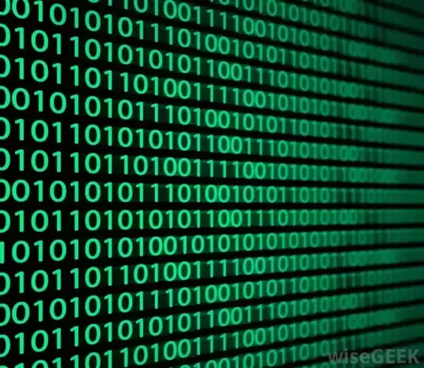
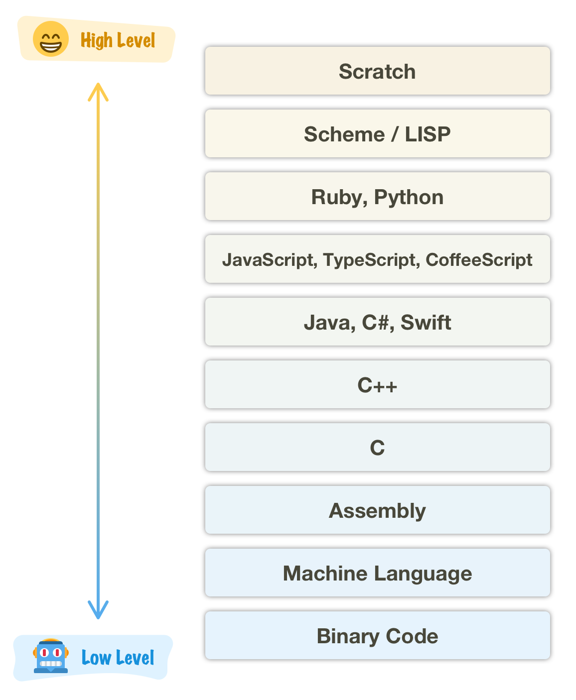

# C# 학습 1주차

## 목차

1.  **개요**
    1.  프로그램과 프로그래밍 언어
    2.  프로그래밍 언어의 분류
2.  **C# 기본 구조**
    1.  C#의 장점과 단점
    2.  가비지 컬렉터(Garbage Collector, GC)
    3.  C#의 기본 형식
    4.  C#의 기본 입출력 방법
3.  **C# 프로그램 생성 원리**
    1.  CLR과 중간 언어
4.  **자료형과 변수(Data Type & Variable)**
    1.  프로세스 메모리 구조
    2.  변수
    3.  값 형식과 참조 형식
    4.  C# 자료형의 종류
    5.  정수 자료형(Integer Type)
        1.  오버플로우(Overflow)와 언더플로우(UnderFlow)
    6.  문자 자료형(Character Type)
    7.  실수 자료형(Floating Point Type)
    8.  문자열 자료형(String Type)
    9.  논리 자료형(Boolean Type)
    10.  오브젝트 자료형(Object Type)
    11.  형변환(Type Conversion)
    12.  상수(Constant)
    13.  열거형(Enumeration Type)
    14.  Nullable 형식(Nullable Type)
    15.  var - 타입 추론 형식(Inference Type)
5.  **연산자(Operator)**
    1.  표현식이란?
    2.  연산자와 피연산자
    3.  전체 연산자 둘러보기
        1.  피연산자의 개수에 따라
        2.  연산자의 기능에 따라
    4.  연산자의 종류
        1.  대입 연산자(Assignment Operator)
        2.  산술 연산자(Arithmetic Operator)
        3.  증감 연산자(Increment/Decrement Operator)
        4.  관계 연산자(Relational Operator)
        5.  논리 연산자(Logical Operator)
        6.  비트 연산자(Bitwise Operator)
        7.  복합 대입 연산자(Additional Assignment Operator)
        8.  조건 연산자(Conditional Operator)
        9.  Null 관련 연산자(Null Type Operator)
        10.  그 밖의 연산자들
    5.  연산자 우선순위와 연산 방향

----

### 1.1. 프로그램과 프로그래밍 언어

#### 프로그램이란?

  우리는 컴퓨터 뿐만 아니라 일상 생활에서도 **프로그램(Program)** 이라는 단어를 자주 사용합니다.

*   TV 프로그램
*   컴퓨터 프로그램
*   수련회 프로그램
*   기타 등등

이러한 다양한 문장/단어들에서 프로그램이라는 용어는 보통 **어떤 작업이 나열된 계획표, 또는 순서표**를 뜻합니다.

컴퓨터에서의 프로그램도 마찬가지입니다. 컴퓨터에서 프로그램이란

**'컴퓨터에게 작업할 일을 순서대로 나열한 파일'**

이라 할 수 있습니다.

그런데 단순히 컴퓨터에게 요청할 작업들을 순서대로 우리 멋대로 적어놓기만 한다고 프로그램이라고 말할 순 없겠죠?

프로그램은 보통 파일 확장자가 `.exe`인 파일을 의미합니다. 이러한 파일을 **실행 파일**이라고 하며, 해당 실행 파일에는 작업할 내용을 **컴퓨터가 이해할 수 있는 언어**로 작성해 놓습니다. 그리고 이러한 **컴퓨터가 이해할 수 있는 언어**를 **기계어(Machine Language)** 라고 합니다.

위와 같이 **0과 1이 나열**된 사진은 다양한 매체에서 마치 컴퓨터(특히 해킹)의 상징과도 같이 묘사되는데, 이와 같이 **0과 1, 즉 2진수로만 이루어진 명령어 집합**이 바로 **기계어**입니다.

그런데 이와 같이 0과 1로 컴퓨터에게 명령을 내리려면, 굉장히 어렵고 복잡하지 않을까요? 예를 들어, 어쩌다 1을 입력해야 하는데 실수로 0을 입력하기라도 한다면, 프로그램을 전부 작성한 후 오류가 났을 때 어디에 문제가 있는지 쉽게 찾을 수 있을까요?

(참고로, 프로그램 작성 후 프로그램이 정상적으로 실행되지 않을 때 오류를 찾는 과정을 **디버깅(Debugging)** 이라고 한답니다!)

이런 불편함 때문에 컴퓨터과학자들은 기계어를 조금 더 사람들이 작성하기 쉬운 형태로 구현하기 위해 고민했고, 그러던 와중에 이러한 생각을 하게 되었습니다.

**"인간이 쉽게 이해할 수 있는 언어로 프로그램을 작성한 뒤, 이를 기계어로 번역하는 프로그램을 만들면 되지 않을까?"**

마치 독일어를 모르는 한국 사람들이 독일 방송사에서 방영할 드라마를 촬영한다면, 먼저 한국어로 드라마를 촬영한 후 대사를 독일어로 번역해서 독어 더빙을 하는 과정과 같은 것이죠.

이 때 한국어 대사를 독일어로 번역해주는 번역가가 존재하는 것 처럼, 컴퓨터 프로그램도 인간이 쓰는 언어를 기계어로 번역해주는 번역가(프로그램)이 탄생했고, 우리는 이를 **컴파일러(Compiler)** 라고 합니다.

이렇게 번역 프로그램이 탄생했으니 인간은 자신들이 이해할 수 있는 언어를 이용해 프로그램을 작성할 수 있게 되겠죠? 그런데 아무리 컴파일러가 존재한다 하더라도 완전히 **인간이 사용하는 언어(한국어, 영어, 중국어 등)** 를 사용해서 컴퓨터 논리를 완전히 표현할 수는 없기에(정확히는 컴파일러를 완벽하게 이해시킬 수 없기에), 약간의 타협을 통해 친숙하지만 컴퓨터 논리 구조를 반영한 언어들을 만들어냈습니다. 그리고 우리는 이러한 언어들을 

**프로그래밍 언어(Programming Language)** 

라고 부릅니다.

(참고로, 앞서 언급된 '인간이 사용하는 언어 - 한국어, 영어, 중국어 등'는 **자연어**라고 부른답니다.)

현재 세계에는 매우 많은 프로그래밍 언어가 존재하는데요, [해당 출처](https://careerkarma.com/blog/how-many-coding-languages-are-there/)에 따르면 최소 245개, 최대 700개의 프로그래밍 언어가 살아있는 언어로서 사용되고 있고, 이제는 사용되지 않는 사라진 언어들까지 모두 합하면 무려 **25,000**종류의 프로그래밍 언어가 존재한다고 합니다.

프로그래밍 언어는 저마다 독특한 특징과 개성을 가지고 있으며, 나름의 강점과 약점을 가지고 있습니다. 따라서 일률적으로 모든 언어들을 구분해 분류하는 것은 무리가 있겠지만, 일반적으로 **고급 언어(High-Level Language)** 와 **저급 언어(Low-Level Language)** 로 분류합니다.

용어만 들으면 마치 **고급 언어**는 기능이 많은 훌륭한 언어 같고, **저급 언어**는 기능이 안 좋은 허접(?)한 언어 처럼 느껴질 수 있겠지만, 이는 사실 다음과 같은 분류 방법입니다.

>   컴퓨터(하드웨어)에 가까운 언어일수록 저급 언어, 인간에 가까운 언어일수록 고급 언어이다.

하드웨어에 가까운 언어라는 말은 곧, 하드웨어 최적화를 요구하거나 굉장히 제한된 자원을 가진 상태에서 최적의 성능을 낼 수 있는 언어라는 뜻입니다.(물론 그만큼 문법 구조가 난해합니다!)

반면 인간에게 가까운 언어라는 말은 인간이 프로그래밍을 할 때 깊은 하드웨어 지식을 가지고 있지 않거나, 최적화 이론에 대해 잘 알지 못하더라도 언어 스스로 그러한 기능을 지원함으로써 편안한 프로그래밍 환경을 지원해 주는 언어라는 뜻이겠죠?(대신, 실행 속도가 느리거나 많은 자원을 잡아먹는 등의 단점이 존재합니다.)

그렇기에 앞서 봤던 **기계어**는 대표적인 저급 언어이며, 기계어보다 저급인 언어는 하드웨어 그 자체를 스위치와 전류를 통해 제어하는 방법 뿐입니다. 그 외에도 저급 언어에는 **어셈블리어(Assembly)** 라는 언어도 존재합니다.

반면 우리가 지금 학습하고 있는 **C**#의 경우 **대표적인 고급 언어들 중 하나**로서 자리하고 있습니다. 특히 **Windows OS에 가장 최적화된 환경과 성능**을 보유하면서도 **다양한 플랫폼에서 최적의 성능을 보장**받는 프로그램을 작성할 수 있도록 도와주는데, 이는 다음에 살펴 볼 **.NET 프레임워크**의 역할이 크다고 할 수 있습니다(예전에는 C#이 오직 Windows OS만 실행될 수 있었으며, 이처럼 다양한 플랫폼에서 실행 가능해진 것은 비교적 최근의 일입니다).

게다가 C#은 최근 게임 개발 분야에서 매우 높은 사용 빈도를 보이고 있습니다. **게이머들의 대부분의 실행 환경(운영체제)이 Windows OS**라는 점(무려 99%에 가까운 점유율 보유)과, **Unity Engine의 스크립팅 언어**라는 점 때문이죠.

이런 특징들 덕분에 저희 동아리 뿐만 아니라 **게임 개발을 위해서라면 반드시 알아 두어야 할 언어** 중 하나라고 볼 수 있습니다.

(만약 2021년 기준, 가장 많이 사용되는 프로그래밍 언어 Top 10을 알고 싶다면 [부록.1](../../../C/1주차/Main_Text/7.부록.md)을 확인해보세요!)

----

*(C) 2021. Im-Yongsik(Hamsik2rang) all rights reserved.*

 <a href="../">← 첫 페이지로</a>

 <a href="./2.C%23_기본_구조.md">C# 기본 구조 →</a>

