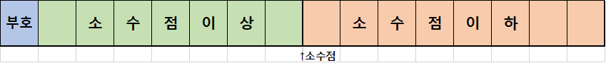

# C# 학습 1주차

## 목차

1.  **개요**
    1.  프로그램과 프로그래밍 언어
    2.  프로그래밍 언어의 분류
2.  **C# 기본 구조**
    1.  C#의 장점과 단점
    2.  가비지 컬렉터(Garbage Collector, GC)
    3.  C#의 기본 형식
    4.  C#의 기본 입출력 방법
3.  **C# 프로그램 생성 원리**
    1.  CLR과 중간 언어
4.  **자료형과 변수(Data Type & Variable)**
    1.  프로세스 메모리 구조
    2.  변수
    3.  값 형식과 참조 형식
    5.  정수 자료형(Integer Type)
        1.  오버플로우(Overflow)와 언더플로우(UnderFlow)
    6.  문자 자료형(Character Type)
    7.  실수 자료형(Floating Point Type)
    8.  문자열 자료형(String Type)
    9.  논리 자료형(Boolean Type)
    10.  오브젝트 자료형(Object Type)
    11.  형변환(Type Conversion)
    12.  상수(Constant)
    13.  열거형(Enumeration Type)
    14.  Nullable 형식(Nullable Type)
    15.  var - 타입 추론 형식(Inference Type)
5.  **연산자(Operator)**
    1.  표현식이란?
    2.  연산자와 피연산자
    3.  전체 연산자 둘러보기
        1.  피연산자의 개수에 따라
        2.  연산자의 기능에 따라
    4.  연산자의 종류
        1.  대입 연산자(Assignment Operator)
        2.  산술 연산자(Arithmetic Operator)
        3.  증감 연산자(Increment/Decrement Operator)
        4.  관계 연산자(Relational Operator)
        5.  논리 연산자(Logical Operator)
        6.  비트 연산자(Bitwise Operator)
        7.  복합 대입 연산자(Additional Assignment Operator)
        8.  조건 연산자(Conditional Operator)
        9.  Null 관련 연산자(Null Type Operator)
        10.  그 밖의 연산자들
    5.  연산자 우선순위와 연산 방향

----

## 4. 자료형과 변수(Data Type & Variable)

### 4.1. 프로세스 메모리 구조

본 페이지에서 설명할 자료형과 변수는 모두 **데이터(Data)** 와 관련이 있는 문법 요소입니다.

그런데 컴퓨터에서 데이터는 **메모리(Memory)** 에 저장되기 때문에 메모리 구조를 이해해야 합니다.

게다가 C#은 객체지향 문법이며, **모든 데이터가 객체 형태**를 가지는데, 객체는 가지고 있는 구성 요소에 따라 크기(차지하는 메모리 공간)가 천차만별입니다.

그렇다 보니 크기가 큰 객체 데이터들은 일반적인 데이터들과는 조금 다른 저장 방식을 가지는데, 이를 알기 위해선 **스택** 과 **힙**에 대한 지식도 어느정도 필요합니다.

따라서 본 단락에서는 전체적인 메모리의 구조와 프로세스 메모리 중 **스택**과 **힙**에 대해 알아보겠습니다.

**메모리(Memory)**란 컴퓨터에서 데이터를 저장하는 장치입니다. 컴퓨터에는 다양한 저장 장치가 존재하지만, 앞으로 우리는 메모리 = RAM이라고 가정하고 설명을 진행하겠습니다.

**RAM(Random Access Memory)** 는 선형 구조(1차원 구조)를 가진 컴퓨터의 주 기억 장치이며, **메모리를 구성하는 각 바이트(Byte)별로 주소가 매겨져 있습니다.**


*(원칙적으로 메모리의 주소는 16진수로 표기하나, 편의상 지금은 10진수로 표기합니다.)*

그래서 메모리의 특정 위치를 찾을 때 가장 처음부터 순차적으로 찾아갈 필요 없이 해당 주소를 통해 바로 접근할 수 있죠. 이러한 특성 때문에 **임의의 위치(Random)에 바로 접근(Access)할 수 있는 메모리** 라는 이름을 가진 것입니다.

예를 들어서, 여러분의 컴퓨터에 4GB RAM이 장착되어 있다고 하면, 해당 메모리에는 0번지에서 2^32 -1번지까지의 주소가 순서대로 매겨져 있습니다.

(만약 비트, 바이트, 기가바이트 등 컴퓨터의 자료 저장 단위가 생소하다면 [부록.2](../../../C/1주차/Main_Text/7.부록.md)를 참고하세요.)

 

만약 여러분의 컴퓨터에 Windows OS **32bit** 가 설치되어 있다면 컴퓨터에 16GB RAM을 장착하더라도 메모리는 **0번지에서 2^32 -1 번지**까지밖에 사용할 수 없습니다. 반면 Windows OS **64bit** 가 설치되어 있다면 **0번지에서 2^64 -1번지**까지 사용할 수 있습니다.

(정확한 값이 아닙니다. 운영 체제 버전에 따라 이러한 차이가 왜 발생하는지는 추후에 **포인터**를 배우면 이해할 수 있습니다.)


그런데 이러한 **바이트(Byte)단위의 주소 관리**는 **운영체제가 메모리를 관리하는 단위**이고, 실제 컴퓨터는 바이트보다 더 작은 **비트(bit)** 단위로 데이터를 저장하거나 읽을 수 있습니다.


*(위의 숫자는 1바이트에 2진수가 저장될 시 각각의 자릿수를 의미합니다.)*

따라서 만약에 **메모리의 1044번지에 97이라는 값이 저장**되어 있을 경우, 아래와 같은 구조로 메모리가 구성되어 있을 것입니다.


여기까지 이해되셨다면 **메모리**에 대한 기초적인 이해가 완료된 것입니다.

그 다음은 **프로세스(Process)**에 대해 알아보겠습니다.

우리가 프로그램을 저장할 때 모든 프로그램을 주 기억 장치(RAM)에 저장하지는 않습니다. 왜냐하면 주 기억 장치는 용량이 작기 때문이죠.

대신 **보조 기억 장치(HDD, SSD 등)** 에 실행 파일을 저장하게 되는데, 보조 기억 장치는 접근 속도가 매우 느리므로 보조 기억 장치에 저장된 프로그램을 실행하면 해당 프로그램은 **RAM 위에 올라간 후 실행**되게 됩니다.

이 때 **RAM 위에 올라간 프로그램**을 **프로세스**라 합니다. 즉, **실행 중인 프로그램 = 프로세스** 라는 것이죠.

*(참고로 이러한 프로세스를 실행시키는 장치가 CPU이기 때문에 CPU를 **프로세서**라 부릅니다.)*

주 기억 장치 안에 프로그램이 탑재되어 프로세스가 되면 **프로세스는 자신에게 할당된 메모리 공간을 용도에 맞게 구분지어 사용**합니다.

우리가 34평 집에 산다고 가정할 때 **34평 전체를 하나로 쓰는 것이 아니라 일부는 화장실, 일부는 침실, 일부는 부엌 등으로 나누어 사용하는 것**과 같은 원리이죠.

프로세스는 자신에게 할당된 메모리 공간을 네 가지 공간으로 분할하는데, 각 분할 구역을 **세그먼트(Segment, 또는 그냥 동일하게 메모리라 부르기도 함)** 라 하며, 이 네 개의 세그먼트 중 **스택 세그먼트(Stack Segment)** 와 **힙 세그먼트(Heap Segment)** 가 존재합니다.

스택 세그먼트와 힙 세그먼트의 자세한 구조와 작동 원리는 자료구조 및 컴퓨터구조를 알아야만 이해할 수 있기에 간단히 설명하자면,

**스택 세그먼트**는 **작은 메모리 공간(이지만 접근 속도가 빠름)** 으로서 **크기가 작고 지역 범위를 가지는 데이터들을 저장**합니다.

반면 **힙 세그먼트**는 **큰 메모리 공간(이지만 접근 속도가 상대적으로 느림)** 으로서 **크기가 크고 넓은 범위를 가지는 데이터들을 저장**합니다.

정리하면 다음과 같습니다.

*   스택 세그먼트(스택 메모리) : 공간이 좁지만 접근 속도가 빠름. 크기가 작고 특정 영역에서만 사용되는 데이터들을 저장
*   힙 세그먼트(힙 메모리) : 공간이 넓지만 접근 속도가 느림. 크기가 크고 다양한 범위에서 사용되어야 하는 데이터들을 저장

프로그램이 실행될 때 메모리 공간을 나눠 쓰고, 그 중 스택과 힙이 있으며, 둘의 차이가 이러하다 는 정도까지 이해하셨다면 이번 단락에서 이해하셔야 할 내용을 전부 이해한 것입니다.

---

### 4.2. 변수

앞서 실행 중인 프로그램 데이터를 메모리에 저장한다고 했습니다.

그리고 메모리는 주소가 있어 특정 위치로 바로 접근할 수 있음도 배웠죠.

프로그램에서 데이터를 저장해야 할 때 내가 원하는 크기만큼 메모리를 사용하는 문법이 바로 **변수(Variable)** 입니다.

**변수는 각자 자기만의 이름을 가지고 있는데, 이 이름은 메모리 주소에 별칭을 붙여 준 것입니다.**

즉 **변수의 이름은 메모리 공간**에 대응되는 것이죠.

변수를 사용하겠다고 컴파일러에게 알리는 것을 **선언(Declaration)** 이라고 합니다.

변수의 선언은 다음과 같은 형태로 이루어집니다.

```c#
키워드 자료형 변수명;
```

이 때 변수명처럼 **코드 안에서 프로그래머가 지정할 수 있는 모든 이름**을 **식별자(Identifier)** 라고 합니다.

다음과 같은 요소들이 모두 식별자입니다.

*   변수명
*   필드명
*   메서드명
*   클래스명
*   네임스페이스명
*   기타 등등

이러한 식별자는 별도의 **명명 규칙(Notation)** 이 존재하는데, 다음과 같습니다.

*   영어 대소문자와 숫자, 그리고 밑줄기호`_`만 사용할 수 있다.
*   첫 글자에는 숫자가 올 수 없다.
*   공백 문자가 포함될 수 없다.
*   C **문법에서 이미 사용되는 용어(이들을 가리켜 예약어라 합니다)** 를 사용할 수 없다.

예약어에는 다음과 같은 것들이 있습니다.

*   main
*   for
*   while
*   var
*   int
*   short
*   double
*   const
*   그 외 기타

즉, 문법 용어로서 이미 쓰이는 단어들은 사용할 수 없다는 뜻입니다.

다음 예시 코드를 살펴보시면 식별자 명명 규칙을 쉽게 이해할 수 있습니다.

```c#
/*올바른 예시들*/
int a;
int _bb;
double aA13;
float GRAV1TY_;

/*올바르지 않은 예시들*/
short 1a;				// 첫 문자로 숫자가 올 수 없다.
int var;				// 예약어를 사용할 수 없다.
char while;				// 예약어를 사용할 수 없다.
const int const;		// 예약어를 사용할 수 없다.
int my arr;				// 공백 문자가 포함될 수 없다.
int 총합;					//영어 대소문자, 숫자, 밑줄기호 외 문자를 사용할 수 없다.
```

또, 식별자에서 대문자와 소문자는 서로 구분됩니다(대문자와 소문자의 ASCII Code가 다르니 당연하겠죠?)

```c
/*아래 네 변수는 모두 다 다른 변수이다.*/
int age;
int Age;
int aGe;
int AGE;
```

식별자를 명명하는 **규칙**은 정해져 있지만 식별자를 명명하는 **방식**은 개발자마다, 그리고 프로젝트마다 다 다릅니다.

다양한 식별자 명명 방식은 [부록.4](../../../C/1주차/Main_Text/7.부록.md)를 참고해보세요.

지금까지의 내용을 바탕으로 변수의 선언과 사용 방법을 코드로 살펴보면 다음과 같습니다.

```c#
int a;
a = 3;

Console.WriteLine(a);
```

위 코드에서 a라는 int자료형 변수를 선언한 후 해당 변수 안에 3을 저장하였습니다. 그 후 WriteLine 메서드로 3을 출력했습니다.

그런데 이 때 만약 a에 값이 저장되지 않은 상태에서 WriteLine메서드로 a를 출력하면 어떻게 될까요?

```c#
int a;

Console.WriteLine(a);
```

결과는 **아무도 모른다**입니다. 컴파일러에 따라 오류로 간주해 빌드가 불가하다고 판단하는 경우도 있으며, 값을 출력은 해 주지만 전혀 알 수 없는 값(이를테면 -442325823)이 출력되기도 합니다. 그리고 이 알수 없는 값은 프로그램 실행 시 마다 다른 값이 나오게 됩니다!

이처럼 변수를 선언한 후 값을 저장하지 않고 사용하게 될 때 나타나는 **예측 불가능한 값**을 **쓰레기값(Garbage Value - GC와는 관련 없음!)** 이라고 부릅니다.

쓰레기 값이 왜 생기는지는 한번 직접 고민해보세요! (고민 안하고 그냥 물어보셔도 됩니다)

아무튼, C# 문법에서는 이러한 쓰레기값의 위험성 때문에 선언 직후 입력을 통해 바로 값을 넣어주는 것이 아니라면 선언과 동시에 값을 넣어주는 것을 권장합니다.

이 때 선언과 동시에 값을 넣어주는 것을 **초기화(Initialize)** 라고 합니다.

초기화는 다음과 같은 형태로 진행합니다.

```c#
키워드 자료형 변수명 = 값;
```

예를 들면 다음과 같습니다.

```c#
char letter = 'T';
const short tell = 182;
int a = 33842123;
```

간단하죠? 이처럼 **선언 시 초기화를 진행하면 해당 변수에 쓰레기 값이 존재할 여지가 없으므로 안전한 코드를 작성할 수 있습니다.**

이번엔 변수를 사용하는 방법을 알아봅시다. 변수의 사용 방법은 무궁무진하고, 각각의 문법 시간마다 배우게 되므로 간단한 입출력, 그리고 변수와 변수 간에 값을 복사하는 방법만 간단히 살펴봅시다.

##### 1. Console.WriteLine

이미 알고 있겠지만 Console.WriteLine 메서드를 통해 변수 값을 출력할 때에는 다음과 같이 사용합니다.

```c#
Console.WriteLine(출력할 값);
```

##### 2. Console.ReadLine

C#의 입력 메서드는 대표적으로 **Console.ReadLine** 메서드가 있습니다(그 외에도 Console.Read 등이 있음).

```c
값을_저장할_변수 = Console.ReadLine();
```

ReadLine 메서드는 사용자가 입력한 값을 줄 단위로 받습니다. 즉, `Enter`를 입력하기 직전까지 입력한 모든 값(공백 문자, 즉 스페이스바 포함)을 한 번에 받는다는 것이죠. 또한 ReadLine은 **문자열(String)** 형태로 값을 입력받기 때문에 다른 데이터 형식으로 사용하고 싶다면 형변환을 거쳐야 합니다.

형변환은 다양한 방법이 있으나 다음과 같은 두 가지 방법을 사용합니다.

```c#
변수 = 변환할_자료형.Parse(변환할_값);

변수 = Convert.To변환할_객체자료형(변환할_값);
```

코드로 예를 들면 다음과 같습니다.

```c
string s = Console.ReadLine();

int a = int.Parse(s);		// 첫 번째 방법
int b = Convert.ToInt32(s);	// 두 번째 방법
```

##### 3. 변수 간의 값 복사

```c
int a = 3;
int b = a;

int c;
c = b;
```

초기화를 진행할 때 리터럴 상수를 저장하듯이 변수를 통해서도 초기화가 가능하며, 이렇게 초기화를 하게 되면 값을 주는 변수의 값이 **복사**되어 제공됩니다.

### 4.3. 값 형식과 참조 형식

C#에는 변수를 두 가지 형태로 분류할 수 있습니다.

첫 번째는 데이터가 자신이 저장할 값을 가지고 있는 **값(Value)** 형식이고, 두 번째는 데이터가 지신이 저장할 값을 가지고 있는 공간의 주소를 가지고 있는 **참조(Reference)** 형식입니다.

그림으로 표현하면 다음과 같습니다.


a라는 변수는 1024라는 정수 **값**을 저장합니다.

반면 변수 b는 1044라는 **주소**를 저장하고 힙 영역의 1044번지에는 82라는 정수 값이 저장되어 있습니다.

**힙 영역**은 이처럼 **스택에 있는 참조 변수를 통해서만 접근할 수 있습니다.** 즉 바로 접근이 가능한 스택과 달리 힙은 한 번의 접근 과정을 더 거쳐야 하는 것이죠.

이 때문에 아까 메모리에 대해 배울 때 힙 영역이 접근 속도가 상대적으로 느리다고 설명한 것입니다.

결론적으로 **C#**에는 **값을 저장하는 변수**와 **다른 변수를 참조하는 변수** 두 가지 변수가 존재한다는 것을 기억해주세요.

---

### 4.4. 정수 자료형(Integer Type)

*   1
*   -13
*   1388254

위 세 값의 공통점이 무엇일까요? 바로 **정수** 값이라는 것입니다.

C#에서 변수를 선언하려면 해당 변수가 얼마만큼의 공간을 사용할지, 그리고 어떤 형태의 값을 저장할지 **자료형**으로 표시해야 합니다.

변수 중 정수 데이터를 저장할 변수들은 앞에 정수 자료형을 표기해줍니다.

C#의 정수 자료형은 다음과 같습니다.

| 자료형     | 형태 | 크기  | 표현 범위                                          |
| :--------- | :--: | :---: | -------------------------------------------------- |
| **byte**   | 정수 | 1Byte | 0 ~ 255                                            |
| **sbyte**  | 정수 | 1Byte | -128 ~ 127                                         |
| **short**  | 정수 | 2Byte | -32,768 ~ 32,767                                   |
| **ushort** | 정수 | 2Byte | 0 ~ 65,535                                         |
| **int**    | 정수 | 4Byte | -2,147,483,648 ~ 2,147,483,647                     |
| **uint**   | 정수 | 4Byte | 0 ~ 4,294,967,295                                  |
| **long**   | 정수 | 8Byte | -922,337,203,685,477,508 ~ 922,337,203,685,477,507 |
| **ulong**  | 정수 | 8Byte | 0 ~ 2^64 -1                                        |

참고로 변수명 앞에 s가 붙은 경우 signed(부호가 있음)를, u가 붙은 경우 unsigned(부호가 없음)를 의미합니다.

#### 1. 오버플로우와 언더플로우

정수 자료형에서 주의해야 할 점은, 최댓값보다 더 큰 값을 저장하거나 최솟값보다 더 작은 값을 저장하면 의도하지 않은 값이 저장될 수 있다는 점입니다.

예를 들어 short 크기 공간에 32,767을 할당한 후 1을 증가시킨다고 합시다(아직 변수와 연산자를 배우지 않았지만 직관적으로 이해해 주세요.)

```c#
using System;

namespace DataType
{
    class Example
    {
		short val = 32767;
        val++;
        
        Console.WriteLine(a);
    }
}
```

"32,767에 1을 더했으니 32,768이 출력되겠군" 이라고 생각하실 수 있으나, 실제 위 코드를 따라 친 후 빌드를 해 보면 

```c
-32768
```

이 출력됩니다. 왜일까요?

왜냐하면 이는 메모리 구조와 관련이 있습니다.

32,767이 저장된 val의 상태는 다음과 같습니다.


여기서 1을 더해주게 되면 다음 값이 됩니다.


위 값은 **2의 보수로 표현된 -32,768**입니다.

즉, 1을 더함으로써 부호 비트의 값을 변경해 버렸기 때문에 음수의 최솟값이 되어 버린 것이죠.

이는 부호 없는 정수형도 마찬가지입니다.

```c
using System;

namespace DataType
{
    class Example
    {
		ushort val = 32767;
        val++;
        
        Console.WriteLine(a);
    }
}
```

위 코드의 출력 결과는 다음과 같습니다.

```c
0
```

마찬가지로 부호 없는 2바이트 정수형이 가질 수 있는 최솟값으로 변했습니다.

역시 메모리 구조로 살펴보면


에서 1을 더해줄 때


val에 할당된 메모리를 벗어난 곳에 1이 더해지고 나머지 값은 전부 0이 되어버렸기 때문에 0을 가지게 되는 것입니다.

이와 같은 현상을 **오버플로우(Overflow)**라고 합니다.

반대로, 최솟값에서 값을 빼서 최댓값으로 바뀌는 것은 **언더플로우(Underflow)**라고 합니다.

언더플로우에 대한 코드는 한번 스스로 작성해 보면서 실험해 보시기 바랍니다.

### 4.5. 문자 자료형(Character Type)

컴퓨터는 모든 데이터를 2진수 형태로 저장하기 때문에, 문자 데이터('A', 'B', 'z' 등) 역시 2진수 형태로 저장됩니다.

그 말은 각각의 문자를 서로 다른 정수들에 **대응(매핑, Mapping)** 시킨 후 대응되는 정수들을 이용한다는 뜻입니다.

예를 들어서 제가 A라는 알파벳 문자를 나타내기 위해 A를 67이라는 정수에 대응시킨다고 생각해 봅시다.

Console.ReadLine 함수를 이용해 키보드로 A를 입력하면 프로그램은 A를 67의 2진수 형태로 저장시키겠죠?

마찬가지로 B를 68에, C를 69에, ... 이렇게 하나씩 대응시켜서 문자를 저장하는 것입니다.

그런데, 모든 프로그래머들이 다들 자신이 원하는 정수에 문자를 대응시킨다면 각각의 프로그램마다 파일을 열었을 때 안에 들어있는 문자들이 제각각일 것입니다.

다음과 같은 상황을 상상해봅시다.

>   프로그래머 A는 H를 47, E를 44, L을 51, O를 54로 대응시킨다고 가정하고 프로그램을 작성한다.
>
>   프로그래머 B는 H를 47, U를 44, R을 51, Y를 54로 대응시킨다고 가정하고 프로그램을 작성한다.

이 때 A가 만든 프로그램에서 저장한 데이터 파일을 B가 만든 프로그램에서 불러오게 되면

```c
"HELLO"
```

라는 문자열이

```c
"HURRY"
```

라는 문자열로 표현되게 됩니다. 

이러면 문제가 생기겠죠? 그래서 컴퓨터과학자들은 문자와 정수의 대응 규칙을 표로 만들고 이를 표준화했는데 그게 바로 다양한 **문자 코드**입니다.

C#에서 문자는 **유니코드(UNICODE)**에 대응되어 정수 형태로 저장되고, 유니코드 안에는 총 65,535 가지의 문자가 정수와 대응되어 있기 때문에 문자를 저장하려면 **2Byte의 정수면 충분**합니다.

따라서 C#의 문자 자료형은 단 하나 존재합니다.	

| 자료형   |    형태    | 크기  |           표현 범위            |
| -------- | :--------: | :---: | :----------------------------: |
| **char** | 문자(정수) | 2Byte | 0 ~ 65535 (유니코드 표현 범위) |

ushort와 표현 범위는 완전히 같지만 ushort에 문자 데이터로 표현되길 원하는 값을 저장하거나, char에 정수로 표현되길 원하는 값을 저장하면 혼동이 올 수 있으므로 **문자는 char에만, 정수는 ushort에만 저장**하는 것을 권장합니다.

예제 코드를 간단히 살펴보겠습니다.

```c#
char c = 'A';
char enter = '\n';
```

위 코드에서 알 수 있듯이 문자 데이터는 작은따옴표`''`로 문자를 묶어 표현합니다.

### 4.6. 실수 자료형(Floating Point Type)

컴퓨터에서는 실수를 어떻게 표현할까요?

언뜻 보기에는 숫자형 데이터이므로 정수와 동일하게 저장하면 될 거라고 생각할 수 있습니다.

그런데 실수에는 정수와 달리 **소수점`.`** 이 있기 때문에 정수와 동일하게 표기를 하는 데에는 무리가 있음을 짐작할 수 있습니다.

이를 해결하기 위해 컴퓨터과학자들이 여러 방법을 고안했는데, 그 중에는 이런 방법도 존재합니다.

>   실수는 2바이트 이상으로 저장하기로 하고, 두 바이트의 경계를 소수점으로 생각하자!

그림으로 보면 다음과 같은 형태입니다.



상당히 합리적인 표현 같지만, 사실 문제가 존재합니다. 위의 경우 소수점 이상의 크기가 최대 127까지밖에 표현되지 못하므로(7개의 비트로 가질 수 있는 최댓값이 127이기 때문입니다), 만약에 

```c
12834456829.024439002175
```

같은 큰 수를 표현하려면 굉장히 많은 메모리 공간을 낭비해야 한다는 것입니다. (참고로 이러한 표기법을 **고정소수점(Fixed-Point)** 표기법이라고 합니다.)

따라서 실수를 표현할 때 일반적으로 **부동소수점(Floating-Point)** 표기법을 사용합니다(다만 C#은 고정소수점 표기도 지원합니다.).

**부동소수점을 사용하면 4바이트를 사용해 최대 1.99999... x 2^127까지의 값을 표기할 수 있습니다.**

그러나 부동소수점이라 할지라도 완전한 무리수를 표현할 수는 없기 때문에 **컴퓨터에서는 필연적으로 실수 저장 시 오차가 발생**합니다.

이 특징은 나중에 조건문을 배울 때 중요하게 다뤄 보겠습니다.

(부동소수점에 대해 자세히 알고 싶다면 [부록.4](../../../C/1주차/Main_Text/7.부록.md)를 확인하세요.)

C#에서 부동소수점과 고정소수점 둘 다의 형태로 실수를 저장하는데, 이러한 실수 자료형은 다음과 같습니다.

| 자료형  | 형태       | 크기  | 표현 범위                      |
| ------- | ---------- | ----- | ------------------------------ |
| float   | 실수(부동) | 4Byte | ±3.4 ×10^-37 ~ ±3.4 ×10^38     |
| double  | 실수(부동) | 8Byte | ±1.7 ×10^-307이상 ±3.4 ×10^308 |
| decimal | 실수(고정) | 2Byte | ±1.0 ×10^-28 ~ ±7.9 ×10^28     |

decimal 자료형은 고정소수점 형태이기 때문에 크기 대비 표현 범위가 적습니다. 그러나 정밀도가 부동소수점에 비해 높다는 장점이 있습니다. 즉, 오차가 작다는 말이죠.

일반적으로 float형은 소수점 이하 7자리까지, double은 15자리까지 정밀도를 보장받을 수 있습니다. 그 이후 소수점부터는 오차가 발생하게 됩니다.

그러나 decimal 자료형은 소수점 이하 **27자리**까지 정밀도를 보장받을 수 있습니다.

---

### 4.7. 문자열 자료형(String Type)

C#은 문자열만을 위한 자료형을 지원합니다. 다만 객체 형태의 자료형이기에 **참조 형식**으로 사용됩니다.

문자열은 큰따옴표`""`로 문장을 묶어서 표현합니다.

문자열 자료형은 다음과 같습니다.

| 자료형 | 형태         | 크기          | 표현 범위     |
| ------ | ------------ | ------------- | ------------- |
| string | 문자열(객체) | 정해지지 않음 | 정해지지 않음 |

예시 코드로 살펴보겠습니다.

```c#
string name = "Im Yongsik";
string university = "공주대학교";
```

string형 변수는 저장하는 문자열의 크기에 맞게 변수의 크기가 정해집니다. 이처럼 크기가 따로 정해지지 않은 데이터 형식을 **가변 크기 자료형(Varibale Length Type)** 이라고 합니다.

따라서 특정 문자열 객체의 크기(길이)를 알고 싶다면 해당 객체의 뒤에 **.Length**를 붙이면 해당 객체의 크기를 반환합니다.

```c#
string name = "Im Yongsik";
Console.WriteLine(name.Length);
```

이외에 문자열 객체는 많은 멤버 필드와 멤버 인스턴스를 가지고 있으나, 자세한 사항은 다음에 다루어 보겠습니다.

---

### 4.8. 논리 자료형(Boolean Type)

논리 자료형은 참(True) 또는 거짓(False)중 하나의 값만을 저장할 수 있는 자료형입니다.

논리 자료형은 다음과 같이 단 하나 존재합니다.

| 자료형 | 형태   | 크기  | 표현 범위              |
| ------ | ------ | ----- | ---------------------- |
| bool   | 논리형 | 1Byte | 0 or 1 (false or true) |

예시 코드로 살펴보겠습니다.

```c#
bool hasMoreToken = false;
bool isFinish = true;
```

논리형은 단독으로 쓰이기보단 조건문 및 논리 연산자와 함께 쓰일 때가 많으니, 나중을 위해 미리 기억해 두시기 바랍니다.

----

### 4.9. 오브젝트 자료형(Object Type)

지금까지 본 자료형 중 문자열을 제외한 자료형들은 모두 값 형식의 자료형입니다. 따라서 일반적인 형태로 변수를 선언하면 스택 메모리에 저장되게 됩니다.

만약 기본 자료형을 힙 영역에 할당하고 싶다면 **Obejct 자료형**을 이용합니다.

Object 자료형은 사실 기본 자료형들의 기반(Base) 자료형입니다. 이는 나중에 객체지향과 상속에 대해 배워야 알 수 있는 내용이지만 간단히 설명하자면 Object 자료형은 모든 자료형들의 뼈대가 되는 자료형이라는 뜻이죠. 따라서 특정 데이터를 지칭하지 않고 **어떠한 값**이라는 의미로 자료형을 선언하고 싶을 때 사용하기도 합니다.

```c#
object a = 25;
object b = 2.3f;
object c = true;
```

모든 자료형들의 기반 자료형이기 때문에 타입 상관없이 모든 형태의 데이터를 담을 수 있습니다.

다만 이렇게 담은 데이터는 모두 힙에 저장되므로 object 자료형이 참조하는 데이터를 스택에 옮기고 싶다면 기본 자료형으로 형변환을 해 주어야 합니다.

### 4.10. 형변환(Type Conversion)

형 변환은 데이터의 자료형을 변경하는 것입니다. 일반적으로 서로 다른 데이터 간의 연산이 있을 때 컴파일러는 자동으로 최대한 결과 데이터의 손실이 적도록 형변환을 진행해줍니다. 이를 **암시적 형변환(Implicit Conversion)** 이라고 합니다.

그러나, 때로는 프로그래머가 의도적으로 데이터 손실을 감수하며 형변환을 진행하고 싶을 때가 있습니다. 이 때에는 프로그래머가 컴파일러에게 어떤 자료형으로 형변환을 진행할지 알려야 합니다. 이를 **명시적 형변환(Explicit Conversion)** 이라고 합니다.

암시적 형변환과 명시적 형변환을 간단히 살펴보겠습니다.

```c#
/*암시적 형변환*/
short a = 3;
int b = a + 4;	//short + int -> short를 int 로 형변환

int c = 4;
double d = 5.542 + c; // double + int -> c를 double 로 형변환

/*명시적 형변환*/
int x = (int)5.42;
short y = (short)3.12f;
double z = (double)true;
```

암시적 형변환은 프로그래머가 형변환 타입을 따로 지정하지 않아도 연산 과정에서 자동으로 데이터의 타입을 바꾸는 모습을 확인할 수 있습니다.

그러나 프로그래머가 명시적 형변환을 진행하고자 한다면 코드의 아랫 부분처럼 어떤 타입으로 형변환을 할지 표시해야 합니다.

명시적 형변환은 다음과 같은 형태로 이루어집니다.

```C#
(변환하려는_자료형)값;
```

다시 위에서 배웠던 object 자료형으로 돌아가면, 힙에 저장된 데이터를 스택으로 복사해 저장하기 위한 형변환은 다음처럼 할 수 있습니다.

```c#
object a = 20;	// 20이라는 값을 힙 영역에 저장 후 a라는 참조 변수로 가리킴
int b = (int)a;	// 힙 영역에 있던 값을 꺼내서 스택에 있는 변수 b에 복사 저장
```

반대로 스택의 값을 힙에 복사 전달할 수도 있습니다.

```c#
int a = 123;
object b = (object)a;
```

----

### 4.11. 상수(Constant)

우리는 지금까지 자료형을 살펴보면서 많은 변수들을 선언했습니다. 그런데 **변수들은 언제든지 자신이 저장한 값을 변경할 수 있습니다.**

프로그래밍을 하다 보면, 값이 수정되지 않아야 할 때가 있는데, 이 때 사용해야 하는 것이 **상수**입니다.

C#에서 상수는 두 가지 종류가 있습니다.

*   리터럴 상수
*   const 변수

리터럴 상수는 우리가 지금까지 변수에 값을 대입할 때 사용해 왔습니다. 예를 들면 다음과 같은 것들이 모두 리터럴 상수이죠.

```c#
3
2.24f
true
5.312425
'A'
"Hello"
```

우리가 직접적으로 입력한 값은 모두 리터럴 상수의 형태를 띄고 있습니다.

리터럴 상수의 단점은 재사용이 불가능하다는 것입니다. 우리가 키보드 입력 등을 통해 상수를 입력하면 해당 상수는 임시 변수에 잠시 저장된 후 해당 상수를 입력한(또는 사용한) 명령이 끝나면 사라져 버립니다.

그러나 상수 중에는 재사용이 필요한 상수가 많습니다. 우리가 게임 제작을 할 때 게임 안에 중력을 처리하는 물리 엔진을 작성한다고 가정하면, 9.8(중력가속도)이라는 실수는 매우 자주 사용하게 되겠죠. 이 때마다 리터럴 상수를 이용하게 되면 상당히 귀찮을 뿐더러 코드 가독성도 저하될 수 있습니다.

따라서 이 때 우리는 상수에 이름을 붙인 후 사용하기 위한 **const변수**를 이용하게 됩니다.

const변수는 변수 앞에 const 키워드를 붙여 사용할 수 있습니다.

```c#
const float GRAVITY = 9.8f;
const int HP = 50;
const double PI = 3.141592;
const double EPSILON = 2.7e-18;
```

일반적으로 const 변수는 식별자를 대문자와 밑줄기호만 사용하는 것을 권장합니다. 소문자를 사용한다고 컴파일 에러가 나는 것은 아니지만 프로그래머들은 관습상 상수를 대문자만으로 정의하기 때문이죠.

----

### 4.12 열거형(Enumeration Type)

열거형은 서로 연관 있는 여러 상수들을 묶어 사용하기 위한 자료형입니다.

우리가 게임 내에서 무기 코드를 상수로 정의한다고 가정해 보죠.

*   검 = 0
*   도끼 = 1
*   활 = 2
*   지팡이 = 3
*   단도 = 4

일 때 5개의 상수 변수를 선언하는 것도 좋지만, 5개의 상수 값이 모두 무기 코드임을 쉽게 알도록 열거형을 통해 묶어 사용하는 것이 좋습니다.

열거형은 다음처럼 사용합니다.

```c#
enum 자료형명 : {상수1, 상수2, 상수3, ...}
```

주의할 점은 열거형은 **사용자 정의 자료형(User Define Type)** 이라는 점입니다. 따라서 우리는 열거형을 사용하기 전에 먼저 사용할 열거 자료형을 정의한 후 해당 자료형의 변수를 만들어 사용합니다.

```c#
using System;

namespace Enum
{
    class EnumExample
    {
        enum WeaponCode{SWORD, AXE, BOW, STAFF, DAGGER}
        
        static void Main(string[] args)
        {
            WeaponCode wCode = WeaponCode.SWORD;
            
            Console.WriteLine(wCode);
        }
    }
}
```

위 코드를 실행하면 아래와 같이 출력됩니다.

```c#
SWORD
```

일반적으로 열거형은 내부 상수들에 0부터 시작해서 정수 값을 매깁니다. 위 코드의 경우엔 다음과 같죠.

*   SWORD = 0
*   AXE = 1
*   BOW = 2
*   STAFF = 3
*   DAGGER = 4

그렇지만 해당 열거형 안의 상수를 출력하려고 할 땐 해당 상수명이 문자열 형태로 출력됩니다. 만약 이를 정수 형태 그대로 사용하고 싶다면 형변환을 이용하면 됩니다.

```c#
using System;

namespace Enum
{
    class EnumExample
    {
        enum WeaponCode{SWORD, AXE, BOW, STAFF, DAGGER}
        
        static void Main(string[] args)
        {
            WeaponCode wCode = WeaponCode.SWORD;
            
            Console.WriteLine((int)wCode);
        }
    }
}
```

이 경우 다음처럼 출력됩니다.

```c#
0
```

----

### 4.13. Nullable 형식(Nullable Type)

앞서 변수를 선언 후 아무런 값을 저장하지 않으면 쓰레기 값을 가진다고 설명했습니다. 심지어 C# 컴파일러 중에서는 프로그래머의 실수를 줄이기 위해 변수 안에 특정한 값을 할당하지 않으면(쓰레기 값을 가진 변수가 코드에 있다면) 설사 그 변수를 사용하지 않더라도 컴파일 에러를 띄우기도 합니다.

그런데 변수를 선언하더라도 그 변수에 의미없는 값을 넣는 것이 아니라 **아예 비어있게** 하고 싶다면 어떻게 해야 할까요?

프로그래머들은 비어있다 라는 용어를 **NULL**(0)이라는 용어로 사용합니다.

그리고 C#에는 변수 안에 NULL값이 되도록 지원해주는 자료형이 존재하는데, 이것이 바로 **Nullable 자료형**입니다.

Nullable 자료형은 다음과 같이 선언합니다.

```c#
자료형? 변수명 = null;
```

예시 코드를 살펴봅시다.

```c#
int? a = null;
double? b = null;
bool? c = null;
```

nullable 변수는 값이 아예 비어 있으므로 현재 변수 안의 공간이 비어 있는지 그렇지 않은지 파악하기 위한 방법을 제공합니다.

nullable 변수 뒤에 **.hasValue**를 입력하면 변수가 비어 있을 때 false를, 들어 있을 때 true를 반환합니다.

또한, nullable변수는 안에 들어있는 값을 사용할 때 .Value를 입력해 사용할 수 있습니다(물론 일반 변수처럼 사용해도 되지만, .Value는 값이 없을 경우 예외 메시지를 출력해주므로 더 안전합니다).

```c#
using System;

namespace AlgoCSharp
{
    class Program
    {
        static void Main(string[] args)
        {
            int? a = null;
            Console.WriteLine(a.hasValue);
            
            a = 3;
            Console.WriteLine(a.hasValue);
            Console.WriteLine(a.Value);
        }
    }
}

```

 위 코드의 출력 결과는 다음과 같습니다.

```c#
false
true
3
```

----

### 4.14. var - 타입 추론 형식(Type Inference)

C#은 변수 선언 시 적절한 자료형을 직접 입력해 주어야 합니다. 그러나 **var**자료형을 이용하면 컴파일러가 값을 판단해 자동으로 적절한 자료형을 지정해줍니다.

이처럼 컴파일 과정에서 컴파일러가 적절한 타입을 골라 지정해 주는 것을 **타입 추론(Type Inferene)**이라고 합니다.

예제 코드로 살펴보겠습니다.

```c#
int a = 3;
float b = 5.22f;
bool c = true;

var a = 3;
var b = 5.22f;
var c = true;
```

위 코드는 타입을 프로그래머가 직접 입력해 준 것이지만, 아래 코드는 var자료형을 이용해 컴파일러에게 알아서 타입을 지정하도록 하였습니다.

var 자료형은 프로그래머가 자료형에 대해 고민하지 않도록 도와주지만, 남발할 경우 코드 가독성이 떨어지니 주의해야 합니다.

(var 자료형을 사용하더라도 그 변수가 어떤 타입인지 확실히 알만한 변수/상황에 사용하는 것을 권장합니다.)

----

*(C) 2021. Im-Yongsik(Hamsik2rang) all rights reserved.*

<div style="text-align:left"> <a href="./3.C#_프로그램_생성_원리.md">← C# 프로그램 생성 원리</a><div/>
<div style="text-align:right"> <a href="./5.연산자.md">연산자 →</a><div/>


