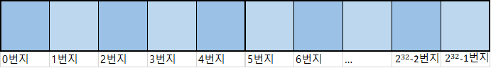
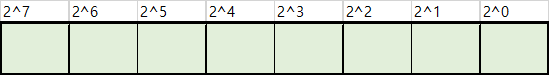
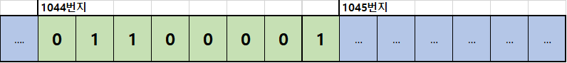

# C# 학습 1주차

## 목차

1.  **개요**
    1.  프로그램과 프로그래밍 언어
    2.  프로그래밍 언어의 분류
2.  **C# 기본 구조**
    1.  C#의 장점과 단점
    2.  가비지 컬렉터(Garbage Collector, GC)
    3.  C#의 기본 형식
    4.  C#의 기본 입출력 방법
3.  **C# 프로그램 생성 원리**
    1.  CLR과 중간 언어
4.  **자료형과 변수(Data Type & Variable)**
    1.  프로세스 메모리 구조
    2.  변수
    3.  값 형식과 참조 형식
    4.  C# 자료형의 종류
    5.  정수 자료형(Integer Type)
        1.  오버플로우(Overflow)와 언더플로우(UnderFlow)
    6.  문자 자료형(Character Type)
    7.  실수 자료형(Floating Point Type)
    8.  문자열 자료형(String Type)
    9.  논리 자료형(Boolean Type)
    10.  오브젝트 자료형(Object Type)
    11.  형변환(Type Conversion)
    12.  상수(Constant)
    13.  열거형(Enumeration Type)
    14.  Nullable 형식(Nullable Type)
    15.  var - 타입 추론 형식(Inference Type)
5.  **연산자(Operator)**
    1.  표현식이란?
    2.  연산자와 피연산자
    3.  전체 연산자 둘러보기
        1.  피연산자의 개수에 따라
        2.  연산자의 기능에 따라
    4.  연산자의 종류
        1.  대입 연산자(Assignment Operator)
        2.  산술 연산자(Arithmetic Operator)
        3.  증감 연산자(Increment/Decrement Operator)
        4.  관계 연산자(Relational Operator)
        5.  논리 연산자(Logical Operator)
        6.  비트 연산자(Bitwise Operator)
        7.  복합 대입 연산자(Additional Assignment Operator)
        8.  조건 연산자(Conditional Operator)
        9.  Null 관련 연산자(Null Type Operator)
        10.  그 밖의 연산자들
    5.  연산자 우선순위와 연산 방향

----

## 4. 자료형과 변수(Data Type & Variable)

### 4.1. 프로세스 메모리 구조

본 페이지에서 설명할 자료형과 변수는 모두 **데이터(Data)** 와 관련이 있는 문법 요소입니다.

그런데 컴퓨터에서 데이터는 **메모리(Memory)** 에 저장되기 때문에 메모리 구조를 이해해야 합니다.

게다가 C#은 객체지향 문법이며, **모든 데이터가 객체 형태**를 가지는데, 객체는 가지고 있는 구성 요소에 따라 크기(차지하는 메모리 공간)가 천차만별입니다.

그렇다 보니 크기가 큰 객체 데이터들은 일반적인 데이터들과는 조금 다른 저장 방식을 가지는데, 이를 알기 위해선 **스택** 과 **힙**에 대한 지식도 어느정도 필요합니다.

따라서 본 단락에서는 전체적인 메모리의 구조와 프로세스 메모리 중 **스택**과 **힙**에 대해 알아보겠습니다.

**메모리(Memory)**란 컴퓨터에서 데이터를 저장하는 장치입니다. 컴퓨터에는 다양한 저장 장치가 존재하지만, 앞으로 우리는 메모리 = RAM이라고 가정하고 설명을 진행하겠습니다.

**RAM(Random Access Memory)** 는 선형 구조(1차원 구조)를 가진 컴퓨터의 주 기억 장치이며, **메모리를 구성하는 각 바이트(Byte)별로 주소가 매겨져 있습니다.**



*(원칙적으로 메모리의 주소는 16진수로 표기하나, 편의상 지금은 10진수로 표기합니다.)*

그래서 메모리의 특정 위치를 찾을 때 가장 처음부터 순차적으로 찾아갈 필요 없이 해당 주소를 통해 바로 접근할 수 있죠. 이러한 특성 때문에 **임의의 위치(Random)에 바로 접근(Access)할 수 있는 메모리** 라는 이름을 가진 것입니다.

예를 들어서, 여러분의 컴퓨터에 4GB RAM이 장착되어 있다고 하면, 해당 메모리에는 0번지에서 2^32 -1번지까지의 주소가 순서대로 매겨져 있습니다.

(만약 비트, 바이트, 기가바이트 등 컴퓨터의 자료 저장 단위가 생소하다면 [부록.2](../../../C/1주차/Main_Text/7.부록.md)를 참고하세요.)

 

만약 여러분의 컴퓨터에 Windows OS **32bit** 가 설치되어 있다면 컴퓨터에 16GB RAM을 장착하더라도 메모리는 **0번지에서 2^32 -1 번지**까지밖에 사용할 수 없습니다. 반면 Windows OS **64bit** 가 설치되어 있다면 **0번지에서 2^64 -1번지**까지 사용할 수 있습니다.

(정확한 값이 아닙니다. 운영 체제 버전에 따라 이러한 차이가 왜 발생하는지는 추후에 **포인터**를 배우면 이해할 수 있습니다.)


그런데 이러한 **바이트(Byte)단위의 주소 관리**는 **운영체제가 메모리를 관리하는 단위**이고, 실제 컴퓨터는 바이트보다 더 작은 **비트(bit)** 단위로 데이터를 저장하거나 읽을 수 있습니다.



*(위의 숫자는 1바이트에 2진수가 저장될 시 각각의 자릿수를 의미합니다.)*

따라서 만약에 **메모리의 1044번지에 97이라는 값이 저장**되어 있을 경우, 아래와 같은 구조로 메모리가 구성되어 있을 것입니다.



여기까지 이해되셨다면 **메모리**에 대한 기초적인 이해가 완료된 것입니다.

그 다음은 **프로세스(Process)**에 대해 알아보겠습니다.

우리가 프로그램을 저장할 때 모든 프로그램을 주 기억 장치(RAM)에 저장하지는 않습니다. 왜냐하면 주 기억 장치는 용량이 작기 때문이죠.

대신 **보조 기억 장치(HDD, SSD 등)** 에 실행 파일을 저장하게 되는데, 보조 기억 장치는 접근 속도가 매우 느리므로 보조 기억 장치에 저장된 프로그램을 실행하면 해당 프로그램은 **RAM 위에 올라간 후 실행**되게 됩니다.

이 때 **RAM 위에 올라간 프로그램**을 **프로세스**라 합니다. 즉, **실행 중인 프로그램 = 프로세스** 라는 것이죠.

*(참고로 이러한 프로세스를 실행시키는 장치가 CPU이기 때문에 CPU를 **프로세서**라 부릅니다.)*

주 기억 장치 안에 프로그램이 탑재되어 프로세스가 되면 **프로세스는 자신에게 할당된 메모리 공간을 용도에 맞게 구분지어 사용**합니다.

우리가 34평 집에 산다고 가정할 때 **34평 전체를 하나로 쓰는 것이 아니라 일부는 화장실, 일부는 침실, 일부는 부엌 등으로 나누어 사용하는 것**과 같은 원리이죠.

프로세스는 자신에게 할당된 메모리 공간을 네 가지 공간으로 분할하는데, 각 분할 구역을 **세그먼트(Segment, 또는 그냥 동일하게 메모리라 부르기도 함)** 라 하며, 이 네 개의 세그먼트 중 **스택 세그먼트(Stack Segment)** 와 **힙 세그먼트(Heap Segment)** 가 존재합니다.

스택 세그먼트와 힙 세그먼트의 자세한 구조와 작동 원리는 자료구조 및 컴퓨터구조를 알아야만 이해할 수 있기에 간단히 설명하자면,

**스택 세그먼트**는 **작은 메모리 공간(이지만 접근 속도가 빠름)** 으로서 **크기가 작고 지역 범위를 가지는 데이터들을 저장**합니다.

반면 **힙 세그먼트**는 **큰 메모리 공간(이지만 접근 속도가 상대적으로 느림)** 으로서 **크기가 크고 넓은 범위를 가지는 데이터들을 저장**합니다.

정리하면 다음과 같습니다.

*   스택 세그먼트(스택 메모리) : 공간이 좁지만 접근 속도가 빠름. 크기가 작고 특정 영역에서만 사용되는 데이터들을 저장
*   힙 세그먼트(힙 메모리) : 공간이 넓지만 접근 속도가 느림. 크기가 크고 다양한 범위에서 사용되어야 하는 데이터들을 저장

프로그램이 실행될 때 메모리 공간을 나눠 쓰고, 그 중 스택과 힙이 있으며, 둘의 차이가 이러하다 는 정도까지 이해하셨다면 이번 단락에서 이해하셔야 할 내용을 전부 이해한 것입니다.

---

### 4.2. 변수

앞서 실행 중인 프로그램 데이터를 메모리에 저장한다고 했습니다.

그리고 메모리는 주소가 있어 특정 위치로 바로 접근할 수 있음도 배웠죠.

프로그램에서 데이터를 저장해야 할 때 내가 원하는 크기만큼 메모리를 사용하는 문법이 바로 **변수(Variable)** 입니다.

**변수는 각자 자기만의 이름을 가지고 있는데, 이 이름은 메모리 주소에 별칭을 붙여 준 것입니다.**

즉 **변수의 이름은 메모리 공간**에 대응되는 것이죠.

변수를 사용하겠다고 컴파일러에게 알리는 것을 **선언(Declaration)** 이라고 합니다.

변수의 선언은 다음과 같은 형태로 이루어집니다.

```c#
키워드 자료형 변수명;
```

이 때 변수명처럼 **코드 안에서 프로그래머가 지정할 수 있는 모든 이름**을 **식별자(Identifier)** 라고 합니다.

다음과 같은 요소들이 모두 식별자입니다.

*   변수명
*   필드명
*   메서드명
*   클래스명
*   네임스페이스명
*   기타 등등

이러한 식별자는 별도의 **명명 규칙(Notation)** 이 존재하는데, 다음과 같습니다.

*   영어 대소문자와 숫자, 그리고 밑줄기호`_`만 사용할 수 있다.
*   첫 글자에는 숫자가 올 수 없다.
*   공백 문자가 포함될 수 없다.
*   C **문법에서 이미 사용되는 용어(이들을 가리켜 예약어라 합니다)** 를 사용할 수 없다.

예약어에는 다음과 같은 것들이 있습니다.

*   main
*   for
*   while
*   var
*   int
*   short
*   double
*   const
*   그 외 기타

즉, 문법 용어로서 이미 쓰이는 단어들은 사용할 수 없다는 뜻입니다.

다음 예시 코드를 살펴보시면 식별자 명명 규칙을 쉽게 이해할 수 있습니다.

```c#
/*올바른 예시들*/
int a;
int _bb;
double aA13;
float GRAV1TY_;

/*올바르지 않은 예시들*/
short 1a;				// 첫 문자로 숫자가 올 수 없다.
int var;				// 예약어를 사용할 수 없다.
char while;				// 예약어를 사용할 수 없다.
const int const;		// 예약어를 사용할 수 없다.
int my arr;				// 공백 문자가 포함될 수 없다.
int 총합;					//영어 대소문자, 숫자, 밑줄기호 외 문자를 사용할 수 없다.
```

또, 식별자에서 대문자와 소문자는 서로 구분됩니다(대문자와 소문자의 ASCII Code가 다르니 당연하겠죠?)

```c
/*아래 네 변수는 모두 다 다른 변수이다.*/
int age;
int Age;
int aGe;
int AGE;
```

식별자를 명명하는 **규칙**은 정해져 있지만 식별자를 명명하는 **방식**은 개발자마다, 그리고 프로젝트마다 다 다릅니다.

다양한 식별자 명명 방식은 [부록.4](../../../C/1주차/Main_Text/7.부록.md)를 참고해보세요.

지금까지의 내용을 바탕으로 변수의 선언과 사용 방법을 코드로 살펴보면 다음과 같습니다.

```c#
int a;
a = 3;

Console.WriteLine(a);
```

위 코드에서 a라는 int자료형 변수를 선언한 후 해당 변수 안에 3을 저장하였습니다. 그 후 WriteLine 메서드로 3을 출력했습니다.

그런데 이 때 만약 a에 값이 저장되지 않은 상태에서 WriteLine메서드로 a를 출력하면 어떻게 될까요?

```c#
int a;

Console.WriteLine(a);
```

결과는 **아무도 모른다**입니다. 컴파일러에 따라 오류로 간주해 빌드가 불가하다고 판단하는 경우도 있으며, 값을 출력은 해 주지만 전혀 알 수 없는 값(이를테면 -442325823)이 출력되기도 합니다. 그리고 이 알수 없는 값은 프로그램 실행 시 마다 다른 값이 나오게 됩니다!

이처럼 변수를 선언한 후 값을 저장하지 않고 사용하게 될 때 나타나는 **예측 불가능한 값**을 **쓰레기값(Garbage Value - GC와는 관련 없음!)** 이라고 부릅니다.

쓰레기 값이 왜 생기는지는 한번 직접 고민해보세요! (고민 안하고 그냥 물어보셔도 됩니다)

아무튼, C# 문법에서는 이러한 쓰레기값의 위험성 때문에 선언 직후 입력을 통해 바로 값을 넣어주는 것이 아니라면 선언과 동시에 값을 넣어주는 것을 권장합니다.

이 때 선언과 동시에 값을 넣어주는 것을 **초기화(Initialize)** 라고 합니다.

초기화는 다음과 같은 형태로 진행합니다.

```c#
키워드 자료형 변수명 = 값;
```

예를 들면 다음과 같습니다.

```c#
char letter = 'T';
const short tell = 182;
int a = 33842123;
```

간단하죠? 이처럼 **선언 시 초기화를 진행하면 해당 변수에 쓰레기 값이 존재할 여지가 없으므로 안전한 코드를 작성할 수 있습니다.**

이번엔 변수를 사용하는 방법을 알아봅시다. 변수의 사용 방법은 무궁무진하고, 각각의 문법 시간마다 배우게 되므로 간단한 입출력, 그리고 변수와 변수 간에 값을 복사하는 방법만 간단히 살펴봅시다.

##### 1. Console.WriteLine

이미 알고 있겠지만 Console.WriteLine 메서드를 통해 변수 값을 출력할 때에는 다음과 같이 사용합니다.

```c#
Console.WriteLine(출력할 값);
```

##### 2. Console.ReadLine

C#의 입력 메서드는 대표적으로 **Console.ReadLine** 메서드가 있습니다(그 외에도 Console.Read 등이 있음).

```c
값을_저장할_변수 = Console.ReadLine();
```

ReadLine 메서드는 사용자가 입력한 값을 줄 단위로 받습니다. 즉, `Enter`를 입력하기 직전까지 입력한 모든 값(공백 문자, 즉 스페이스바 포함)을 한 번에 받는다는 것이죠. 또한 ReadLine은 **문자열(String)** 형태로 값을 입력받기 때문에 다른 데이터 형식으로 사용하고 싶다면 형변환을 거쳐야 합니다.

형변환은 다양한 방법이 있으나 다음과 같은 두 가지 방법을 사용합니다.

```c#
변수 = 변환할_자료형.Parse(변환할_값);

변수 = Convert.To변환할_객체자료형(변환할_값);
```

코드로 예를 들면 다음과 같습니다.

```c
string s = Console.ReadLine();

int a = int.Parse(s);		// 첫 번째 방법
int b = Convert.ToInt32(s);	// 두 번째 방법
```

##### 3. 변수 간의 값 복사

```c
int a = 3;
int b = a;

int c;
c = b;
```

초기화를 진행할 때 리터럴 상수를 저장하듯이 변수를 통해서도 초기화가 가능하며, 이렇게 초기화를 하게 되면 값을 주는 변수의 값이 **복사**되어 제공됩니다.

### 4.3. 값 형식과 참조 형식

C#에는 변수를 두 가지 형태로 분류할 수 있습니다.

첫 번째는 데이터가 자신이 저장할 값을 가지고 있는 **값(Value)** 형식이고, 두 번째는 데이터가 지신이 저장할 값을 가지고 있는 공간의 주소를 가지고 있는 **참조(Reference)** 형식입니다.

그림으로 표현하면 다음과 같습니다.


a라는 변수는 1024라는 정수 **값**을 저장합니다.

반면 변수 b는 1044라는 **주소**를 저장하고 힙 영역의 1044번지에는 82라는 정수 값이 저장되어 있습니다.

**힙 영역**은 이처럼 **스택에 있는 참조 변수를 통해서만 접근할 수 있습니다.** 즉 바로 접근이 가능한 스택과 달리 힙은 한 번의 접근 과정을 더 거쳐야 하는 것이죠.

이 때문에 아까 메모리에 대해 배울 때 힙 영역이 접근 속도가 상대적으로 느리다고 설명한 것입니다.


----

*(C) 2021. Im-Yongsik(Hamsik2rang) all rights reserved.*

<div style="text-align:left"> <a href="./3.C#_프로그램_생성_원리.md">← C# 프로그램 생성 원리</a><div/>
<div style="text-align:right"> <a href="./5.연산자.md">연산자 →</a><div/>


