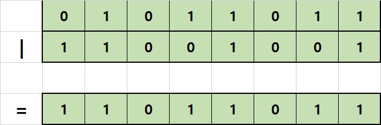
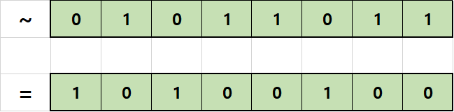
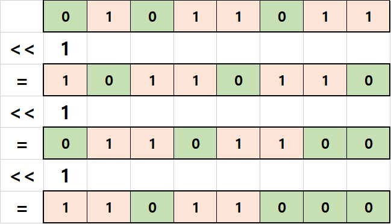

# C# 학습 1주차

## 목차

1.  **개요**
    1.  프로그램과 프로그래밍 언어
    2.  프로그래밍 언어의 분류
2.  **C# 기본 구조**
    1.  C#의 장점과 단점
    2.  가비지 컬렉터(Garbage Collector, GC)
    3.  C#의 기본 형식
    4.  C#의 기본 입출력 방법
3.  **C# 프로그램 생성 원리**
    1.  CLR과 중간 언어
4.  **자료형과 변수(Data Type & Variable)**
    1.  프로세스 메모리 구조
    2.  변수
    3.  값 형식과 참조 형식
    4.  C# 자료형의 종류
    5.  정수 자료형(Integer Type)
        1.  오버플로우(Overflow)와 언더플로우(UnderFlow)
    6.  문자 자료형(Character Type)
    7.  실수 자료형(Floating Point Type)
    8.  문자열 자료형(String Type)
    9.  논리 자료형(Boolean Type)
    10.  오브젝트 자료형(Object Type)
    11.  형변환(Type Conversion)
    12.  상수(Constant)
    13.  열거형(Enumeration Type)
    14.  Nullable 형식(Nullable Type)
    15.  var - 타입 추론 형식(Inference Type)
5.  **연산자(Operator)**
    1.  표현식이란?
    2.  연산자와 피연산자
    3.  전체 연산자 둘러보기
        1.  피연산자의 개수에 따라
        2.  연산자의 기능에 따라
    4.  연산자의 종류
        1.  대입 연산자(Assignment Operator)
        2.  산술 연산자(Arithmetic Operator)
        3.  증감 연산자(Increment/Decrement Operator)
        4.  관계 연산자(Relational Operator)
        5.  논리 연산자(Logical Operator)
        6.  비트 연산자(Bitwise Operator)
        7.  복합 대입 연산자(Additional Assignment Operator)
        8.  조건 연산자(Conditional Operator)
        9.  Null 관련 연산자(Null Type Operator)
        10.  그 밖의 연산자들
    5.  연산자 우선순위와 연산 방향

----

### 6.1. 표현식이란?

C# 관련해서 모르는 점이 있을 때 구글로 검색을 하다 보면 **'expression'**이라는 영단어를 자주 보게 됩니다.

**표현식(Expression)**이란 하나 이상의 연산자를 포함한 **문장(Statement)** 입니다.

간단히 예를 들어 살펴봅시다.

```c
int a = 3;				// 연산자 '='가 들어있으므로 표현식
int b = a + 3;			// 연산자 '=', '+'가 들어있으므로 표현식

Console.WriteLine(b);	// 어떠한 연산자도 들어있지 않으므로 표현식이 아님
```

앞으로 어떠한 연산을 하는 문장이 있다면, 그 문장을 표현식이라는 용어로 부르겠습니다.

---

### 6.2. 연산자와 피연산자

앞서 표현식에는 하나 이상의 **연산자**가 포함된다고 했습니다.

그렇다면 연산자란 무엇일까요?

**연산자(Operator)** 란 **하나 이상의 값을 정해진 기능(규칙)에 따라 변형해주는 요소**입니다. 이 때 **정해진 규칙**은 각 연산자마다 다르게 설정되어 있습니다.

이렇게 사전적 정의를 하지 않아도 직관적으로 연산자가 무엇인지 이해하실 것입니다.

```c
-a;
a + 3;
c = b * a;
c / 7;
a % 3;

a++;
b-=1;
a>b ? c : c - 1;
a, b, c
```

위 코드에 a, b, c, 상수, 그리고 세미콜론을 제외한 모든 기호가 바로 연산자입니다.

그리고 이 연산자를 통해 변형시킬 값을 **피연산자(Operand)** 라고 합니다.

연산자는 하나 이상의 피연산자를 가지게 되고, 연산자마다 필요로 하는 피연산자가 다르기 때문에 보통 연산자를 구분할 때에는 **연산자의 기능** 또는 피연산자의 개수에 따라 구분합니다.

----

### 6.4.  연산자의 종류

#### 1. 대입 연산자(Assignment Operator)

대입 연산자란, 오른쪽 피연산자의 값을 복사해 왼쪽에 대입 후 평가하는 연산자입니다.

```c
a = 3;
```

이 때 3이라는 값이 **복사되어** 왼쪽의 a에게 전달됩니다.

왼쪽 피연산자는 값을 전달받으므로 값의 저장이 가능한 **변수(거나 초기화되려는 const변수)** 여야 합니다.

다음과 같은 표현식은 올바르지 않습니다.

```c
4 = 3
```

4라는 정수 리터럴은 *물론 임시변수가 할당되어 있긴 하지만* 값을 저장할 수 없으므로 이 경우 에러가 나게 됩니다.

하나의 연산자 기호는 최대 양 옆에 두 개의 피연산자를 가지므로(삼항연산자는 두 개의 기호를 사용하므로 각각의 기호를 기준으로는 피연산자가 두 개입니다) 일반적으로 연산자의 **왼쪽 피연산자**를 **l-value(left value)** , **오른쪽 피연산자**를 **r-value(right value)** 라고 부릅니다.

따라서 대입 연산자의 경우 **l-value가 변수여야 합니다.**

#### 2. 산술 연산자(Arithmetic Operator)

**산술 연산자(Arithmetic Operator)** 는 이름 그대로 산술연산(사칙연산)을 수행하는 연산자이며, 다음과 같은 종류가 존재합니다.

| 기호 | 이름                         | 의미                                            |
| :--: | ---------------------------- | ----------------------------------------------- |
|  +   | 덧셈 연산자                  | 덧셈을 수행한 후 그 값을 평가한다               |
|  -   | 뺄셈 연산자                  | 뺄셈을 수행한 후 그 값을 평가한다               |
|  *   | 곱셈 연산자                  | 곱셈을 수행한 후 그 값을 평가한다               |
|  /   | 몫 연산자                    | 나눗셈을 수행한 후 그 결과의 몫을 평가한다      |
|  %   | 나머지 연산자(모듈로 연산자) | 나눗셈을 수행항 후 그 결과의 나머지를 평가한다. |

아까부터 등장한 **평가(Evaluate)** 라는 용어는 무슨 뜻일까요?

**평가**란, 연산자가 연산을 수행한 후 그 결과를 **반환**한다는 뜻입니다.

예를 들어 대입 연산자는 r-value를 l-value에 복사해 전달한 후 그 값을 반환합니다. 따라서 이런 코드가 허용됩니다.

```c#
int a = 3;
int b = 2;
int c = b = a;

Console.WriteLine(c);
```

세 번째 줄의 코드에서, b = a라는 연산이 수행된 후 그 결과인 3이 **평가(반환)** 됩니다. 그리고 이 값과 변수 c가 또 대입 연산자에 의해 대입 연산이 수행되므로 c에도 3이 복사된 후 그 값이 평가되죠.

따라서 위 코드를 실행하면 3이 출력됩니다.

일반적으로 연산자들은 각각의 연산 결과를 출력합니다(심지어 **컴마`,`연산자**마저도 그 결과를 평가합니다!)

마찬가지로, 모든 산술 연산자들은 값을 평가하므로 산술 연산을 수행하는 표현식을 대입 연산자를 통해 변수에 대입할 수 있습니다.

장황하게 쓰여 있지만 다음과 같은 코드가 가능하다는 뜻입니다.

```c#
int a = 3 - 2 * 4;
```

#### 3. 증감 연산자(Increment/Decrement Operator)

**증감 연산자(Incrememt/Decrememt Operator)** 란 단항 연산자로서 피연산자의 값을 1 증가/감소시키는 연산자입니다. 다만 산술 연산자와 달리 피연산자는 반드시 변수여야 합니다. 1 증가/감소시킨 값을 다시 저장해야 하기 때문이죠.

증감 연산자는 다음과 같습니다.

| 기호 | 이름        | 의미                            |
| :--: | ----------- | ------------------------------- |
|  ++  | 증가 연산자 | 피연산자의 값을 1 증가시킵니다. |
|  --  | 감소 연산자 | 피연산자의 값을 1 감소시킵니다. |

단순히 보기엔 굉장히 간단한 연산자 같지만, 프로그래밍을 처음 배우는 분들에게 매우 이해하기 어려운 연산자입니다. 왜냐하면 **증감 연산자는 피연산자의 앞에 붙을 수도 있고, 뒤에 붙을 수도 있는데 어디에 붙었냐에 따라 평가 결과가 달라지기 때문**입니다.

피연산자의 앞에 붙는 증감연산자를 **전위 증감 연산자(Prefix In/Dec Operator)** 라 합니다.

피연산자의 뒤에 붙는 증감연산자를 **후위 증감 연산자(Postfix In/Dec Operator)** 라 합니다.

표로 정리하면 다음과 같습니다.

|    기호    | 이름             | 의미                                             |
| :--------: | ---------------- | ------------------------------------------------ |
| ++피연산자 | 전위 증가 연산자 | 피연산자의 값을 1 증가시키고 그 값을 평가합니다. |
| --피연산자 | 전위 감소 연산자 | 피연산자의 값을 1 감소시키고 그 값을 평가합니다. |
| 피연산자++ | 후위 증가 연산자 | 피연산자의 값을 평가한 후 값을 1 증가시킵니다.   |
| 피연산자-- | 후위 증가 연산자 | 피연산자의 값을 평가한 후 값을 1 감소시킵니다.   |

예제 코드를 통해 확인해 보겠습니다.

```c#
int a = 3;
int b = 3;

int c = ++a;
int d = b++;

Console.WriteLine("c is " + c + ", d is " + d);
```

위 코드의 결과를 한번 예측해 보시기 바랍니다.

결과는 다음과 같습니다.

```c#
c is 4, d is 3
```

a와 b에 같은 값을 대입한 후 c와 d에 각각 a와 b에 증가 연산을 수행한 뒤 평가된 값을 대입했습니다.

그런데 c는 4이고 d는 3이 대입되었죠.

왜냐하면 전위 연산은 연산 후 평가를 진행하고, 후위 연산은 평가 후 연산을 진행하기 때문입니다.

여기까지 이해가 되셨다면 다음은 표현식 안에서 전위 연산과 후위 연산의 차이를 살펴보겠습니다.

```c#
int a = 4;
int b = 3;

int c = 5 + ++a - b++;

Console.WriteLine("c is "+ c +", a is " + a + ", and b is " + b);
```

위 코드의 결과를 한 번 스스로 생각해 본 뒤, 결과를 확인해 보시기 바랍니다.

결과는 다음과 같습니다.

```c
c is 7, a is 5, and b is 4
```

전위 연산은 연산을 수행 후 그 값을 평가하므로 위 코드에서 a는 1이 증가된 상태로 표현식에 포함됩니다.

그러나 후위 연산은 값을 평가 후 연산을 수행하므로 b는 표현식에 원래 값을 평가(제공)한 후 자신의 값을 증가시킵니다.

여기까지 정확히 이해하셨다면 전위 연산과 후위 연산의 마지막 차이를 살펴보겠습니다.

두 연산의 또 다른 차이점은 **후위 연산은 중복 연산이 불가능하다**입니다.

예를 들어, 전위 연산은 다음과 같은 연산 형태가 허용됩니다.

```c#
int a = 3;
++++a;

int b = 4;
------b;

int c = 5;
--++c;
```

여기서 각각의 연산은 다음과 같은 의미입니다.

```c#
++(++a);
--(--(--b));
--(++c);
```

그러나 후위 연산은 먼저 평가한 후 연산을 진행하는데, 후위 연산 여러개가 중복 적용될 경우 그 평가 결과를 예측할 수 없으므로 문법적으로 허용하지 않습니다.

즉, 아래와 같은 연산은 불가능합니다.

```c#
int a = 4;
a++++;
```

또, 후위 연산과 전위 연산은 함께 사용할 수 없습니다. 따라서 아래와 같은 연산은 불가능합니다.

```c#
int a = 5;
++a++;
```

여기까지 이해하셨다면 증감연산자의 사용법에 대해 완벽하게 이해한 것입니다. 축하합니다!

#### 4. 관계 연산자(Relational Operator)

**관계 연산자(Relational Operator)** 는 두 피연산자 사이의 비교를 수행하고 그 결과를 참/거짓으로 평가하는 연산자입니다.

관계 연산자는 다음과 같습니다.

| 기호 | 이름                    | 의미                                                         |
| :--: | :---------------------- | :----------------------------------------------------------- |
|  ==  | 같음 연산자             | 양쪽의 피연산자가 같은 값이라면 참(1)을, 다르다면 거짓(0)을 평가합니다. |
|  !=  | 같지 않음 연산자        | 양쪽의 피연산자가 다른 값이라면 참(1)을, 같다면 거짓(0)을 평가합니다. |
|  >   | 보다 큼 연산자          | l-value가 r-value보다 크면 참(1)을, 그렇지 않다면 거짓(0)을 평가합니다. |
|  <   | 보다 작음 연산자        | l-value가 r-value보다 작으면 참(1)을, 그렇지 않다면 거짓(0)을 평가합니다. |
|  >=  | 보다 크거나 같음 연산자 | l-value가 r-value보다 크거나 같으면 참(1)을, 그렇지 않다면 거짓(0)을 평가합니다. |
|  <=  | 보다 작거나 같음 연산자 | l-value가 r-value보다 작거나 같으면 참(1)을, 그렇지 않다면 거짓(0)을 평가합니다. |

기호의 형태에서 알 수 있듯이 수학의 등호, 부등호와 동일한 역할을 수행하는 연산자이나, 두 가지 주의해야 할 사항이 있습니다.

* 첫 번째로, 같음 연산자는 `=`가 두 개 연속으로 붙어 있는 형태라는 점입니다. **대입 연산자와 같음 연산자를 헷갈리지 않도록 조심해야 합니다.**

* C에서 **거짓(False)은 0으로 표현**되며, **0이 아닌 값은 모두 참(True)** 으로 표현됩니다.

둘 다 지금은 중요성이 크게 와닿지 않으나, 나중에 **조건문**에 대해 배우게 될 때 반드시 숙지해야 하는 내용입니다.

그 외에는 어려운 부분이 없으므로 간단히 코드로 살펴보고 넘어가겠습니다.

```c#
int a = 3 == 4;
int b = 0 != 1;

int c = a < b;

printf("%d = %d < %d", c, a, b);
```

출력 결과는 다음과 같습니다.

```c#
1 = 0 < 1
```

#### 5. 논리 연산자(Logical Operator)

**논리 연산자(Logical Operator)** 는 피연산자들의 참/거짓에 따른 결과를 평가하는 연산자입니다.

논리 연산자는 다음과 같습니다.

| 기호 | 이름       |                            의미                            |
| :--: | :--------- | :--------------------------------------------------------: |
| \|\| | OR 연산자  | 두 피연산자 중 하나라도 참이면 참, 그렇지 않으면 거짓 평가 |
|  &&  | AND 연산자 |    두 피연산자 모두 참이면 참, 그렇지 않으면 거짓 평가     |
|  !   | NOT 연산자 |          피연산자가 참이면 거짓, 거짓이면 참 평가          |

NOT 연산자는 단항 연산자(피연산자가 하나)이며, AND연산자와 OR연산자는 이항 연산자(피연산자가 둘)입니다.

간단히 코드로 살펴보겠습니다.

```c#
bool a = true;
bool b = false;
bool c = true;
bool d = false;

bool x = a || b;	// true || false = true
bool y = a && b;	// true && false = false
bool z = a && c;	// true && true = true
bool w = b || d;	//	false || false = false

bool notX = !x;		// not true = false
bool notY = !y;		// not false = true
```

논리 연산자는 단독적으로 사용하기보다는 조건문과 함께 사용하는 경우가 많지만, 논리 연산자의 연산 과정을 자세히 알면 논리 연산자만으로 조건문을 구현할 수 있습니다.

모든 논리 연산자는 왼쪽 피연산자의 값을 먼저 확인한 후 오른쪽 피연산자의 값을 확인합니다. 그러므로

**AND연산의 경우 하나라도 false라면 바로 false를 평가하기 때문에 왼쪽 피연산자가 false라면 오른쪽 피연산자는 값을 확인하지 않습니다.**

**OR연산의 경우 하나라도 true면 바로 true를 평가하기 때문에 왼쪽 피연산자가 ture라면 오른쪽 피연산자는 값을 확인하지 않습니다.**

이를 반대로 생각하면

**AND연산자는 왼쪽이 true라면 오른쪽을 반드시 확인해 보아야 합니다.**

**OR연산자는 왼쪽이 false라면 오른쪽을 반드시 확인해 보아야 합니다.**

따라서 이런 코드가 가능합니다.

```c#
int a = 3;
int b = 4;

(a > 2) && b++;
(a > 4) && b++;
```

위 코드에서 a는 2보다 크기 때문에 첫 번째 AND연산은 b++이라는 코드를 실행합니다.

그러나 a는 4보다는 작으므로 두 번째 AND연산의 b++은 실행하지 않습니다.

따라서 위 코드의 결과는 b의 값이 5가 됩니다.

이 과정이 이해되신다면 한번 다음 코드의 결과를 예측해 보시기 바랍니다.

```c#
int a = 0;
int b = 5;

a || b--;
a++ && b--;
a && b--;
a++ || b--;

Console.WriteLine("a is" + a + " and b is " + b);
```

답은 직접 코드를 작성해 확인해 보세요!

----

#### 6. 비트 연산자(Bitwise Operator)

**비트 연산자(Bitwise Operator)** 는 **비트 단위의 연산을 위한 연산자**입니다.

컴퓨터 안의 데이터는 비트 단위로 저장되지만 **운영체제는 바이트 단위로 주소를 관리하기 때문에 비트 하나하나를 세부적으로 수정하기 위해선 반드시 비트 연산을 사용해야만 합니다.**

비트 연산자는 다음과 같습니다.

| 기호 | 이름               | 의미                                                         |
| :--: | ------------------ | ------------------------------------------------------------ |
|  \|  | 비트 OR 연산자     | 두 값의 자릿수가 같은 각 비트를 비교해 하나라도 1이면 1, 그렇지 않으면 0으로 비트를 채운 결과를 평가합니다. |
|  &   | 비트 AND 연산자    | 두 값의 자릿수가 같은 각 비트를 비교해 둘 다 1이면 1, 그렇지 않으면 0으로 비트를 채운 결과를 평가합니다. |
|  ^   | 비트 XOR 연산자    | 두 값의 자릿수가 같은 각 비트를 비교해 두 비트가 서로 다른 값이면 1, 그렇지 않으면 0으로 비트를 채운 결과를 평가합니다. |
|  ~   | 비트 NOT 연산자    | 피연산자의 비트를 전체 반전시킨 후 그 값을 평가합니다.       |
|  >>  | 우측 시프트 연산자 | l-value의 모든 비트를 r-value만큼 오른쪽으로 자리이동 한 결과를 평가합니다. |
|  <<  | 좌측 시프트 연산자 | l-value의 모든 비트를 r-value만큼 왼쪽으로 자리이동 한 결과를 평가합니다. |

각 비트 연산을 이미지로 확인해 보겠습니다.

*   **비트 OR 연산자**

    


*   **비트 AND 연산자**

    


*   **비트 XOR 연산자**

    


*   **비트 NOT 연산자**

    


*   **좌측 시프트 연산자**

    


*   **우측 시프트 연산자**

    

위 그림은 1바이트 크기의 데이터들을 기준으로 비트연산을 수행한 결과를 나타낸 것입니다.

이 중 시프트 연산의 경우, **좌측으로 밀거나 우측으로 밀었을 때 새로 생기는 비트는 모두 0값을 가진다는 것**에 주의하세요.

위 그림만으로 비트 연산을 이해하신 분들도 있겠지만, 일반적으로 비트 연산자는 상당히 이해하기 어려운 연산자입니다. 그러니 그림으로 이해가 어려우시다면 부담 가지지 말고 언제든지 개인적으로 질문해주세요!

---

#### 7. 복합 대입 연산자(Additional Assignment Operator)

**복합 대입 연산자(Additional Assignment Operator)** 는 몇몇 연산자가 할당 연산자와 결합된 형태를 띕니다. 그리고 그 기능 역시 두 연산자가 결합된 것 처럼 기능합니다.

복합 대입 연산자는 다음과 같습니다.

| 기호 | 이름                    | 의미                                                         |
| :--: | ----------------------- | ------------------------------------------------------------ |
|  +=  | 덧셈 대입 연산자        | l-value의 값을 r-value에 더한 후 그 결과를 l-value에 대입합니다. |
|  -=  | 뺄셈 대입 연산          | l-value의 값을 r-value에서 뺀 후 그 결과를 l-value에 대입합니다. |
|  *=  | 곱셈 대입 연산자        | l-value의 값을 r-value에 곱한 후 그 결과를 l-value에 대입합니다. |
|  /=  | 몫 대입 연산자          | l-value의 값을 r-value로 나눈 몫을 l-value에 대입합니다.     |
|  %=  | 나머지 대입 연산자      | l-value의 값을 r-value로 나눈 나머지를 l-value에 대입합니다. |
| \|=  | 비트 OR 대입 연산자     | l-value와 r-value를 비트 OR 연산한 후 그 결과를 l-value에 대입합니다. |
|  &=  | 비트 AND 대입 연산자    | l-value와 r-value를 비트 AND 연산한 후 그 결과를 l-value에 대입합니다. |
|  ^=  | 비트 XOR 대입 연산자    | l-value와 r-value를 비트 XOR 연산한 후 그 결과를 l-value에 대입합니다. |
| <<=  | 좌측 시프트 대입 연산자 | l-value를 r-value만큼 좌측 시프트 연산한 후 그 결과를 l-value에 대입합니다. |
| >>=  | 우측 시프트 대입 연산자 | l-value를 r-value만큼 우측 시프트 연산한 후 그 결과를 l-value에 대입합니다. |

복합 대입 연산자는 다음 코드를 보면 매우 직관적으로 이해할 수 있습니다.

```c#
int a = 3;

a += 2;
a -= 2;
a *= 2;
a /= 2;
a %= 2;
a |= 2;
a &= 2;
a ^= 2;
a <<= 2;
a >>= 2;
//////////////////////////////////////
//위 코드는 아래 코드와 완전히 동치입니다.//
//////////////////////////////////////
a = a + 2;
a = a - 2;
a = a * 2;
a = a / 2;
a = a % 2;
a = a | 2;
a = a & 2;
a = a ^ 2;
a = a << 2;
a = a >> 2;
```

----

#### 8. 조건 연산자(Conditional Operator)

**조건 연산자(Conditional Operator)** 는 연산자 중 유일한 **삼항 연산자(Tenary Operator - 피연산자가 세 개)** 이기 때문에 삼항 연산자라고 부르기도 합니다.

조건 연산자는 다음과 같습니다.

| 기호 | 이름        | 의미                                                         |
| ---- | ----------- | ------------------------------------------------------------ |
| ?:   | 관계 연산자 | 왼쪽 표현식(피연산자)의 결과가 참이라면 중간 표현식(피연산자)를, 그렇지 않다면 마지막 표현식(피연산자)를 반환합니다. |

즉, 다음과 같습니다.

```c#
표현식?표현식이_true일때_리턴할_값:표현식이_false일때_리턴할_값;
```

예시 코드로 살펴보겠습니다.

``` C#
int a = 3;

int b = a > 2 ? 4 : 1;				// b = 4
bool c = a > 5 ? true : false;		// c = false
```

a는 2보다 크므로 조건 연산자는 **중간에 위치한 피연산자인 4를 평가**합니다. 따라서 b에는 4가 대입됩니다.

그러나 a는 5보다 작으므로 조건 연산자는 **마지막 피연산자인 false를 평가**합니다. 따라서 c에는 false가 대입됩니다.

다음 코드는 실제 조건 연산자를 사용하는 예시입니다.

```c#
using System;

namespcae Conditional
{
	class Example
    {
		int a = 3, b = 5, c = 2;
        int max = a;
        int min = a;
        
        max = max < b ? b : max;
        max = max < c ? c : max;
        
        min = min > b ? b : min;
        min = min > c ? c : min;
        
        Console.WriteLine("최댓값 : " + max);
        Console.WriteLine("최솟값 : " + min);
    }
}
```

출력 결과는 다음과 같습니다.

```c#
최댓값 : 5
최솟값 : 2
```

이 정도면 조건 연산자를 이해하는 데 충분하실 거라 생각합니다.

----

#### 9. Null 관련 연산자

**Null 관련 연산자들**은 Nullable 변수 또는 객체 자료형과 함께 사용되는 조금 특수한 연산자입니다.

Null 관련 연산자들은 다음과 같습니다.

| 기호   | 이름             | 의미                                                         |
| ------ | ---------------- | ------------------------------------------------------------ |
| ??     | Null 병합 연산자 | l-value가 null값을 가진다면(비어있다면) r_value를, 그렇지 않다면 l-value를 반환합니다. |
| ?. ?[] | Null 조건 연산자 | 피연산자가 null값을 가진다면(비어있다면) null을, 그렇지 않다면 지정된 멤버를 반환합니다. |

Null 조건 연산자는 클래스에 대해 이해해야 알 수 있으므로, 지금은 Null 병합 연산자만 살펴보겠습니다.

Null병합 연산자는 다음처럼 사용합니다.

```c#
객체변수 ?? 값;
```

참고로 객체변수란 null값을 가질 수 있는 모든 변수(객체, nullable) 모두를 의미합니다.

예시 코드로 살펴보겠습니다.

```c#
int? a = null;
Console.WriteLine(a ?? 0);

string s = "hello";
Console.WriteLine(s ?? "bye");
```

nullable int 자료형 변수 a는 null값을 가지고 있으므로 0을 평가합니다.

그러나 문자열 자료형 변수 s는 "hello"라는 값을 가지고 있으므로 "bye" 대신 s의 값 "hello"를 평가합니다.

따라서 출력 결과는 다음과 같습니다.

```c#
0
hello
```

---

#### 10. 그 밖의 연산자들

그 밖에도 C#에는 다양한 연산자가 있으나, 모두 객체 자료형에 사용되기 때문에 지금 당장은 배우지 않고 클래스를 배운 후 알아보겠습니다.

## 5.5. 연산자 우선순위

한 표현식에 서로 다른 연산자들이 함께 등장하는 경우 어떤 연산부터 먼저 수행해야 할까요?

이처럼 **연산자들이 섞여 있을 때 어떤 연산부터 진행해야 하는지에 대한 규칙**이 바로 **연산자 우선순위** 입니다.

C#의 연산자 우선순위는 다음과 같습니다.

| 우선순위 | 종류                                  | 연산자             |
| :------: | ------------------------------------- | ------------------ |
|    0     | **괄호 연산자**                       | ()                 |
|    1     | 후위 증감 연산자 및 Null조건부 연산자 | 후위++/--  ?.  ?[] |
|    2     | 전위 증감 연산자                      | ++/--전위          |
|    3     | 산술 연산자                           | * / %              |
|    4     | 산술 연산자                           | + -                |
|    5     | 시프트 연산자                         | >> <<              |
|    6     | 관계 연산자                           | > >= < <=          |
|    7     | 관계 연산자                           | == !=              |
|    8     | 비트 논리 연산자                      | &                  |
|    9     | 비트 논리 연산자                      | ^                  |
|    10    | 비트 논리 연산자                      | \|                 |
|    11    | 논리 연산자 - NOT                     | !                  |
|    12    | 논리 연산자 - AND                     | &&                 |
|    13    | 논리 연산자 - OR                      | \|\|               |
|    14    | Null 병합 연산자                      | ??                 |
|    15    | 조건 연산자                           | ?:                 |
|    16    | 콤마 연산자                           | ,                  |
|    17    | 할당 연산자                           | =                  |

연산자 우선순위는 프로그래밍을 자주 하면서 연산 실수를 겪다 보면 알아서 외워지고, 또 숙련된 프로그래머도 헷갈리는 경우가 많으니 일부러 외우실 필요는 없습니다.

우선순위가 헷갈리신다면 간편하게 괄호`()` 연산을 사용하면 해결되기 때문입니다.

참고로, 동일한 연산자가 수식에 여러 개 존재한다면, **할당 연산자를 제외한 모든 연산자는 왼쪽->오른쪽 형태의 우선순위를 가집니다.**

----

*(C) 2021. Im-Yongsik(Hamsik2rang) all rights reserved.*

<div style="text-align:left"> <a href="./4.자료형과_변수.md">← 자료형과 변수</a><div/>
<div style="text-align:right"> <a href="">마지막 페이지</a><div/>


