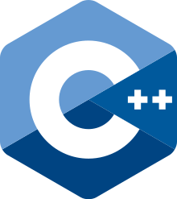

# C++ 학습 페이지

    

이곳은 C++ 프로그래밍 언어 학습을 원하는 참여자들을 위한 C++ 학습 페이지입니다.

학습 페이지는 매주 토요일마다 업데이트됩니다.

## 학습 목표

본 페이지의  학습 목표는 다음과 같습니다.

*   언어의 기본적인 문법과 원리, 학습
*   객체지향 원리 학습
*   기본 자료구조와 STL(Standard Template Library) 사용 방법 학습
*   모던 C++ 학습
*   기초적인 쓰레드 프로그래밍 학습

## 학습 로드맵

**학습 대상의 특성 상 알고리즘을 위한 문법보다 프로그래밍(설계)을 위한 문법 위주로 학습 로드맵이 구성되었습니다.**  

**만약 기초 알고리즘의 학습을 원하는 경우, [C 학습 페이지](../C)에서 학습이 가능합니다.**

|      주차       | 주제                                                      | 학습 목표                                                    |
| :-------------: | :-------------------------------------------------------- | :----------------------------------------------------------- |
|      1주차      | C++ 기본 구조와 입출력 변수와 상수, 자료형 연산자 | * C++과 다른 언어(특히 C)의 차이점, C++의 기본 구조와 C++로 코딩한 프로그램이 실행 파일로 생성되는 과정을 알아봅니다. * C++의 기본적인 입출력 방법에 대해 알아봅니다. * C++의 기본 자료형 및 고정 너비 자료형, 그 외 다양한 자료형에 대해 알아봅니다. * C++ STL에 포함된 기본 컨테이너 std::string에 대해 알아봅니다. * C++의 연산자에 대해 알아봅니다. |
|      2주차      | 조건문과 제어문                                           | * 프로그램 흐름 제어를 위한 조건문과 제어문에 대해 알아봅니다. * C++의 출력 스트림 cin의 구조와 다양한 사용법에 대해 알아봅니다. |
|      3주차      | 배열과 포인터 기본 컨테이너                           | * 동일한 자료형의 여러 데이터를 한번에 묶어 사용할 수 있는 배열에 대해 알아봅니다. * 기본 메모리 구조와 주소의 개념에 대해 알아봅니다. * 포인터 문법에 대해 알아봅니다. * C++의 새로운 동적 할당 방식인 new와 delete에 대해 알아봅니다. * C++ STL에 포함된 기본 컨테이너 std::array와 sd::vector에 대해 알아봅니다. |
|      4주차      | 네임스페이스와 함수                                       | * C++의 변수 영역과 네임스페이스에 대해 알아봅니다 * C++의 함수에 대해 알아봅니다. * 인라인 함수(Inline Function)에 대해 알아봅니다. * 동일 이름의 함수를 다양한 시그니처로 정의하는 함수 오버로드에 대해 알아봅니다. * 함수를 포인터로 가리키는 함수 포인터와 콜백 함수의 개념에 대해 알아봅니다. |
|      5주차      | 객체지향 기초와 클래스                                    | * 객체지향의 의미와 용어들에 대해 알아봅니다. * 객체지향 패러다임의 원칙에 대해 알아봅니다. * 클래스와 클래스에 사용되는 문법들을 알아봅니다. * 생성자와 소멸자에 대해 알아봅니다. |
|      6주차      | 연산자 오버로딩                                           | * 객체 간의 연산을 가능하게 해 주는 연산자 오버로드에 대해 알아봅니다. * 연산자 오버로딩을 직접 구현해봅니다. |
|      7주차      | 상속과 다형성 객체 간 관계                            | * 객체 간의 상속에 대해 알아봅니다. * 객체지향의 다형성 원칙에 대해 알아봅니다. * 추상 클래스와 이를 정의하기 위한 가상 함수에 대해 알아봅니다. * 가상 함수의 원리와 가상 테이블에 대해 알아봅니다. * 객체들 사이의 대표적 관계인 구성/집합/제휴/의존 관계를 각각 살펴보고 차이를 알아봅니다. |
|      8주차      | 제네릭 프로그래밍과 템플릿                                | * 타입에 얽매이지 않는 제네릭 프로그래밍(일반화 프로그래밍)의 개념에 대해 알아봅니다. * C++에서 제네릭 프로그래밍 구현을 위한 템플릿(Template) 문법에 대해 알아봅니다. |
|      9주차      | 예외 처리, 파일 입출력, 그리고 스마트 포인터          | * C++의 예외 처리 문법에 대해 알아봅니다. * 스트림의 의미와 구조, C++의 스트림 객체와 이를 통한 파일 입출력에 대해 알아봅니다. * 메모리 누수를 해결하기 위한 스마트 포인터에 대해 알아봅니다. |
| 10주차 <완> | STL과 모던 C++요소,  쓰레드 프로그래밍                | * 지금까지 살펴보지 않은 다양한 STL에 대해 간단히 살펴봅니다. * 지금까지 살펴보지 않은 모던 C++의 다양한 문법들에 대해 알아봅니다. * 쓰레드 프로그래밍에 대해 알아봅니다. * 기초 게임 서버 프로그래밍(TCP/IP 네트워크 프로그래밍)에 대해 실습해봅니다. |
