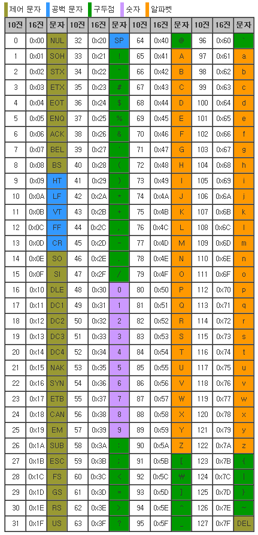

# C 학습 1주차

## 목차

1.  **개요**
    1.  프로그램과 프로그래밍 언어
    2.  프로그래밍 언어의 분류
    
2.  **C 기본 구조**
    1.  C의 장점과 단점
    2.  C의 구성 요소
    3.  C의 기본 형식
    4.  C의 기본 입출력 방법
    5.  주석
    
3.  **C 프로그램 생성 원리**
    
    1.  실행 파일 생성 과정
    
4.  **자료형(Data Type)**
    1.  메모리(Memory)란?
    2.  컴퓨터의 양수/음수 구별 방법
    3.  컴퓨터의 정수/문자 구별 방법
        1.  ASCII Code란?
    4.  컴퓨터의 실수 표현 방법
    5.  자료형의 종류
        1.  정수 자료형(Integer Type)
            1.  오버플로우(Overflow)와 언더플로우(Underflow)
        2.  문자 자료형(Character Type)
        3.  실수 자료형(Floating Point Type)

    6.  자료형의 크기를 알 수 있는 sizeof 연산자

5.  **상수와 변수(Constant & Variable)**

    1.  상수와 변수의 차이
    2.  상수
        1.  진법 기초
        2.  리터럴 상수(Literal)
            1.  정수 리터럴
            2.  문자 리터럴
            3.  실수 리터럴
            4.  문자열 리터럴
        3.  매크로 상수
        4.  const 변수
    3.  변수
        1.  변수의 이름 - 식별자(Identifier)
        2.  변수 선언과 초기화
        3.  변수의 사용 방법

6.  **연산자(Operator)**
    1.  표현식이란?
    2.  연산자와 피연산자
    3.  전체 연산자 둘러보기
        1.  피연산자의 개수에 따라
        2.  연산자의 기능에 따라
    4.  연산자의 종류
        1.  대입 연산자(Assignment Operator)
        2.  산술 연산자(Arithmetic Operator)
        3.  증감 연산자(Increment/Decrement Operator)
        4.  관계 연산자(Relational Operator)
        5.  논리 연산자(Logical Operator)
        6.  비트 연산자(Bitwise Operator)
        7.  복합 대입 연산자(Additional Assignment Operator)
        8.  조건 연산자(Conditional Operator)
        9.  그 밖의 연산자들
    5.  연산자 우선순위와 연산 방향
        1.  연산자 우선순위
        2.  연산 방향

7.  **알고 계셨나요?🤓(부록)**
    1.  2021년 가장 많이 사용되는 프로그래밍 언어 Top 10.
    2.  컴퓨터의 기본 자료 저장 단위
    3.  컴퓨터에서 음수를 표현하는 세 가지 방법
    4.  부동 소수 표기법
    5.  다양한 코딩 스타일과 코드 컨벤션(Code Convention)

---

## 4. 자료형(Data Type)

### 4.1. 메모리(Memory)란?

자료형이라는 문법을 정확히 알려면 반드시 **메모리(Memory)** 에 대한 이해가 필요합니다.

본 단락에서는 컴퓨터의 메모리의 개념과 구조에 대해 아주 간략하게나마 알아보겠습니다(추후 다시 한 번 메모리에 대해 설명하겠지만, 자세한 구조는 컴퓨터공학 교육과정의 **컴퓨터구조**시간에 배울 수 있습니다).

**메모리(Memory)**란 컴퓨터에서 데이터를 저장하는 장치입니다. 컴퓨터에는 다양한 저장 장치가 존재하지만, 앞으로 우리는 메모리 = RAM이라고 가정하고 설명을 진행하겠습니다.

**RAM(Random Access Memory)** 는 선형 구조(1차원 구조)를 가진 컴퓨터의 주 기억 장치이며, **메모리를 구성하는 각 바이트(Byte)별로 주소가 매겨져 있습니다.**


*(원칙적으로 메모리의 주소는 16진수로 표기하나, 편의상 지금은 10진수로 표기합니다.)*

그래서 메모리의 특정 위치를 찾을 때 가장 처음부터 순차적으로 찾아갈 필요 없이 해당 주소를 통해 바로 접근할 수 있죠. 이러한 특성 때문에 **임의의 위치(Random)에 바로 접근(Access)할 수 있는 메모리** 라는 이름을 가진 것입니다.

예를 들어서, 여러분의 컴퓨터에 4GB RAM이 장착되어 있다고 하면, 해당 메모리에는 0번지에서 2^32 -1번지까지의 주소가 순서대로 매겨져 있습니다.

(만약 비트, 바이트, 기가바이트 등 컴퓨터의 자료 저장 단위가 생소하다면 [부록.2](./7.부록.md)를 참고하세요.)

또한 운영체제(OS)마다 메모리를 관리하는 방식이 다릅니다. 

만약 여러분의 컴퓨터에 Windows OS **32bit** 가 설치되어 있다면 컴퓨터에 16GB RAM을 장착하더라도 메모리는 0번지에서 2^32 -1 번지까지밖에 사용할 수 없습니다. 반면 Windows OS **64bit** 가 설치되어 있다면 0번지에서 2^64 -1번지까지 사용할 수 있습니다.

(정확한 값이 아닙니다. 운영 체제 버전에 따라 이러한 차이가 왜 발생하는지는 추후에 **포인터**를 배우면 이해할 수 있습니다.)


그런데 이러한 바이트(Byte)단위의 주소 관리는 운영체제가 메모리를 관리하는 단위이고, 실제 컴퓨터는 바이트보다 더 작은 **비트(bit)** 단위로 데이터를 저장하거나 읽을 수 있습니다.


*(위의 숫자는 1바이트에 2진수가 저장될 시 각각의 자릿수를 의미합니다.)*

따라서 만약에 **메모리의 1044번지에 97이라는 값이 저장**되어 있을 경우, 아래와 같은 구조로 메모리가 구성되어 있을 것입니다.


여기까지 이해가 되셨다면 앞으로의 내용을 이해하기 위한 기본적인 메모리 구조 개념이 파악된 것입니다.

----

### 4.2. 컴퓨터의 양수/음수 구별법

컴퓨터에서는 모든 데이터를 0과 1의 집합인 비트(bit)로 표현합니다. 그 말은 **모든 정수(뿐만 아니라 모든 데이터)는 2진수 형태로 저장**된다는 뜻입니다.

그렇다면 컴퓨터는 저장된 2진수가 양수인지 음수인지 어떻게 구별할 수 있을까요?

바로 **1바이트의 가장 최상위 비트를 부호를 표기하는 데 사용**함으로써 양수와 음수를 구별합니다.

1바이트는 8비트로 이루어져 있는데, 이 8개의 비트 중 가장 앞(가장 큰 자릿수) 비트의 값이 0이면 양수를, 1이면 음수를 표현하기로 한 것이죠.

*(이처럼 1바이트 내의 비트들 중 가장 앞의 비트를 **MSB(Most Significant Bit)** 라고 하며, 반대로 가장 뒤의 비트를 **LSB(Least Significant Bit)** 라고 합니다.)*

그럼 위에서 예시로 들었던 **97**을 -97로 표현하려면 어떻게 해야 할까요?

97을 2진수로 나타내면

```c
0100 0001 // 97
```

이므로, 맨 앞의 비트만 1로 바꿔서

```c
1100 0001
```

로 표기하면 -97이겠죠?

**아닙니다.** 음수/양수 표기를 위해 MSB를 사용하는 것은 맞지만, MSB만 수정한다고 양수/음수 전환이 일어나지는 않습니다.

이처럼 MSB만 뒤집으면 음수/양수 전환이 일어나는 형태의 표기를 **부호화 절대치** 라고 하는데, 컴퓨터에서는 이 방법이 그다지 효율적이지 못하므로 **2의 보수(2's Complement)** 라는 조금 다른 표기법을 사용합니다.

2의 보수는 쉽게 말해서, 음수로 바꾸고자 하는 양수가 있을 때 해당 양수의 모든 비트를 뒤집고(0이면 1로, 1이면 0으로) 1을 더해주어 음수를 나타내는 표기법입니다.

결국 97은 다음처럼 -97로 표시됩니다.

```c
0100 0001 // 97
    
1011 1110 // 97의 비트 반전
    
1000 1111 // 97의 비트 반전값에 +1. 이 결과가 -97을 나타내는 값임.
```

(만약, 이러한 보수 표현의 원리와 왜 이런 식의 표기를 하는지 조금 더 깊게 알아보고 싶다면 [부록.3](./7.부록.md)을 확인해보세요.)

반대로, 음수를 양수로 전환하고 싶다면 앞서 한 연산을 역으로 진행하면 되겠죠? 스스로 -97을 다시 97로 바꿔 보면서 차근차근 이해해 보시기 바랍니다.

----

### 4.3. 컴퓨터의 정수/문자 구별법

컴퓨터는 모든 데이터를 2진수 형태로 저장하기 때문에, 문자 데이터('A', 'B', 'z' 등) 역시 2진수 형태로 저장됩니다.

그 말은 각각의 문자를 서로 다른 정수들에 **대응(매핑, Mapping)** 시킨 후 대응되는 정수들을 이용한다는 뜻입니다.

예를 들어서 제가 A라는 알파벳 문자를 나타내기 위해 A를 67이라는 정수에 대응시킨다고 생각해 봅시다.

scanf 함수를 이용해 키보드로 A를 입력하면 프로그램은 A를 67의 2진수 형태로 저장시키겠죠?

마찬가지로 B를 68에, C를 69에, ... 이렇게 하나씩 대응시켜서 문자를 저장하는 것입니다.

그런데, 모든 프로그래머들이 다들 자신이 원하는 정수에 문자를 대응시킨다면 각각의 프로그램마다 파일을 열었을 때 안에 들어있는 문자들이 제각각일 것입니다.

다음과 같은 상황을 상상해봅시다.

>   프로그래머 A는 H를 47, E를 44, L을 51, O를 54로 대응시킨다고 가정하고 프로그램을 작성한다.
>
>   프로그래머 B는 H를 47, U를 44, R을 51, Y를 54로 대응시킨다고 가정하고 프로그램을 작성한다.

이 때 A가 만든 프로그램에서 저장한 데이터 파일을 B가 만든 프로그램에서 불러오게 되면

```c
"HELLO"
```

라는 문자열이

```c
"HURRY"
```

라는 문자열로 표현되게 됩니다. *(혹시 여기서 문자열이 문자 데이터들의 연속된 형태로 표현된다는 걸 알아챈 분은 정말 탁월한 컴퓨터 센스를 보유하고 계신 겁니다!)* 

이러면 문제가 생기겠죠? 그래서 컴퓨터과학자들은 문자와 정수의 대응 규칙을 표로 만들고 이를 표준화했는데 그게 바로 **ASCII Code**입니다.

#### 1. ASCII Code

**ASCII Code(아스키 코드)** 란 앞서 보았듯이 문자를 정수로 대응시키는 표준화된 규칙입니다.

최초의 ASCII Code는 127개의 문자를 대응시키는 규칙이었으나, 컴퓨터에서 표현할 수 있는 문자들이 많아지면서 확장되기도 하고, 다양한 표준 규칙들이 제정되었습니다. 255개의 문자를 대응시키는 ASCII Code를 확장 ASCII Code라고 부릅니다. 다만 저희들은 최초의 ASCII Code만 살펴보도록 하겠습니다.



*위처럼 아스키 코드들을 한데 모아 표로 만든 것을 **아스키 테이블(ASCII Table)** 이라고 부릅니다.*

아스키 테이블을 보면 확인할 수 있지만 **A(대문자 a)는 65에 대응**시키도록 되어 있고 **h(소문자 h)는 104에 대응**시키도록 되어 있습니다. **모든 프로그램과 프로그래밍 언어들은 이 ASCII Code를 기준으로 문자를 표현/저장**합니다.

여기서 한가지 눈여겨 볼 것은 아스키 테이블 안에 **0~9의 값이 존재**한다는 것입니다

우리가 숫자 형태의 값을 입력할 때, 정수 0과 문자 '0'은 완전히 다른 데이터입니다.

정수 0의 값은 말 그대로 0입니다. 그러나 문자 '0'의 값은 48입니다.

이 차이를 정확히 인지하고 계시기 바랍니다.

+참고로 한국어와 같은 영어가 아닌 문자의 경우 아스키 코드가 아닌 **유니코드(UNICODE)** 라는 **2바이트** 문자 코드에 대응되어 있어서, 한글 문자를 저장하려면 2바이트를 사용해야 합니다.

---

### 4.4. 컴퓨터의 실수 표현 방법

지금까지 컴퓨터에서 정수, 문자 데이터를 저장하고 표현하는 방법을 알아봤습니다.

그렇다면 실수는 어떻게 표현할까요? 언뜻 보기에는 숫자형 데이터이므로 정수와 동일하게 저장하면 될 거라고 생각할 수 있습니다.

그런데 실수에는 정수와 달리 **소수점`.`** 이 있기 때문에 정수와 동일하게 표기를 하는 데에는 무리가 있음을 짐작할 수 있습니다.

이를 해결하기 위해 컴퓨터과학자들이 여러 방법을 고안했는데, 그 중에는 이런 방법도 존재합니다.

>   실수는 2바이트 이상으로 저장하기로 하고, 두 바이트의 경계를 소수점으로 생각하자!

그림으로 보면 다음과 같은 형태입니다.


상당히 합리적인 표현 같지만, 사실 문제가 존재합니다. 위의 경우 소수점 이상의 크기가 최대 127까지밖에 표현되지 못하므로(7개의 비트로 가질 수 있는 최댓값이 127이기 때문입니다), 만약에 

```c
12834456829.024439002175
```

같은 큰 수를 표현하려면 굉장히 많은 메모리 공간을 낭비해야 한다는 것입니다.

그래서 결론적으로 이러한 표기법을 사용하지 않고, **부동소수점(Floating-Point)** 표기법을 사용합니다.

**부동소수점을 사용하면 4바이트를 사용해 최대 1.99999... x 2^127까지의 값을 표기할 수 있습니다.**

그러나 부동소수점이라 할지라도 완전한 무리수를 표현할 수는 없기 때문에 **컴퓨터에서는 필연적으로 실수 저장 시 오차가 발생**합니다.

이 특징은 나중에 조건문을 배울 때 중요하게 다뤄 보겠습니다.

(부동소수점에 대해 자세히 알고 싶다면 [부록.4](./7.부록.md)를 확인하세요.)

----

### 4.5. 자료형의 종류

이제 다양한 형태의 데이터들이 컴퓨터에서 어떻게 저장되고 표현되는지 이해했으니, C언어의 자료형에 대해 알아봅시다.

자료형이란 우리가 프로그램에서 값을 저장하기 위해 메모리를 사용할 때 어떤 형태의 자료를 얼마만큼의 크기의 메모리에 저장할지 컴파일러에게 알려주는 키워드입니다.

예를 들어 아래 코드는

```c
int a;
```

**'4바이트 크기의 정수를 저장하기 위한 메모리가 필요한데, 그 메모리의 시작 주소에 a라는 이름을 붙여서 사용하겠다'** 라고 컴파일러에게 알리는 것입니다.

이 때 **int**가 바로 4바이트 정수 자료형입니다.

C의 자료형은 다음과 같은 종류가 존재합니다.

<부호 있는 자료형>

| 자료형                       | 형태(Type) | 크기(32bit 컴파일러 기준) |                       표현 범위                        |
| ---------------------------- | :--------: | :-----------------------: | :----------------------------------------------------: |
| **char**                     | 문자(정수) |           1Byte           |                       -128 ~ 127                       |
| *signed* **short** *int*     |    정수    |           2Byte           |                    -32,768 ~ 32,767                    |
| *signed* **int**             |    정수    |           4Byte           |             -2,147,483,648 ~ 2,147,483,647             |
| *signed* **long** *int*      |    정수    |           4Byte           |             -2,147,483,648 ~ 2,147,483,647             |
| *signed* **long long** *int* |    정수    |           8Byte           | -9,223,372,036,854,775,808 ~ 9,223,372,036,854,775,807 |
| **float**                    |    실수    |           4Byte           |              ±3.4 ×10^-37 ~ ± 3.4 × 10^38              |
| **double**                   |    실수    |           8Byte           |            ±1.7 ×10^-307이상 ± 3.4 × 10^308            |
| **long double**              |    실수    |        8Byte 이상         |                      double 이상                       |

<부호 없는 자료형>

| 자료형                       | 형태(Type) | 크기(32bit 컴파일러 기준) |     표현 범위     |
| ---------------------------- | :--------: | :-----------------------: | :---------------: |
| **unsigned char**            | 문자(정수) |           1Byte           |      0 ~ 255      |
| **unsigned short** *int*     |    정수    |           2Byte           |    0 ~ 65,535     |
| **unsigned int**             |    정수    |           4Byte           | 0 ~ 4,294,967,295 |
| **unsigned long** *int*      |    정수    |           4Byte           | 0 ~ 4,294,967,295 |
| **unsigned long long** *int* |    정수    |           8Byte           |   0 ~ 2^64 - 1    |

참고로 *이탤릭체*로 표기된 키워드는 생략 가능합니다.

눈여겨 보아야 할 것은 각 자료형별로 범위가 있다는 것입니다. 표현 범위는 해당 자료형으로 선언된 변수(메모리 공간)에 들어갈 수 있는 최댓값과 최솟값입니다.

정확히 말하면 **해당 크기의 변수 안에 들어갈 수 있는 모든 정수/실수 값들을 원소로 하는 집합**입니다.

이제 각 자료형들을 형태에 따라 살펴봅시다.

#### 1. 정수 자료형(Integer Type)

정수를 표현하기 위한 자료형은 앞서보았듯이 다음과 같습니다.

| 자료형                       | 형태(Type) | 크기(32bit 컴파일러 기준) |                       표현 범위                        |
| ---------------------------- | :--------: | :-----------------------: | :----------------------------------------------------: |
| *signed* **short** *int*     |    정수    |           2Byte           |                    -32,768 ~ 32,767                    |
| *signed* **int**             |    정수    |           4Byte           |             -2,147,483,648 ~ 2,147,483,647             |
| *signed* **long** *int*      |    정수    |           4Byte           |             -2,147,483,648 ~ 2,147,483,647             |
| *signed* **long long** *int* |    정수    |           8Byte           | -9,223,372,036,854,775,808 ~ 9,223,372,036,854,775,807 |
| **unsigned short** *int*     |    정수    |           2Byte           |                       0 ~ 65,535                       |
| **unsigned int**             |    정수    |           4Byte           |                   0 ~ 4,294,967,295                    |
| **unsigned long** *int*      |    정수    |           4Byte           |                   0 ~ 4,294,967,295                    |
| **unsigned long long** *int* |    정수    |           8Byte           |                      0 ~ 2^64 - 1                      |

##### 1. 오버플로우(Overflow)와 언더플로우(Underflow)

정수 자료형에서 주의해야 할 점은, 최댓값보다 더 큰 값을 저장하거나 최솟값보다 더 작은 값을 저장하면 의도하지 않은 값이 저장될 수 있다는 점입니다.

예를 들어 short 크기 공간에 32,767을 할당한 후 1을 증가시킨다고 합시다(아직 변수와 연산자를 배우지 않았지만 직관적으로 이해해 주세요.)

```c
#include <stdio.h>

int main()
{
    short val = 32767;
    val = val + 1;
    printf("%d", val);
    
    return 0;
}
```

"32,767에 1을 더했으니 32,768이 출력되겠군" 이라고 생각하실 수 있으나, 실제 위 코드를 따라 친 후 빌드를 해 보면 

```c
-32768
```

이 출력됩니다. 왜일까요?

왜냐하면 이는 메모리 구조와 관련이 있습니다.

32,767이 저장된 val의 상태는 다음과 같습니다.


여기서 1을 더해주게 되면 다음 값이 됩니다.


위 값은 **2의 보수로 표현된 -32,768**입니다.

즉, 1을 더함으로써 부호 비트의 값을 변경해 버렸기 때문에 음수의 최솟값이 되어 버린 것이죠.

이는 부호 없는 정수형도 마찬가지입니다.

```c
#include <stdio.h>

int main()
{
    unsigned short val = 65535;
    val = val + 1;
    printf("%d", val);
    
    return 0;
}
```

위 코드의 출력 결과는 다음과 같습니다.

```c
0
```

마찬가지로 부호 없는 2바이트 정수형이 가질 수 있는 최솟값으로 변했습니다.

역시 메모리 구조로 살펴보면


에서 1을 더해줄 때


val에 할당된 메모리를 벗어난 곳에 1이 더해지고 나머지 값은 전부 0이 되어버렸기 때문에 0을 가지게 되는 것입니다.

이와 같은 현상을 **오버플로우(Overflow)**라고 합니다.

반대로, 최솟값에서 값을 빼서 최댓값으로 바뀌는 것은 **언더플로우(Underflow)**라고 합니다.

언더플로우에 대한 코드는 한번 스스로 작성해 보면서 실험해 보시기 바랍니다.

#### 2. 문자 자료형(Character Type)

앞서 살펴본 문자 자료형은 다음과 같습니다.

| 자료형            | 형태(Type) | 크기(32bit 컴파일러 기준) | 표현 범위  |
| ----------------- | :--------: | :-----------------------: | :--------: |
| **char**          | 문자(정수) |           1Byte           | -128 ~ 127 |
| **unsigned char** | 문자(정수) |           1Byte           |  0 ~ 255   |

ASCII Code를 통해 문자가 저장되므로 정수 자료형 변수에 문자 데이터를 저장합니다. 다만 아스키 코드는 최대 1Byte크기인데 이를 int나 long long같은 큰 공간에 저장하면 메모리가 낭비되겠죠? 따라서 문자 데이터를 저장할 정수 자료형 `char`는 1바이트의 최소 크기를 가지도록 되어있습니다.

그렇다면 만약 한국어 문자 `가`와 같이 2바이트 크기 정수에 대응되는 문자는 어떻게 저장해야 할까요?

1.  문자는 정수 코드로 표현하므로 정수 자료형에 저장한다.
2.  한국어 문자는 2Byte이다.
3.  그러므로 2Byte 정수형에 저장한다.

라는 논리에 따라 2Byte 정수 자료형 **unsigned short**에 저장하게 됩니다.

그런데 이 경우 다음과 같은 문제가 있을 수 있습니다.

```c
unsigned short ko_character = 44032;
```

위 코드는 정수 44,032를 저장하려는 의도일까요? 아니면 '가'라는 한글 문자를 지정하려는 의도일까요?

이처럼 **일반적인 정수 자료형과 문자 자료형을 두 가지 용도로 혼용해 쓰면 코드의 가독성이 저하**됩니다. 따라서 C 언어에서는 2바이트 크기의 글자를 저장하기 위해 `wchar_t`라는 자료형을 지원합니다.

```c
unsigned short integer_value = 44032;
wchar_t ko_character = '가';
```

와 같이 사용하는 것이지요.

위 예시와 마찬가지로 **char 자료형 역시 근본적으로 정수 자료형이긴 하지만 코드 가독성을 위해서 문자를 저장하기 위한 용도로만 사용하는 것을 권장**합니다.

#### 3. 실수 자료형(Floating Point Type)

실수 자료형은 다음과 같습니다.

| 자료형          | 형태(Type) | 크기(32bit 컴파일러 기준) | 표현 범위                        |
| --------------- | ---------- | ------------------------- | -------------------------------- |
| **float**       | 실수       | 4Byte                     | ±3.4 ×10^-37 ~ ± 3.4 × 10^38     |
| **double**      | 실수       | 8Byte                     | ±1.7 ×10^-307이상 ± 3.4 × 10^308 |
| **long double** | 실수       | 8Byte 이상                | double 이상                      |

실수 자료형은 부동소수점 형태로 값을 저장하기 때문에 float와 double이 **표현할 수 있는 범위** 뿐만 아니라 **정밀도**에도 차이가 존재합니다.

*   float의 경우 **소수점 이하 6자리**까지 정확하게 표현 가능하며 그 이후 자릿수에서는 오차가 발생합니다.

*   double의 경우 **소수점 이하 15자리**까지 정확하게 표현 가능하며 그 이후 자릿수에서는 오차가 발생합니다.
*   long double의 경우 **소수점 이하 최소 15자리, 최대 33자리**까지 정확하게 표현 가능하며 그 이후 자릿수에서는 오차가 발생합니다.

### 4.6. 자료형의 크기를 알 수 있는 sizeof 연산자

코드를 작성하다 보면 가끔 자료형의 크기(또는 변수의 크기)를 알고 싶을 때가 있습니다.

sizeof 연산자는 피연산자로 주어지는 자료형 또는 변수의 Byte단위 크기를 제공합니다.

sizeof 연산자는 다음과 같이 사용합니다.

```c
sizeof(자료형_또는_변수);
```

예시 코드로 살펴보겠습니다.

```c
#include <stdio.h>

int main()
{
    int a;
    
    printf("short 자료형의 크기 = %dByte\nint 변수 a의 크기 = %dByte", sizeof(short), sizeof(a));
    
    
    return 0;
}
```

위 코드의 출력 결과는 다음과 같습니다.

```c
short 자료형의 크기 = 2Byte
int 변수 a의 크기 = 4Byte
```

단순히 자료형이나 변수 크기를 확인하는 것 뿐만 아니라 추후 배열 등의 문법에서 자주 사용되니 꼭 알아 둡시다.

----

*(C) 2021. Im-Yongsik(Hamsik2rang) all rights reserved.*

<div style="text-align:left"> <a href="./3.C_프로그램_생성_원리.md">← C 프로그램 생성 원리</a><div/>

<div style="text-align:right"> <a href="./5.상수와_변수.md">상수와 변수 →</a><div/>