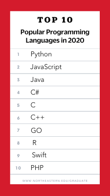

# C 학습 1주차

## 목차

1.  **개요**
    1.  프로그램과 프로그래밍 언어
    2.  프로그래밍 언어의 분류
2.  **C 기본 구조**
    1.  C의 장점과 단점
    2.  C의 구성 요소
    3.  C의 기본 형식
    4.  C의 기본 입출력 방법
    5.  주석
3.  **C 프로그램 생성 원리**
    
    1.  실행 파일 생성 과정
4.  **자료형(Data Type)**
    1.  메모리(Memory)란?
    2.  컴퓨터의 양수/음수 구별 방법
    3.  컴퓨터의 정수/문자 구별 방법
        1.  ASCII Code란?
    4.  컴퓨터의 실수 표현 방법
    5.  자료형의 종류
        1.  정수 자료형(Integer Type)
            1.  오버플로우(Overflow)와 언더플로우(Underflow)
        2.  문자 자료형(Character Type)
        3.  실수 자료형(Floating Point Type)

    6.  자료형의 크기를 알 수 있는 sizeof 연산자
5.  **상수와 변수(Constant & Variable)**
1.  상수와 변수의 차이
    2.  상수
        1.  진법 기초
        2.  리터럴 상수(Literal)
            1.  정수 리터럴
            2.  문자 리터럴
            3.  실수 리터럴
            4.  문자열 리터럴
        3.  매크로 상수
        4.  const 변수
    3.  변수
        1.  변수의 이름 - 식별자(Identifier)
        2.  변수 선언과 초기화
        3.  변수의 사용 방법
6.  **연산자(Operator)**
    1.  표현식이란?
    2.  연산자와 피연산자
    3.  전체 연산자 둘러보기
        1.  피연산자의 개수에 따라
        2.  연산자의 기능에 따라
    4.  연산자의 종류
        1.  대입 연산자(Assignment Operator)
        2.  산술 연산자(Arithmetic Operator)
        3.  증감 연산자(Increment/Decrement Operator)
        4.  관계 연산자(Relational Operator)
        5.  논리 연산자(Logical Operator)
        6.  비트 연산자(Bitwise Operator)
        7.  복합 대입 연산자(Additional Assignment Operator)
        8.  조건 연산자(Conditional Operator)
        9.  그 밖의 연산자들
    5.  연산자 우선순위와 연산 방향
        1.  연산자 우선순위
        2.  연산 방향
7.  **알고 계셨나요?🤓(부록)**
    1.  2021년 가장 많이 사용되는 프로그래밍 언어 Top 10.
    2.  컴퓨터에서 음수를 표현하는 세 가지 방법
    3.  부동 소수 표기법
    4.  다양한 코딩 스타일과 코드 컨벤션(Code Convention)

---

## 7. 알고 계셨나요?🤓(부록)

### 7.1. 2021년 가장 많이 사용되는 프로그래밍 언어 Top 10.

미국의 NorthEastern University의 조사에 따르면, 2021년 가장 많이 사용되는(정확히는 북미 기준 가장 **일자리가 많은!**) 프로그래밍 언어 Top 10은 다음과 같다고 합니다.

10위 언어 중 C는 5위에 랭크된 것을 확인할 수 있습니다.

그 외의 언어들을 간략히 소개하자면(제가 아는 만큼만 소개하므로 빠지거나 올바르지 않은 부분이 있을 수 있습니다.)

#### 1. Python

파이썬은 굉장히 간단한 문법 구조를 자랑하는 프로그래밍 언어이며, 컴파일러를 통해 번역되는 언어가 아니라 **인터프리터(Interpreter)라는 장치를 활용한 대화식 프로그래밍을 지원하는 언어**입니다. 이는 컴파일 언어가 모든 명령들을 작성한 후 한번에 실행시키는 것이 아니라 명령 한 줄 한줄을 실시간으로 입력과 동시에 실행하는(마치 컴퓨터와 인간이 대화를 주고받듯이) 프로그래밍 언어의 형태를 가지고 있다는 의미입니다.

단순히 언어의 구조가 쉬운 것만이 장점이 아니라, **매우 많은 라이브러리**(혹시 아직 라이브러리 라는 용어에 대해 들어보지 못하셨다면, 저희 학습 페이지 주차가 진행되면서 곧 소개될 것이니 걱정하지 마세요!)를 가지고 있으며, 이를 바탕으로 **굉장히 넓은 분야에 광범위하게 사용될 수 있다는 장점**을 가지고 있습니다.

대표적으로 파이썬이 사용되는 분야는 다음과 같습니다.

*   데이터 과학
*   인공지능
*   웹 어플리케이션
*   웹 서버
*   금융
*   자연과학 및 공학
*   데스크탑/웹 어플리케이션

반면 **느린 언어 처리 속도** 때문에 다음과 같은 분야에는**대체로** 적합하지 않습니다.

*   모바일 어플리케이션
*   임베디드(초소형 컴퓨터)
*   **게임**(모든 분야에 그런 것은 아님!)

### 2. JavaScript

자바스크립트는 프로그래밍을 위해 탄생한 언어가 아닌, 웹 페이지에 다양한 기능들을 부가적으로 구현하기 위한 용도로 탄생한 '스크립트 언어'입니다. 그러나 매우 빠른 개발 속도와 사용 빈도 때문에 점점 진화해 이제는 많은 개발자들이 사용하는(특히 **웹 분야라면 사용할 수 밖에 없는**) 언어가 되었습니다.

게임 개발의 관점에서도, 웹 브라우저에서 구동되는 **웹 게임** 개발에 사용되는 주요 언어 중 하나입니다.

### 3. Java

**프로그래밍 언어 계의 블루 칼라(Blue Color)라는 별명을 가진 자바**는, 말 그대로 안 쓰이는 곳이 없을 정도로 광범위한 용도와 팬층을 보유한 언어입니다.

특히, **대한민국에서 가장 많이 사용되는 언어**가 바로 이 Java인데요, Java는 대표적으로 다음과 같은 분야에 사용됩니다.

*   안드로이드 애플리케이션
*   웹 서버
*   데스크톱 애플리케이션

Java는 성능 이슈(정확히는 속도)에서 강점을 드러내지는 못하지만, 이따금 자바를 통해 게임을 개발하는 경우도 있으며, 자바를 이용해 개발된 대표적인 게임은 **마인크래프트(Minecraft)** 가 있습니다.

### 4. C#

JAVA의 포지션을 노리고 **마이크로소프트社가 개발**한 C#은 일반적으로 **Windows OS에 최적화**된 Java라고 평가받기도 합니다. 

C/C++과 유사한 문법 구조를 지닌 Java라는 평가를 벗어날 수 없었던 C#은, **유니티 엔진(Unity Engine)** 이라는 게임 엔진의 인기에 힘입어 단숨에 게임 개발을 위한 최적의 언어로 자리매김하게 되었습니다. 

게다가 앞서 말했듯이 마이크로소프트가 개발하여 Windows에 최적화되어 있다는 말은 **게임을 플레이하는 유저들이 일반적으로 어떤 운영체제를 사용하는지** 생각해본다면 그 강력함을 이해할 수 있습니다.

C#은 대표적으로 다음과 같은 분야에서 사용됩니다.

*   **게임(Unity Engine을 이용한 개발)**
*   윈도우 애플리케이션
*   웹 서버
*   웹 애플리케이션

### 5. C

C언어는 1972년 데니스 리치 선생님이 UNIX 운영체제 개발을 위해 발명한 언어입니다. **특정 하드웨어에 종속되지 않으면서도 하드웨어의 세밀한 부분까지 제어할 수 있다는 독보적인 강점**을 가지고 있기 때문에, **성능과 최적화 이슈를 우선적으로 다루는 분야**에서 특히 사랑받는 언어입니다.

C는 대표적으로 다음과 같은 분야에서 사용됩니다.

*   임베디드(초소형 컴퓨터)
*   커널 개발(운영체제 프로그래밍)
*   **게임**
*   하드웨어 기반 공학(기계공학, 로봇공학 등)
*   정보보안
*   기타 하드웨어 관련 개발

### 6. C++

C언어에 객체지향 원칙과 문법을 추가한 C++은, 탄생 당시만 해도 객체지향 원칙 구현이 가능한 개량형 C언어 정도의 지위였으나, 모던 C++(C++11 및 그 이후) 문법들이 속속 추가되면서 프로그래밍 언어계의 거대한 괴물들 중 하나가 되었습니다.

객체지향 언어들 중 **비교를 불허하는 복잡한 문법**은 많은 입문자들을 좌절시키지만, **객체지향 패러다임에 입각한 프로그래밍이 가능하면서도 C와 비슷한 수준의 속도와 최적화를 자랑한다는 강점**은 그 어떤 분야보다도 **게임 개발**에 적합한 특징입니다.

C++은 대표적으로 다음과 같은 분야에서 사용됩니다.

*   **게임**
*   컴퓨터 그래픽스(CG)
*   인공지능
*   정보보안
*   네트워크

### 9. Swift

나머지 언어들을 건너뛰면서도 스위프트를 소개하는 이유는 이 언어만이 가진 **독자적인 포지션** 때문입니다.

앞서 C#이 마이크로소프트社에 개발되어 Windows OS에 최적화된 언어라고 소개했듯이, **Swift는 Apple社에 의해 개발되어 iOS, Mac OS에 최적화된 언어**입니다.

따라서 만약 본인이 **아이폰 앱 프로그래밍 또는 맥OS 애플리케이션을 개발**하고자 한다면, 어떠한 대안을 찾을 생각은 접어두고 Swift를 익혀야 할 것입니다.

### 7.2 컴퓨터에서 음수를 표현하는 세 가지 방법

-작성 예정-

### 7.3. 부동 소수 표기법

-작성 예정-

### 7.4 코딩 스타일과 코드 컨벤션(Code Convention)

-작성 예정-

----

*(C) 2021. Im-Yongsik(Hamsik2rang) all rights reserved.*

 <a href="./1.개요.md">← 개요</a>

 <a href="./3.C_프로그램_생성_원리.md">C 프로그램 생성 원리 →</a>

