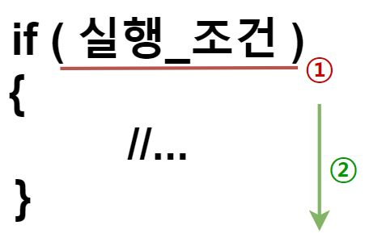
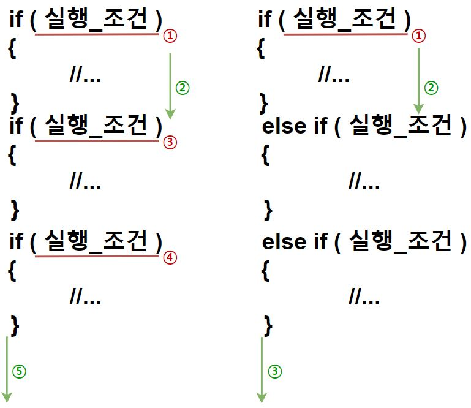
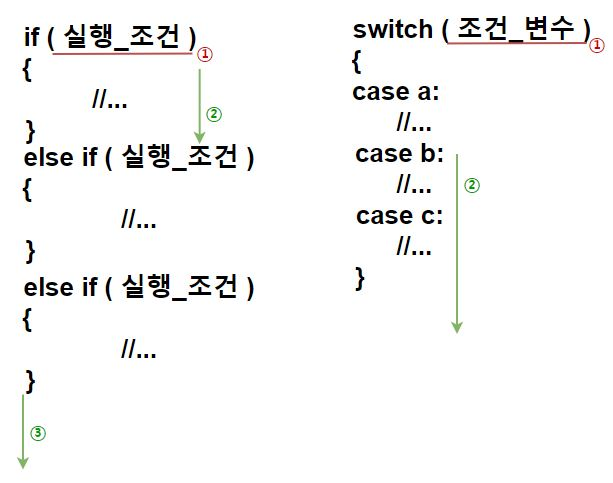

# C 학습 2주차

## 목차

1.  **개요**
    1.  흐름 제어(Flow Control)란?
    2.  C의 흐름 제어 문법 살펴보기
2.  **조건문(Conditional Statemen)**
    1.  if
        1.  if의 사용법과 의미
        2.  if ~ else if
        3.  if ~ else
        4.  if ~ else if ~ else
        5.  중첩 if
    2.  switch
        1.  switch의 사용법과 의미
        2.  break와 default
        3.  Fallthrough(의도적인 non-breaking)
    3.  조건문 사용 시 주의사항
3.  **반복문(Iteration Statement)**
    1.  블록(Block)과 범위
    2.  for
        1.  for의 사용법과 의미
        2.  for의 구성 요소
        3.  for의 동작 원리와 순서
        4.  중첩 for
    3.  while
        1.  while의 사용법과 의미
        2.  while의 구성 요소
        3.  while의 동작 원리와 순서
        4.  중첩 while
    4.  do-while
        1.  do-while의 사용법과 의미
        2.  do-while의 구성 요소
        3.  do-while의 동작 원리와 순서
    5.  무한 루프(Infinity Loop)
    6.  반복문 사용 시 주의사항
4.  **분기문(Branch Statement)**
    1.  분기문의 역할과 필요한 이유
    2.  break
    3.  continue
    4.  return
    5.  goto
        1.  goto의 사용법과 의미
        2.  사용을 권장하지 않는 이유

---

## 1. If

### 1.1. If의 사용법과 의미

이번 페이지에는 C에서 제공하는 조건문들에 살펴보며, 그 중 이번 단락에서는 **if 조건문**에 대해 알아보겠습니다.

**if**는 단어 그대로 **만약 특정 조건이 참이라면** 지정된 코드들을 수행합니다.

**if**는 다음과 같은 형태로 사용됩니다.

```c
if(실행_조건)
{
    //code
}
```

if라는 키워드 뒤에 함수처럼 괄호를 작성한 뒤, 괄호 안에 실행 조건을 작성합니다. 이 때 실행 조건은 **참(!0)/거짓(0)** 으로 구분되는 조건을 제공합니다. 그 다음 조건이 참일 때 실행할 코드를 작성하는데, 중괄호를 이용해 코드를 감싸 블록을 지정합니다.

예를 들면 다음과 같습니다.

```c
int score = 88;

if(score > 90)
{
    printf("%c", 'A');
}
if(score > 80)
{
    printf("%c", 'B');
}
//...
```

score라는 변수에 88을 할당한 후 첫 번째 if문에서 score가 90보다 큰지를 관계연산자를 통해 판단합니다.

score의 값은 90보다 작거나 같으므로 안의 코드가 실행되지 않습니다.

그 다음 if문에서 score가 90보다 큰지 판단하는데, 이 때는 score의 값이 80보다 크므로 안의 코드가 실행됩니다. 따라서 출력 결과는 다음과 같습니다.

(참고로, 이처럼 if 여러개를 동시에 사용하는 것을 **다중 if**라고 합니다.)

```c
B
```

이처럼 if문은 주어진 실행 조건의 참/거짓에 따라 조건이 참일 경우 블록 안의 명령들을 수행합니다.

여기까지 이해됐다면, 다음 코드를 보고 실행 결과를 예상해봅시다.

```c
#include <stdio.h>

int main()
{
    int score = 92;
    
    if(score > 90)
    {
        printf("%c", 'A');
    }
    if(score > 80)
    {
        printf("%c", 'B');
    }
    if(score > 70)
    {
        printf("%c", 'C');
    }
    if(score > 60)
    {
        printf("%c", 'D');
    }
    if(score < 60)
    {
        printf("%c", 'F');
    }
    
    return 0;
}
```

어떤 출력 결과가 나타날까요?

답은 아래와 같습니다.

```c
ABCDF
```

위 코드는 출력이 단순히 'A' 하나만 나타나기를 기대하며 작성한 것 처럼 보이지만 출력 결과는 그렇지 않습니다.

왜 이런 일이 일어날까요?

여러 if문이 사용되었을 때 한 if문이 수행된다고 해서 나머지 if가 수행되지 않는 것은 아닙니다.

즉, 첫 번째 if가 수행되고 나서도 그 아래 존재하는 if들의 조건이 전부 참이므로 나머지 if가 모두 수행되어 모든 출력 함수가 실행되는 것이죠.

이처럼 의도와 다른 수행을 막고 싶다면 실행 조건을 더욱 자세하게 밝히는 방법이 있습니다.

```c
int score = 92;

if(score > 90 && score <= 100)
{
    printf("%c", 'A');
}
if(score > 80 && score <= 90)
{
    printf("%c", 'B');
}
if(score > 70 && score <= 80)
{
    printf("%c", 'C');
}
if(score > 60 && score <= 70)
{
    printf("%c", 'D');
}
if(score > 0 && score <= 60)
{
    printf("%c", 'F');
}
```

이처럼 **각 if의 조건이 겹치지 않도록 자세히 밝히면 한 if가 수행될 때 다른 if가 수행되지 않을 테니** 원하는 의도대로 프로그램이 실행되도록 할 수 있습니다.

그런데 이처럼 조건을 자세히 설정하는 방식은 다음과 같은 **단점**이 존재합니다.

*   조건을 자세히 설정하는 것이 생각만큼 쉽지 않다.
*   다른 if의 안에 들어있는 코드가 수행되지 않을 뿐 if의 실행 조건 판단은 이루어진다.

**첫 번째 단점**은 말 그대로 조건을 자세히 설정하는 것만으로는 항상 원하는 대로 프로그램이 실행되도록 보장할 수 없습니다. 프로그래머도 사람이다 보니 조건 설정 과정에서 실수를 할 수도 있고, 데이터가 굉장히 세밀하게 분류된다면 그만큼 조건이 복잡해지니 조건을 수립하는 것 자체가 힘든 일이 될 수 있습니다.

**두 번째 단점**은 if의 동작 원리를 조금 자세히 들여다보아야 알 수 있습니다. 먼저 if의 동작 순서를 한번 살펴봅시다.



프로그램은 수행 도중 if문을 만나면 첫 번째로 실행 조건의 참/거짓을 판단합니다.

그리고 조건이 참이라면 안의 내용을 수행합니다.

여기서 알 수 있는 사실은, 안의 내용이 수행되지 않더라도 일단 실행 조건의 참/거짓은 판단한다는 것입니다.

따라서 위 코드의 경우 첫 번째 if문만이 수행되는 것처럼 보이지만 사실은 두 번째 이후의 if문들도 실행 조건의 판단은 이루어진다는 뜻입니다.

그렇다면 실행 조건마저도 판단하지 않도록 하려면 어떻게 해야 할까요?

### 1.2. if ~ else if

C의 if 문법은 if 외에도 **else if**라는 문법을 지원합니다.

**else if**는 영단어 해석 그대로 **이전 조건이 참이 아닐 때 만약 또다른 조건이 참일 경우** 지정된 코드들을 수행합니다.

**else if**는 다음과 같은 형태로 사용됩니다.

```c
if(실행_조건_1)
{
    //...
}
else if(실행_조건_2)
{
    //...
}
```

else if가 위의 다중if와 다른 점은 if~ else if 중의 한 조건이 참이어서 수행된다면 이후 조건문들은 평가조차 하지 않는다는 점입니다.

다중 if와 if~else if의 차이를 수행 순서로 비교해 보겠습니다.



**동일한 구문을 다중 if와 if~else if로 각각 구현할 경우, 연산 횟수는 각각 5회와 3회가 됩니다.**

따라서, **각 조건들이 종속적이라면(한 조건이 참일 경우 다른 조건이 거짓이라면) 다중 if 대신 if~else if를 사용하는 것이 효율적**입니다.

### 1.3. if ~ else

그런데, 지금까지 살펴본 다중if와 if~else if는 모두 **가질 수 있는 상태가 여러 개**일 때 사용하기에 적합한 방법입니다.

그러나 조건 중에는 다음처럼 단 두 가지 상태만을 가지는 경우도 많습니다.

*   공주대학교 학생인가?
*   대한민국 국적을 가지고 있는가?
*   평균 학점이 3.5 이상인가?

이렇게 **예/아니오**로 조건을 나눌 수 있다면 else if처럼 실행 조건을 또 적어주지 않고 **else**를 이용할 수 있습니다.

**else**는 다음과 같은 형태로 사용됩니다.

```c
char isKorean = 0;

if(isKorean)
{
    //...
}
else
{
    //...
}
```

isKorean이라는 변수(참/거짓을 나타내는 용도)의 값이 0이 아닐 경우 if 안의 문장이 수행되지만, 그렇지 않다면 바로 else 안의 문장을 수행합니다.

### 1.4. if ~ else if ~ else

else는 else if와 함께 쓰일 수 있습니다. 따라서 if 조건문은 **if ~ else if ~ else** 형태를 가질 수 있습니다.

```c
unsigned short score = 46;
char grade = '\0';

if(score >= 90)
{
    grade = 'A';
}
else if(score >= 80)
{
    grade = 'B';
}
else if(score >= 70)
{
    grade = 'C';
}
else
{
    printf("재수강하세요~");
}
```

위 코드는 score가 if와 else if의 조건들 중 어느 조건들도 만족하지 못하므로 결국 else 안의 코드가 실행됩니다.

## 2. Switch

### 2.1. switch의 사용법과 의미

앞서 if 조건문을 살펴보며 프로그램 내에서 조건에 따라 프로그램 실행을 제어하는 방법을 살펴보았습니다.

그런데 C에는 if 외에도 **switch**라는 문법이 존재합니다.

switch는 다음과 같이 사용합니다.

```c
switch(조건_변수)
{
    case a:
        //...
    case b:
        //...
    case c:
        //...
}
```

위 코드처럼 switch는 하나의 변수가 어떤 값을 가지냐에 따라 다른 코드가 실행됩니다. 이 때 값을 가질 수 있는 값들을 **case label(레이블)**로 표시합니다.

다음 코드를 예시로 살펴봅시다.

```c
int x;
scanf("%d", &x);

switch(x)
{
    case 1:
        printf("x는 1입니다.\n");
    case 2:
        printf("x는 2입니다.\n");
    case 3:
        printf("x는 3입니다.\n");
}
```

x가 1일 때, 2일 때, 3일 때 실행되는 코드를 다르게 설정하였고, 이를 case로 구분하고 있습니다.

사용자가 x에 3을 입력한 경우, 다음과 같이 출력됩니다.

```c
x는 3입니다.
```

switch의 형태에 대해 살펴 보았으므로 다음은 if와 switch의 차이를 알아봅시다.

### 2.2. break와 default

앞서 보았던 예시 코드를 다시 한 번 살펴봅시다.

```c
int x;
scanf("%d", &x);

switch(x)
{
    case 1:
        printf("x는 1입니다.\n");
    case 2:
        printf("x는 2입니다.\n");
    case 3:
        printf("x는 3입니다.\n");
}
```

이전 예시에서는 x에 3을 입력한다고 가정하고 출력을 살펴보았지만, 만약 x에 1이 입력된다면 어떤 출력이 나타날까요?

답은 아래와 같습니다.

```c
x는 1입니다.
x는 2입니다.
x는 3입니다.
```

switch는 if와 달리 특정 레이블의 코드만 실행하는 것이 아니라 해당 레이블로 실행 흐름을 이동시켜주기만 합니다.

if와 switch의 차이를 그림으로 살펴봅시다.



if는 조건에 맞는 블록을 수행하게 되면 이후에 등장하는 모든 블록들을 무시하고 그 다음 코드부터 진행하지만 switch는 조건에 맞는 레이블부터 모든 코드를 실행합니다.

따라서, switch를 사용할 때 특정 레이블에 속한 코드만을 실행하고 싶다면 **분기문**을 사용해야 하며, 일반적으로 **break** 분기문을 사용합니다.

```c
int x;
scanf("%d", &x);

switch(x)
{
    case 1:
        printf("x는 1입니다.\n");
        break;
    case 2:
        printf("x는 2입니다.\n");
        break;
    case 3:
        printf("x는 3입니다.\n");
        break;
}
```

**break**는 현재 **프로그램의 실행 흐름을 해당 break가 속한 블록 밖으로 내보내는 역할**을 합니다.

블록에 대해서는 뒤에서 설명하지만, 지금은 단순하게 **중괄호**라고 생각하시면 됩니다.

또, if에서 **지정되지 않은 모든 조건을 처리하는 else** 구문이 존재했던 것처럼 switch에도 **명시되지 않은 나머지 case들에 대해 일괄적인 명령을 처리**할 수 있는 **default** 레이블이 존재합니다.

default는 일반적으로 모든 case를 나열한 뒤 가장 마지막에 작성하며, 다음과 같이 사용합니다.

```c
int x;
scanf("%d", &x);

switch(x)
{
	case 1:
        printf("x는 1입니다.\n");
        break;
    case 2:
        printf("x는 2입니다.\n");
        break;
    case 3:
        printf("x는 3입니다.\n");
        break;
    default:
        printf("x는 1,2,3이 아닌 다른 수입니다.");
        break;
}
```

만약 x에 4나 -33처럼 명시된 case 외의 값이 저장되어 있다면 프로그램 흐름이 default 레이블로 이동하여 실행을 계속합니다.

### 2.3. Fallthrough(의도적인 Non-breaking)

지금까지 살펴본 switch의 동작 방식을 보면 break를 중복 입력해야 하는 등 불편한 점이 존재하는 것 처럼 느껴집니다. 하지만 이러한 switch의 특성을 통해 오히려 코드의 중복을 줄일 수 있습니다.

간단한 예로, 1~12중 하나의 수를 입력하면 해당 월에 포함된 일수를 출력하는 프로그램을 작성해 봅시다.

```c
int month;
scanf("%d", &month);

switch(month)
{
    case 1:
        printf("%d", 31);
        break;
    case 2:
        printf("%d or %d", 28, 29);
        break;
    case 3:
        printf("%d", 31);
        break;
    case 4:
        printf("%d", 30);
        break;
    case 5:
        printf("%d", 31);
        break;
    case 6:
        printf("%d", 30);
        break;
    case 7:
        printf("%d", 31);
        break;
    case 8:
        printf("%d", 31);
        break;
    case 9:
        printf("%d", 30);
        break;
    case 10:
        printf("%d", 31);
        break;
    case 11:
        printf("%d", 30);
        break;
    case 12:
        printf("%d", 31);
        break;
    default:
        printf("유효하지 않은 월입니다.");
        break;
}
```

그런데 앞서 break를 사용하지 않으면 해당 case label에서부터 밑으로 쭉 내려가며 코드를 실행한다고 했습니다.

이를 이용해 위 코드를 다음처럼 재작성할 수 있습니다.

```c
int month;
scanf("%d", &month);

switch(month)
{
    case 1:
    case 3:
    case 5:
    case 7:
    case 8:
    case 10:
    case 12:
        printf("%d", 31);
        break;
    case 4:
    case 6:
    case 9:
    case 11:
        printf("%d", 30);
        break;
    case 2:
        printf("%d or %d", 28, 29);
        break;
    default:
        printf("유효하지 않은 월입니다.");
}
```

**case 중 중복되는 기능을 수행하는 case들이 많을 때에는 이처럼 의도적으로 break를 작성하지 않아 여러 case가 동일한 기능을 수행하도록 할 수 있습니다.** 이러한 방식을 **Fallthrough**라고 합니다.

----

*(C) 2021. Im-Yongsik(Hamsik2rang) all rights reserved.*

<div style="text-align:left"> <a href="./Main_Text/1.개요.md">← 개요</a><div/>
<div style="text-align:right"> <a href="./Main_Text/3.반복문.md">반복문 →</a><div/>


