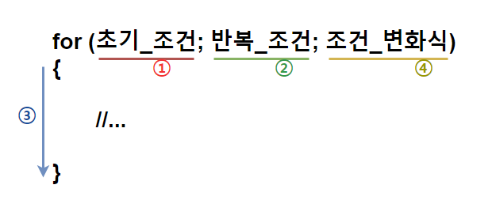
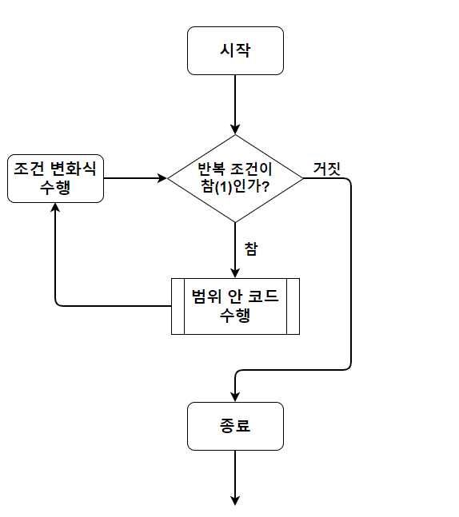

# C 학습 2주차

## 목차

1.  **개요**
    1.  흐름 제어(Flow Control)란?
    2.  C의 흐름 제어 문법 살펴보기
2.  **조건문(Conditional Statemen)**
    1.  if
        1.  if의 사용법과 의미
        2.  if ~ else if
        3.  if ~ else
        4.  if ~ else if ~ else
        5.  중첩 if
    2.  switch
        1.  switch의 사용법과 의미
        2.  break와 default
        3.  Fallthrough(의도적인 non-breaking)
    3.  조건문 사용 시 주의사항
3.  **반복문(Iteration Statement)**
    1.  블록(Block)과 범위
    2.  for
        1.  for의 사용법과 의미
        2.  for의 구성 요소
        3.  for의 동작 원리와 순서
        4.  중첩 for
    3.  while
        1.  while의 사용법과 의미
        2.  while의 구성 요소
        3.  while의 동작 원리와 순서
        4.  중첩 while
    4.  do-while
        1.  do-while의 사용법과 의미
        2.  do-while의 구성 요소
        3.  do-while의 동작 원리와 순서
    5.  무한 루프(Infinity Loop)
    6.  반복문 사용 시 주의사항
4.  **분기문(Branch Statement)**
    1.  분기문의 역할과 필요한 이유
    2.  break
    3.  continue
    4.  return
    5.  goto
        1.  goto의 사용법과 의미
        2.  사용을 권장하지 않는 이유

---

## 1. 블록(Block)과 범위

지금까지의 설명 중에 **블록(Block)** 이라는 단어가 자주 등장했습니다.

**블록**은 C언어에서 변수의 **유효 범위(Scope)**를 나타내는 단위입니다.(C는 각각의 변수마다 사용될 수 있는 범위를 가지는데, 이를 **유효 범위**라고 부르겠습니다)

간단한 문제를 하나 풀어봅시다.

```c
int x = 3;

if(1)
{
    int x = 4;
    printf("%d", x);
}
```

위 코드는 과연 어떤 결과가 나타날까요? 밑의 선지 중에 한번 골라봅시다.

*   "**4가 출력**되겠군"
*   "**3이 출력**되겠군"
*   "**같은 이름의 변수는 두 개 이상일 수 없으니까 에러**가 날 거야."

정답을 알 것 같나요? 출력 결과는 바로

```c
4
```

입니다. 왜 이런 결과가 나타날까요?

우리는 이전에 변수를 배울 때 같은 이름의 변수가 둘 이상 있을 수 없다고 했습니다(달리 말하면, 변수를 만들 때 이미 사용되는 식별자를 붙여줄 수 없다는 뜻이지요).

그러나 정확히는, **같은 블록 안에서** 같은 이름의 변수가 둘 이상 있을 수 없습니다. 따라서 아래와 같은 코드는 에러가 나게 됩니다.

```c
int x = 3;

int x = 4;
printf("%d", x);
```

자, 그럼 **위 코드와 아래 코드의 차이점**이 보이시나요?

두 코드에는 4로 초기화되는 두 번째 x의 주변에 **중괄호(정확히는 if)** 가 감싸져 있는지 아닌지의 차이가 있습니다.

이처럼 C언어에는 중괄호를 기준으로 블록의 범위가 정해집니다. 그런데 이 때 블록은 마치 **집합**과 같기 때문에 블록 안에 블록이 존재할 수 있는 것입니다.


노란색으로 그어 놓은 main함수 범위 안에 초록색으로 그어 놓은 if블록이 존재하는 것을 확인할 수 있습니다.

또 중요한 점은, **겹친 블록들 안에 존재하는 중복되는 요소들은 사용되는 곳으로부터 깊지 않은 (블록 안에 존재하는 블록을 깊은 상태의 블록이라 합니다) 더 가까운 블록의 요소가 사용**됩니다.

```c
int main()
{
    int x = 3;
    
    if(1)
    {
        int x = 4;
        printf("%d\n", x);
    }
    printf("%d", x);
    
    return 0;
}
```

따라서 위 코드의 경우 if 블록이 main블록보다 더 깊은 블록이며, if 범위 안에서 호출되는 printf는 4가 할당된 x를 출력하고, main 범위에서 호출되는 printf는 3이 할당된 x를 출력합니다.

즉, 다음과 같은 출력 결과가 나타납니다.

```c
4
3
```

그리고 각각의 변수들은 **생명(Life)** 을 가지고 있는데, 변수가 **생명을 가지고 있다는 뜻은 메모리에 존재한다는 뜻**이며, **생명이 다 했다는 뜻은 메모리에서 해제(사라짐)되었다는 뜻**입니다. 따라서 **변수의 생명이 다 하면 더 이상 해당 변수를 사용할 수 없게 됩니다.**

**일반적으로 변수의 생명은 자신이 속한 블록이 끝나면 다 하게 됩니다.**

따라서 아래 코드의 경우 에러가 나게 됩니다.

```c
int main()
{
    int x = 3;
    
    if(1)
    {
        int y = 4;
        printf("%d\n", x);
    }
    printf("%d", y);
    
    return 0;
}
```

 왜냐하면 **변수 y는 if블록 안에서 선언되었기 때문에 if블록이 끝나는 순간 메모리에서 사라지기 때문**입니다.

존재하지 않는 변수 y를 출력하려 하면 당연히 에러가 나겠죠?

여기까지 이해했다면 간단한 연습 문제를 풀어봅시다. 

```c
int main()
{
    int x = 3;
    int y = 2;
    if(1)
    {
        int x = 4;
        printf("x in first if is %d\n", x);
        
        if(1)
        {
            int x = 33;
            printf("x in nested if is %d\n", x);
        }
        x++;
        y++;
    }
    printf("x is %d, y is %d", x, y);
}
```

위 출력 결과를 생각해본 후 아래에서 정답을 확인해 보시기 바랍니다.

```c
x in first if ix 4
x in nested if is 33
x is 3, y is 3
```

정답을 맞히셨다면 완벽히 이해한 것이므로 다음으로 넘어갑시다. 아직 변수의 범위에 대해서 알아야 할 것이 더 있지만 나머지는 **함수**를 배울 때 알아봅시다.

## 2. For

이제 본격적으로 반복문에 대해 알아봅시다.

반복문은 이미 개요에서 언급한 것 처럼 **조건을 만족하는 동안 특정 명령들을 반복**하도록 하는 문법입니다.

C에서 반복문은 총 3가지가 존재하며, 다음과 같습니다.

*   for
*   while
*   do-while

이 중 이번 단락에서는 for에 대해 알아보겠습니다.

**For**란, 영단어의 뜻( **~동안** )에서 알 수 있듯이 조건이 만족하는 동안 범위 안의 코드를 반복 수행하는 문법입니다.

다음과 같은 형태로 사용됩니다.

```c
for (초기_조건; 반복_조건; 조건_변화식)
{
    // ...
}
```

 **초기 조건**은 **반복문이 최초로 수행되기 전**에 설정하고 싶은 조건들을 작성하는 곳입니다.

**반복 조건**은 반복문이 수행되기 위한 조건을 작성하는 곳입니다. 반복 조건은 **매 반복이 수행되기 직전**에 검사하며 안의 조건식이 **참(1)** 이라면 반복문이 수행됩니다. 

**조건 변화식**은 **매 반복이 수행된 후** 다음 반복 이전에 변화시키고 싶은 조건들의 변화를 작성하는 곳입니다.

반복문은 설정된 각 조건들이 언제 무엇부터 일어나는지 정확히 알아야 합니다. for의 수행 순서를 도식으로 알아봅시다.



가장 먼저 **초기 조건(1번)** 을 적용한 후, 반복문을 수행할지 판단하기 위해 **반복 조건(2번)** 을 판단합니다. 만약 2번이 참이라면 **반복문 범위 안의 내용(3번)** 을 수행합니다. 이후 **조건 변화식(4번)** 을 적용시킵니다

그리고 **반복 조건(2번) 이 거짓(0)이 될 때까지** 다시 **2번 ~ 4번을 반복**합니다.

순서도(Flowchart)로 살펴보면 다음과 같습니다.



....

## 3. while

### 3.1. while의 사용법과 의미

**while** 역시 for와 마찬가지로 조건이 만족하는 동안 블록 내의 코드를 반복 수행하도록 하는 문법입니다.

**while**은 다음과 같은 형태로 사용합니다.

```c
while(반복_조건)
{
    //...
}
```

초기 조건이나 조건 변화식 등을 지원하는 for와 달리 **while은 단순히 반복 조건 하나만을 작성**합니다.

위에 for로 작성된 예시 코드들을 while로 작성하면 다음과 같습니다.

```c

```


```c

```

while의 동작 순서를 순서도로 확인하면 다음과 같습니다.

>   이미지 넣기


또한 while 역시 중첩해서 사용이 가능합니다.

예시 코드를 살펴봅시다.

```c
#include <stdio.h>

int main()
{
    int n;
	scanf("%d", &n);
	int outerCount = 0;

	while (outerCount < n)
    {
        int innerCount = 0;
        while (innerCount <= outerCount)
        {
            printf("*");
            innerCount++;
        }
        printf("\n");
        outerCount++;
    }
    
    return 0;
}
```

위 코드는 while 안에 또 다른 while이 중첩되어 있는 형태입니다.

만약에 사용자가 n에 5를 입력하면, 다음과 같은 출력 결과가 나타납니다.

```c
*
**
***
****
*****
```


## 4. do-while

for와 while은 반복 조건이 처음부터 성립하지 않는다면 포함한 문장 자체룰 수행하지 않습니다.

그런데 프로그래밍을 하다 보면 일단 코드들을 수행시켜 본 후에 그 결과에 따라 반복 여부를 결정하고 싶을 때가 있습니다.

**do-while**은 조건에 상관없이 한 번 코드들을 수행한 후 그 다음부터 조건에 따라 반복을 수행하는 반복문입니다.

**do-while**은 다음과 같은 형태로 사용합니다.

```
do
{
	//...
} while(반복_조건);
```

do 라는 키워드를 먼저 표기한 후에 중괄호로 반복할 코드들을 감쌉니다. 그 후 중괄호 뒤에 **while**키워드를 표기하고 옆에 반복 조건을 작성합니다.

중요한 점은 do-while의 while 뒤에는 **세미콜론**을 작성해야 한다는 것입니다. 

do-while의 순서도와 while의 순서도를 함께 비교해 봅시다.

>   이미지 넣기


또한 while 


----

*(C) 2021. Im-Yongsik(Hamsik2rang) all rights reserved.*

<div style="text-align:left"> <a href="./Main_Text/1.개요.md">← 개요</a><div/>
<div style="text-align:right"> <a href="./Main_Text/3.반복문.md">반복문 →</a><div/>


