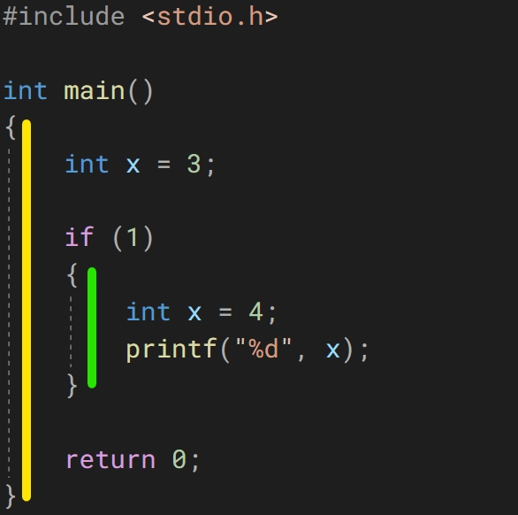
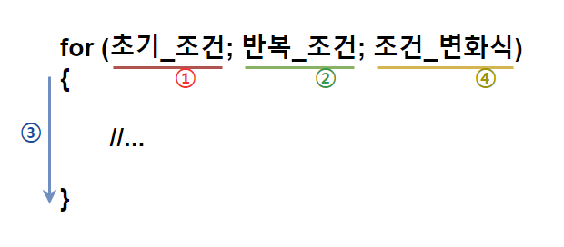
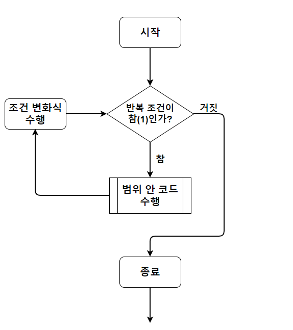
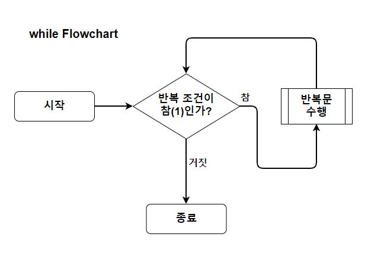
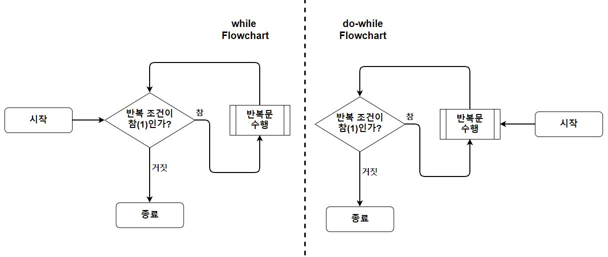

# C 학습 2주차

## 목차

1.  **개요**
    1.  흐름 제어(Flow Control)란?
    2.  C의 흐름 제어 문법 살펴보기
2.  **조건문(Conditional Statemen)**
    1.  if
        1.  if의 사용법과 의미
        2.  if ~ else if
        3.  if ~ else
        4.  if ~ else if ~ else
        5.  중첩 if
    2.  switch
        1.  switch의 사용법과 의미
        2.  break와 default
        3.  Fallthrough(의도적인 non-breaking)
    3.  조건문 사용 시 주의사항
3.  **반복문(Iteration Statement)**
    1.  블록(Block)과 범위
    2.  for
        1.  for의 사용법과 의미
        2.  for의 구성 요소
        3.  for의 동작 원리와 순서
        4.  중첩 for
    3.  while
        1.  while의 사용법과 의미
        2.  while의 구성 요소
        3.  while의 동작 원리와 순서
        4.  중첩 while
    4.  do-while
        1.  do-while의 사용법과 의미
        2.  do-while의 구성 요소
        3.  do-while의 동작 원리와 순서
    5.  무한 루프(Infinity Loop)
    6.  반복문 사용 시 주의사항
4.  **분기문(Branch Statement)**
    1.  분기문의 역할과 필요한 이유
    2.  break
    3.  continue
    4.  return
    5.  goto
        1.  goto의 사용법과 의미
        2.  사용을 권장하지 않는 이유

---

## 1. 블록(Block)과 범위

지금까지의 설명 중에 **블록(Block)** 이라는 단어가 자주 등장했습니다.

**블록**은 C언어에서 변수의 **유효 범위(Scope)**를 나타내는 단위입니다.(C는 각각의 변수마다 사용될 수 있는 범위를 가지는데, 이를 **유효 범위**라고 부르겠습니다)

간단한 문제를 하나 풀어봅시다.

```c
int x = 3;

if(1)
{
    int x = 4;
    printf("%d", x);
}
```

위 코드는 과연 어떤 결과가 나타날까요? 밑의 선지 중에 한번 골라봅시다.

*   "**4가 출력**되겠군"
*   "**3이 출력**되겠군"
*   "**같은 이름의 변수는 두 개 이상일 수 없으니까 에러**가 날 거야."

정답을 알 것 같나요? 출력 결과는 바로

```c
4
```

입니다. 왜 이런 결과가 나타날까요?

우리는 이전에 변수를 배울 때 같은 이름의 변수가 둘 이상 있을 수 없다고 했습니다(달리 말하면, 변수를 만들 때 이미 사용되는 식별자를 붙여줄 수 없다는 뜻이지요).

그러나 정확히는, **같은 블록 안에서** 같은 이름의 변수가 둘 이상 있을 수 없습니다. 따라서 아래와 같은 코드는 에러가 나게 됩니다.

```c
int x = 3;

int x = 4;
printf("%d", x);
```

자, 그럼 **위 코드와 아래 코드의 차이점**이 보이시나요?

두 코드에는 4로 초기화되는 두 번째 x의 주변에 **중괄호(정확히는 if)** 가 감싸져 있는지 아닌지의 차이가 있습니다.

이처럼 C언어에는 중괄호를 기준으로 블록의 범위가 정해집니다. 그런데 이 때 블록은 마치 **집합**과 같기 때문에 블록 안에 블록이 존재할 수 있는 것입니다.



노란색으로 그어 놓은 main함수 범위 안에 초록색으로 그어 놓은 if블록이 존재하는 것을 확인할 수 있습니다.

또 중요한 점은, **겹친 블록들 안에 존재하는 중복되는 요소들은 사용되는 곳으로부터 깊지 않은 (블록 안에 존재하는 블록을 깊은 상태의 블록이라 합니다) 더 가까운 블록의 요소가 사용**됩니다.

```c
int main()
{
    int x = 3;
    
    if(1)
    {
        int x = 4;
        printf("%d\n", x);
    }
    printf("%d", x);
    
    return 0;
}
```

따라서 위 코드의 경우 if 블록이 main블록보다 더 깊은 블록이며, if 범위 안에서 호출되는 printf는 4가 할당된 x를 출력하고, main 범위에서 호출되는 printf는 3이 할당된 x를 출력합니다.

즉, 다음과 같은 출력 결과가 나타납니다.

```c
4
3
```

그리고 각각의 변수들은 **생명(Life)** 을 가지고 있는데, 변수가 **생명을 가지고 있다는 뜻은 메모리에 존재한다는 뜻**이며, **생명이 다 했다는 뜻은 메모리에서 해제(사라짐)되었다는 뜻**입니다. 따라서 **변수의 생명이 다 하면 더 이상 해당 변수를 사용할 수 없게 됩니다.**

**일반적으로 변수의 생명은 자신이 속한 블록이 끝나면 다 하게 됩니다.**

따라서 아래 코드의 경우 에러가 나게 됩니다.

```c
int main()
{
    int x = 3;
    
    if(1)
    {
        int y = 4;
        printf("%d\n", x);
    }
    printf("%d", y);
    
    return 0;
}
```

 왜냐하면 **변수 y는 if블록 안에서 선언되었기 때문에 if블록이 끝나는 순간 메모리에서 사라지기 때문**입니다.

존재하지 않는 변수 y를 출력하려 하면 당연히 에러가 나겠죠?

여기까지 이해했다면 간단한 연습 문제를 풀어봅시다. 

```c
int main()
{
    int x = 3;
    int y = 2;
    if(1)
    {
        int x = 4;
        printf("x in first if is %d\n", x);
        
        if(1)
        {
            int x = 33;
            printf("x in nested if is %d\n", x);
        }
        x++;
        y++;
    }
    printf("x is %d, y is %d", x, y);
}
```

위 출력 결과를 생각해본 후 아래에서 정답을 확인해 보시기 바랍니다.

```c
x in first if ix 4
x in nested if is 33
x is 3, y is 3
```

정답을 맞히셨다면 완벽히 이해한 것이므로 다음으로 넘어갑시다. 아직 변수의 범위에 대해서 알아야 할 것이 더 있지만 나머지는 **함수**를 배울 때 알아봅시다.

## 2. for

이제 본격적으로 반복문에 대해 알아봅시다.

반복문은 이미 개요에서 언급한 것 처럼 **조건을 만족하는 동안 특정 명령들을 반복**하도록 하는 문법입니다.

C에서 반복문은 총 3가지가 존재하며, 다음과 같습니다.

*   for
*   while
*   do-while

이 중 이번 단락에서는 for에 대해 알아보겠습니다.

**for**란, 영단어의 뜻( **~동안** )에서 알 수 있듯이 조건이 만족하는 동안 범위 안의 코드를 반복 수행하는 문법입니다.

다음과 같은 형태로 사용됩니다.

```c
for (초기_조건; 반복_조건; 조건_변화식)
{
    // ...
}
```

**초기 조건**은 **반복문이 최초로 수행되기 전**에 설정하고 싶은 조건들을 작성하는 곳입니다.

**반복 조건**은 반복문이 수행되기 위한 조건을 작성하는 곳입니다. 반복 조건은 **매 반복이 수행되기 직전**에 검사하며 안의 조건식이 **참(1)** 이라면 반복문이 수행됩니다. 

**조건 변화식**은 **매 반복이 수행된 후** 다음 반복 이전에 변화시키고 싶은 조건들의 변화를 작성하는 곳입니다.

반복문은 설정된 각 조건들이 언제 무엇부터 일어나는지 정확히 알아야 합니다. for의 수행 순서를 도식으로 알아봅시다.



가장 먼저 **초기 조건(1번)** 을 적용한 후, 반복문을 수행할지 판단하기 위해 **반복 조건(2번)** 을 판단합니다. 만약 2번이 참이라면 **반복문 범위 안의 내용(3번)** 을 수행합니다. 이후 **조건 변화식(4번)** 을 적용시킵니다

그리고 **반복 조건(2번) 이 거짓(0)이 될 때까지** 다시 **2번 ~ 4번을 반복**합니다.

순서도(Flowchart)로 살펴보면 다음과 같습니다.



이번엔 간단한 예시 코드들을 통해 살펴보겠습니다.

*   자연수 n을 입력하면 1부터 n까지의 합을 구해 출력하는 코드

    ```c
    #include <stdio.h>
    
    int main()
    {
        unsigned int n;
        int sum = 0;
        scanf("%ud", &n);
        
        for(int i = 1; i <= n; i++)
        {
            sum += i;
        }
        printf("%d", sum);
        
        return 0;
    }
    ```

    위 코드는 등차수열의 합 공식을 응용해 아래처럼 작성할 수도 있습니다.

    ```c
    #include <stdio.h>
    
    int main()
    {
        unsigned int n;
        int sum = 0;
        scanf("%ud", n);
        
        for(int i = 1, j = n; i <= n / 2; i++, j--)
        {
            sum = i + j;
        }
        printf("%d", sum);
        
        return 0;
    }
    ```


이처럼 for의 초기 조건에는 한 번에 여러 개의 변수를 초기화할 수도 있습니다. 단, 여러 개의 변수를 초기화 하는 경우 해당 변수들이 같은 자료형을 가져야만 합니다.

또한, for문 안에 for문이 위치할 수도 있습니다. 마치 if 안에 if가 들어갈 수 있었던 것처럼 말이죠.

```c
#include <stdio.h>

int main()
{
    unsigned int n;
    
    scanf("%ud", &n);
    
    for(int i = 0; i < n; i++)
    {
        for(int j = 0; j<= i; j++)
        {
        	printf("*");   
        }
        printf("\n");
    }
}
```

위 코드에서 사용자가 n에 5를 입력한다면, 아래와 같은 출력 결과가 나타납니다.

```c
*
**
***
****
*****
```

## 3. while

**while** 역시 for와 마찬가지로 조건이 만족하는 동안 블록 내의 코드를 반복 수행하도록 하는 문법입니다.

**while**은 다음과 같은 형태로 사용합니다.

```c
while(반복_조건)
{
    //...
}
```

초기 조건이나 조건 변화식 등을 지원하는 for와 달리 **while은 단순히 반복 조건 하나만을 작성**합니다.

위에 for로 작성된 예시 코드들을 while로 작성하면 다음과 같습니다.

*   자연수 n을 입력하면 1부터 n까지의 합을 구해 출력하는 코드

```c
#include <stdio.h>

int main()
{
    unsigned int n;
    int sum = 0;
    scanf("%ud", &n);
    
    int i = 1;
    while(i<=n)
    {
        sum += i;
        i++;
    }
    
    printf("%d", sum);
    
    return 0;
}
```

코드에서 알 수 있듯이, **각 반복이 끝날 때마다 조건 변화식을 적용시켜 자동으로 조건을 변화시키는 for와 달리 while은 반복문 안에서 조건을 변화시켜야 합니다.**

이러한 while의 동작 순서를 순서도로 확인하면 다음과 같습니다.



또한 while 역시 중첩해서 사용이 가능합니다.

예시 코드를 살펴봅시다.

```c
#include <stdio.h>

int main()
{
    int n;
	scanf("%d", &n);
	int outerCount = 0;

	while (outerCount < n)
    {
        int innerCount = 0;
        while (innerCount <= outerCount)
        {
            printf("*");
            innerCount++;
        }
        printf("\n");
        outerCount++;
    }
    
    return 0;
}
```

위 코드는 while 안에 또 다른 while이 중첩되어 있는 형태입니다.

만약에 사용자가 n에 5를 입력하면, 다음과 같은 출력 결과가 나타납니다.

```c
*
**
***
****
*****
```

## 4. do-while

for와 while은 **반복 조건이 처음부터 성립하지 않는다면 포함한 문장 자체를 수행하지 않습니다.**

그런데 프로그래밍을 하다 보면 **일단 코드들을 수행시켜 본 후에 그 결과에 따라 반복 여부를 결정**하고 싶을 때가 있습니다.

**do-while**은 조건에 상관없이 한 번 코드들을 수행한 후 그 다음부터 조건에 따라 반복을 수행하는 반복문입니다.

**do-while**은 다음과 같은 형태로 사용합니다.

```
do
{
	//...
} while(반복_조건);
```

do 라는 키워드를 먼저 표기한 후에 중괄호로 반복할 코드들을 감쌉니다. 그 후 중괄호 뒤에 **while**키워드를 표기하고 옆에 반복 조건을 작성합니다.

중요한 점은 do-while의 while 뒤에는 **세미콜론**을 작성해야 한다는 것입니다. 

do-while의 순서도와 while의 순서도를 함께 비교해 봅시다.



이번엔 코드를 통해 while과 do-while을 비교해 봅시다.

```c
#include <stdio.h>

int main()
{
    int x = 3;	// Let x be true(not 0).
    
    while(!x)
    {
        printf("while is run.");
    }
    
    do
    {
        printf("do-while is run.");
    } while(!x);
    
    return 0;
}
```

위 코드의 실행 결과는 다음과 같습니다.

```text
do-while is run.
```

두 반복문은 모두 **x가 0일 때 반복**하도록 조건이 설정되어 있습니다(x가 0이 아닌 값을 가지므로 !x는 0이 됩니다).

그런데 **x는 3**이라는 값을 가지므로 **while은 처음부터 조건이 성립하지 않아 아예 수행되지 않는 반면, do-while은 먼저 수행하고 나서 조건을 확인하므로 안의 printf가 한 번 출력됩니다.**

이 실행 결과가 이해되었다면 완벽히 do-while을 이해한 것입니다!

또한 do-while 역시 while, for와 마찬가지로 중첩이 가능합니다.

```c
#include <stdio.h>

int main()
{
    unsigned int n;
    scanf("%ud", &n);
    
    int outerCount = 0;
    do
	{
   		int innerCount = 0;
        do
        {
            printf("*");
            innerCount++;
        } while (innerCount <= outerCount);
        printf("\n");
        outerCount++;
	} while (outerCount < n);
    
    return 0;
}
```

당연히 위에서 봤던 코드들과 동일한 실행 결과를 가지겠죠?

```text
*
**
***
****
*****
```

## 5. 무한 루프(Infinity Loop)

우리가 지금까지 본 반복문들은 흔히 **루프(Loop)** 라고 불립니다.

그리고 **모든 반복문들은 조건이 참인 동안만 반복**되는 것을 확인했습니다.

그런데 만약에, 반복문의 조건이 **영원히 참**이라면 어떻게 될까요?

**반복문의 반복 조건을 일부러 항상 참으로 설정해 무한히 반복되도록 한 반복문**을 **무한 루프(Infinity Loop)** 라고 합니다.

```c
while(1)
{
    // while 무한 루프
}

do
{
    // do-while 무한 루프
} while(1);

for(;;)
{
    // for 무한 루프
}
```

위 코드는 각각의 반복문으로 무한 루프를 간단히 구성한 것입니다.

C에서 0이 아닌 값은 모두 참이므로, 조건이 **상수 1**로 설정되어 있으면 영원히 1값이 수정되지 않으므로 반복 조건이 영원히 참이 되는 것이지요.

이러한 무한 루프 안에 들어있는 코드는 말 그대로 **프로그램이 종료되기 전까지 영원히 실행**되게 됩니다.

```c
while(1)
{
    printf("Hello~\n");
}
```

위 코드는 다음처럼 실행됩니다.

```text
Hello~
Hello~
Hello~
Hello~
Hello~
Hello~
Hello~
...
프로그램이 종료되었습니다(error code xxx)...
```

무한 루프를 설정해서 printf가 끝없이 수행되다가 컴퓨터가 버틸 수 없어져 에러와 함께 종료될 것입니다.

그렇다면, 이러한 무한 루프는 정말로 영원히 종료할 수 없는 것일까요?

우리가 앞서 조건문의 switch에서 사용한 **break**라는 분기문을 이용하면 원하는 조건에 무한 루프를 종료할 수 있습니다. 분기문은 뒤에 자세히 배울 것이므로 지금은 예시 코드만 살펴보고 넘어가겠습니다.

```c
int x = 0;

while(1)
{
    x++;
    printf("%d\n", x);
    if(x > 10000)
        break;
}
```

위 코드는 1부터 10000까지의 수가 각 줄에 걸쳐 하나씩 출력되고 더 이상 출력되지 않게 됩니다.

x가 10000이 넘는 순간 while을 break하기 때문에 while밖으로 나가게 되기 때문이죠.

그런데 사실, 위 코드는 굳이 무한 루프를 사용하지 않아도 일반적인 반복문을 사용해도 됩니다.

```c
int x = 0;

while(x <= 10000)
{
    x++;
    printf("%d", x);
}
```

일반적인 반복문으로 무한 루프와 동일한 기능을 구현할 수 있다면 **무한 루프는 왜 사용하는 걸까요?**

무한 루프는 보통 프로그램 실행 환경과 연관이 있습니다. 일반적인 프로그램들은 특정한 조건이 만족하면 자동으로 꺼지는 것이 아니라, **사용자가 직접 프로그램 종료 이벤트를 발생시켜야** 프로그램이 종료됩니다. 따라서 이러한 기능을 구현하기 위해 무한 루프를 이용하게 됩니다.

게임을 예로 들면, 플레이어의 캐릭터가 체력이 0이 되면 캐릭터 애니메이션을 멈추고 시체 리소스를 화면에 띄운다고 합시다.

플레이어의 체력은 주기적으로 감소하는 것이 아니라 몬스터에게 피격당하거나, 높은 지형에서 떨어지는 등 **비주기적이고 예측할 수 없는 발생 조건**에 의해 감소합니다. 그러므로 일반적인 루프로는 이러한 설계를 구현하기 까다롭습니다.

따라서 정리하자면, 반복문을 사용할 때 각 반복마다 반복 조건이 주기적으로 바뀐다면 굳이 무한루프를 이용할 수 없지만, 프로그램 실행 중 사용자가 원하는 타이밍에 루프를 종료시키고 싶다면 무한루프를 사용하는 것이 좋습니다.

## 6. 반복문 사용 시 주의사항

지금까지 알아본 반복문을 사용할 때 주의할 사항에 대해 알아보겠습니다.

*   **뒤에 세미콜론`;` 을 붙이지 않게 조심합니다.**

    세미콜론은 문장이 끝났을 때 붙이는 기호이므로, 반복문에 의도하지 않은 세미콜론이 붙으면 원하는 반복문이 사용되지 않을 수 있습니다.

    ```c
    int x = 3;
    
    while (x == 3);
    {
        printf("x is 3.");
    }
    ```

    위 코드는 다음과 같은 실행 결과가 나타납니다.

    ```text
    
    ```

    분명 무한 루프로 설정된 반복문에서 왜 아무런 실행이 일어나지 않을까요?

    바로 반복문의 조건식 뒤에 세미콜론이 붙어 있기 때문입니다.

    위같은 코드는 매우 조심해야 하는데, **아무 것도 하지 않는** 무한루프가 무한히 돌고 있기 때문에 절대 그 다음 코드가 실행되지 않습니다.

    따라서 반복문(정확히는 do-while이 아닌 반복문)에 의도하지 않은 세미콜론을 붙이지 않도록 해야 합니다.

    반면, do-while은 반드시 while 뒤에 **세미콜론이 붙어야 합니다**.

*   대입 연산자와 같음 비교 연산자를 헷갈리지 않는다.

    조건문에서 본 바와 마찬가지로, 임의의 값이 대입되고 나면 그 값이 평가되므로 반복문이 무한 루프가 될 수 있습니다.

    ```c
    int x = 4;
    
    while(x = 3)
    {
        printf("x is 3");
        x++;
    }
    ```

    원래라면 절대 실행되지 않을 반복문이 연산자 실수로 인해 무한 루프가 되어버린 형태입니다.

*   **반복문(특히 for)의 조건 변화식의 증감을 실수하지 않는다.**

    일반적으로 반복문을 쓸 때 조건 변수를 0값부터 순차적으로 증가시키면서 반복을 진행하기 때문에, 이의 역순으로 반복문을 진행시키려 할 떄 흔히 이런 실수를 하게 됩니다.

    ```c
    for (int i=0; i < 5; i++)
    {
        //...
    }
    
    for(int i = 5; i > 0; i++) // i를 감소시켜야 하는데 실수로 증가시키도록 작성함
    {
        //...
    }
    ```

    위 for의 경우 의도한 대로 5번 반복되겠지만 아래 for의 경우 다른 결과가 나타납니다.

    (아래 코드는 과연 몇 번 반복될지 한 번 맞혀 보시기 바랍니다!)

*   **반복문의 조건 변수를 unsigned 자료형으로 할당하는 것은 가급적 피해야 합니다.**

    위의 논지와 비슷하게, 반복문(특히 for)에서 조건 변수가 0부터 시작하지 않고 점차 감소하면서 반복이 수행될 경우 unsigned형태로 조건 변수가 선언되었다면 의도하지 않은 무한 루프가 발생할 수 있습니다.

    ```c
    for(unsigned int i = 5; i >= 0; i--)
    {
        //...
    }
    ```

    왜 무한 루프가 발생하는지에 대해서도 한번 생각해 보시기 바랍니다!

----

*(C) 2021. Im-Yongsik(Hamsik2rang) all rights reserved.*

<div style="text-align:left"> <a href="./2.조건문.md">← 조건문</a><div/>
<div style="text-align:right"> <a href="./4.분기문.md">분기문 →</a><div/>


