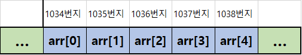
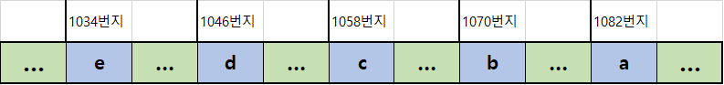

# C 학습 3주차

## 목차

1.  **배열**
    1.  배열의 정의
    2.  배열의 선언과 사용
    3.  배열의 초기화
    4.  배열의 활용
2.  **다차원 배열**
    1.  이차원 배열의 정의
    2.  이차원 배열의 선언과 사용
    3.  이차원 배열의 초기화
    4.  다차원 배열
    5.  다차원 배열의 활용
3.  **문자열**
    1.  C 문자열의 정의
    2.  문자 배열의 선언과 사용
    3.  문자 배열의 초기화
    4.  문자 배열 사용 시 주의사항
4.  **문자열 배열**
    1.  문자열 배열의 정의
    2.  문자열 배열의 선언, 사용과 초기화
5.  **표준 문자열 라이브러리**
    1.  라이브러리란?
    2.  표준 문자열 라이브러리
    3.  strcpy - 문자열의 복사
    4.  strlen - 문자열의 길이
    5.  strcmp - 문자열의 비교
    6.  strcat - 문자열의 연결

---

## 1. 배열의 정의

배열이라는 문법을 알아보기 전에, 간단한 상황을 가정해봅시다.

>   대학생 20명의 수능 국어 점수를 입력받아 저장하는 프로그램을 작성하시오.

위 프로그램을 지금까지 배운 내용만으로 구현하려면 일단 입력을 받는 기능을 제쳐두고도 **20명의 점수를 저장하기 위해 20개의 변수가 필요**합니다.

```c
#include <stdio.h>

int main()
{
    short student1,student2,student3,student4,student5,student6,student7,student8,student9,student10,
    student11,student12,student13,student14,student15,student16,student17,student18,student19,student20;
    
    //...
```

또, **각 변수들은 이름이 다르기 때문에 반복문으로 입력을 받을 수도 없으니 입력 함수를 20번 각각 호출**해야 합니다.

```c
	//...
	scanf("%hd", &student1);
	scanf("%hd", &student2);
	scanf("%hd", &student3);
	scanf("%hd", &student4);
	//..이하 생략
	scanf("%hd", &student19);
	scanf("%hd", &student20);

	//...

	return 0;
}
```

이처럼 저장할 데이터가 매우 많아지면 프로그램을 구현할 때 코드가 많아집니다. 그런데 20명의 학생은 그나마 일일히 입력할 수 있다 해도, 만약 **공주대학교 학생 전체의 수능 국어 성적**을 입력받아 저장해야 한다면 어떻게 해야 할까요?

이처럼, 동일 자료형의 여러 변수를 선언해야 할 때 각각의 변수를 선언해 사용하지 않고 하나의 이름으로 여러 개의 변수를 묶어 사용할 수 있도록 해 주는 문법이 바로 **배열(Array)** 입니다.

다시 말해, **배열**이란 동일한 자료형의 변수들을 그룹으로 묶어서 표현하는 문법을 말합니다.

일반적으로 위 예시처럼 **자료형이 동일**하며 **사용 목적이 비슷한** 변수를 여러 개 만들어서 사용해야 할 때 배열을 사용하게 됩니다.

위 코드를 배열이라는 문법을 이용해 구현하면 다음과 같아집니다.

```c
#include <stdio.h>

int main()
{
    short student[20];
    
    for(int i = 0; i < 20; i++)
    {
        scanf("%hd", &student[i]);
    }
    
    return 0;
}
```

형태가 낮설지만, 일단 코드의 수가 굉장히 줄어들었다는 것을 알 수 있으며, **반복문을 이용할 수 있음**을 확인할 수 있습니다.

이처럼 배열은 여러 변수를 **하나의 이름**으로 사용할 수 있게 해 주는데, 이 때 하나의 이름으로 사용하는 배열 안의 각각의 변수들을 **배열의 원소(Element, 요소)** 라고 합니다.

즉, **배열 그 자체도 하나의 변수**이지만 **하나의 배열 변수는 여러 개의 기본 자료형 변수**들로 구성되어 있고, 그 여러 개의 변수들을 **원소**라고 부르는 것이지요.

또, 각각의 원소를 사용하기 위해 그 원소를 번호로 붙여 사용하는데, 이때의 번호를 배열의 **인덱스(Index, 색인)** 라 부릅니다.

인덱스를 이용해서 각각의 원소를 사용할 수 있다는 것이 조금은 의아할 수 있는데, 이는 메모리 안에서의 배열의 구조를 알면 쉽게 납득할 수 있습니다.

배열은 메모리 안에서 **연속적인 데이터의 집합** 형태로 할당되어 있습니다.

반면 일반적인 변수들을 여러개 선언하는 경우는 데이터가 불연속적으로 메모리에 할당됩니다.

예를 들어 다음과 같은 두 코드가 있다고 합시다.

```c
char arr[5];

char a, b, c, d, e;
```

위의 경우는 arr이라는 **5칸짜리 char형 배열을 선언**한 코드이고, 아래의 경우는 **char형 일반 변수 a, b, c, d, e를 각각 선언**한 모습입니다.

메모리에서 두 코드는 다음과 같은 차이를 보입니다.






살펴보면 **배열의 경우 각각의 원소들이 1byte(char의 크기) 단위로 연속적으로 붙어서 할당**되어 있으나, **각각의 변수들을 선언한 경우 따로 떨어져 있습니다.**

**이러한 배열의 구조적 특성 덕분에 각각의 원소들에 번호(인덱스)를 붙여서 사용할 수 있는 것입니다.**

그런데 여기서 살펴보아야 할 점은, **번호의 시작이 1이 아니라 0**이라는 점입니다. 배열 뿐만 아니라 **컴퓨터에서의 거의 모든 선형 자료구조들은 일반적으로 0부터 번호를 매기므로 주의**해야 합니다.

지금까지 살펴본 내용은 배열을 사용하는 데 있어 기초적이면서도 **매우** 중요하므로 다시 한번 정리하고 넘어가겠습니다.

*   배열은 메모리 안에서 동일 자료형의 변수를 원하는 크기(길이)만큼 연속적으로 할당해 사용하는 문법이다.
*   배열 안에 포함된 각각의 변수들을 **원소**라고 하며, 원소들에 0부터 순차적으로 매겨진 번호를 **인덱스**라고 한다.
*   배열 안의 각각의 원소는 **인덱스**를 이용해 접근/사용할 수 있다.

---

## 2. 배열의 선언과 사용

사실 지금까지 본 내용 안에서 이미 배열을 선언하고 사용하는 방법을 살짝 살펴보았지만 배열을 선언하고 사용하는 방법을 자세히 알아보겠습니다.

**배열**은 다음과 같은 형태로 **선언**할 수 있습니다.

```c
자료형 배열명[길이];
```

예시를 들면 다음과 같습니다.

```c
int 	arr1[3];
double 	arr2[5];
char 	arr3[13];
```

첫 번째 코드는 **int형 3칸 크기(4byte 정수형 * 3)** 의 배열을 선언하는 코드입니다.

두 번째 코드는 **double형 5칸 크기(8byte 실수형 * 5)** 의 배열을 선언하는 코드입니다.

세 번째 코드는 **char형 13칸 크기(1byte 정수형 * 13)** 의 배열을 선언하는 코드입니다.

따라서 각각의 배열을 **sizeof 연산자**를 이용해 크기를 측정해 보면

```c
printf("int arr1[3]의 크기 = %d\n", sizeof(arr1));
printf("double arr2[5]의 크기 = %d\n", sizeof(arr2));
printf("char arr3[13]의 크기 = %d\n", sizeof(arr3));
```

다음과 같은 출력 결과가 나타납니다.

```text
int arr1[3]의 크기 = 12
double arr2[5]의 크기 = 40
char arr3[13]의 크기 = 13
```

참고로, 배열 역시 변수이므로 이름을 지을 때 **식별자 명명 규칙**을 따릅니다.

또, 배열을 선언할 때 주의해야 할 사항이 있습니다. 바로 배열의 크기 선언에 관련된 규칙입니다.

배열의 크기(길이)를 지정할 때에는 다음 규칙을 따라야 합니다.

*   **0보다 큰 정수형 상수여야 한다**
*   **따로 초기화를 하지 않는 한 반드시 지정해야 한다**

즉, 배열을 선언할 때 크기는 **0보다 큰 상수**를 반드시 입력해야 하며, 초기화를 하는 경우에만 생략할 수 있습니다.

*참고로, 최신 C언어 문법(C11)에서는 **가변 길이 배열(Variable Length Array, VLA)** 를 지원함으로써 배열의 크기를 변수로 지정할 수 있게 되었지만, 여기서는 그 이전 문법을 기준으로 설명합니다. 또한 Visual Studio의 경우 VLA를 지원하지 않습니다.*

이를 기준으로 **올바른 배열 선언 방법**과 **그렇지 않은 방법**을 예시를 들어 알아보겠습니다.

```c
#define LENGTH = 20;
int count = 10;
const int size = 5;

//-------OK-------//
short student[LENGTH];
short kor[size];
short math[5+15];
short eng[4];

//------WRONG------//
short cham[0];
short bio[-3];
short phy[count];
short eth[count+3];
short pie[3.14];
```

이러한 규칙에 따라 배열을 선언했다면, 그 배열을 사용할 줄도 알아야겠죠?

배열의 사용 방법은 다음과 같습니다.

```c
배열명[인덱스]
```

예시 코드들을 통해 배열을 사용하는 방법을 알아보겠습니다.

*   int 5칸 배열을 선언한 후 각각의 원소 안에 해당 인덱스와 동일한 값을 넣어 준 후 출력하는 프로그램

```c
#include <stdio.h>

int main()
{
    int arr[5];
    
    arr[0] = 0;
    arr[1] = 1;
    arr[2] = 2;
    arr[3] = 3;
    arr[4] = 4;
    
    printf("%d\n", arr[0]);
    printf("%d\n", arr[1]);
    printf("%d\n", arr[2]);
    printf("%d\n", arr[3]);
    printf("%d\n", arr[4]);
    
    return 0;
}
```

위 코드는 예시를 위해 각각의 인덱스를 직접 이용해 이용하였지만, 위 코드는 반복문을 이용해 훨씬 간단하게 구현할 수도 있습니다.

```c
#include <stdio.h>

int main()
{
    int arr[5];
    
    for(int i = 0; i < 5; i++)
    {
		arr[i] = i;
    }
    
    for(int i = 0; i < 5; i++)
    {
		printf("%d\n", arr[i]);
   	}
    
    return 0;
}
```

그런데 아까 배열을 선언할 때 배열의 크기에 변수를 지정할 수 없다고 했는데, 어떻게 반복문의 조건 변수 i를 이용할 수 있는 것일까요?

여기서 반드시 알아 두어야 할 내용이 있습니다. 바로 **배열의 크기** 와 **배열의 인덱스**는 서로 다른 개념이라는 것입니다.

**크기**는 말 그대로 배열을 선언할 때 컴파일러에게 **메모리 몇 칸**을 사용할 것인지 알리기 위해 전달하는 정보입니다.

**인덱스**는 지정된 크기만큼 선언된 배열의 **각각의 칸**에 접근하기 위해 전달하는 정보입니다.

크기에는 0이 아닌 정수형 상수만이 들어갈 수 있지만, 인덱스는 해당 배열이 가진 칸의 번호를 벗어나지 않는다면 변수를 사용해도 아무런 문제가 되지 않습니다.

이 때, 해당 배열이 가진 칸의 번호를 벗어난다는 것은 다음과 같습니다.

```c
int arr[5];

//-----OK-----//
arr[0];
arr[1];
arr[3];

//-----ERROR-----//
arr[-1];
arr[5];
arr[13];
```

눈여겨보아야 할 점은, 5칸짜리 배열을 사용할 떄 **5번 인덱스**를 사용하면 에러가 난다는 것입니다.

앞에서 언급한 대로, 인덱스는 **0번부터 차례대로 매겨지**기 때문에 **0 ~ 4**까지 할당되게 됩니다. 따라서 반드시 배열을 사용할 땐 최대 인덱스가 크기-1이라는 점을 명심하며 사용해야 합니다.

그 외에 배열 인덱스로 음수가 들어가거나, 크기보다 훨씬 큰 수가 들어갈 수 없는 것은 자명하겠죠?

참고로, 이처럼 인덱스의 유효 범위를 넘겨 사용할 때 컴파일러가 내뱉는 에러가 바로 **OutOfBoundsError** 또는 **OutOfIndexError**입니다.

프로그래밍을 하다 이러한 에러를 마주친다면, 본인이 배열을 사용하다가 어떠한 실수로 인해 인덱스의 유효 범위를 넘겨 접근한 것임을 알아두세요!

## 3. 배열의 초기화

배열을 선언하고 사용하는 데 많은 내용을 할애했지만, 배열의 초기화는 매우 간단합니다.

우리가 일반적인 변수를 선언한 후에 값을 넣어주는 것과 별개로 선언과 동시에 값을 넣어주는 **초기화**를 진행할 수 있는 것처럼, 배열 역시도 **초기화**가 가능합니다.

**배열의 초기화**는 다음과 같이 진행합니다.

```c
자료형 배열명[길이] = {초기화값1, 초기화값2, 초기화값3, ...};
```

즉, 배열의 각각의 원소에 값을 초기화 해 주고 싶다면, 배열을 선언할 때 대입 연산자와 함께 0번 원소부터 순서대로 넣어줄 값을 **중괄호**로 묶어 초기화합니다.

예시 코드로 살펴보면 다음과 같습니다.

```c
int arr[5] = {0, 1, 2, 3, 4};
char abc[3] = {'a', 'b', 'c'};
double irretional[2] = {3.141592, 2.718281};
```

위 코드는 아래 코드와 동일합니다.

```c
int arr[5];
arr[0] = 0;
arr[1] = 1;
arr[2] = 2;
arr[3] = 3;
arr[4] = 4;

char abc[3];
abc[0] = 'a';
abc[1] = 'b';
abc[2] = 'c';

double irretional[2];
irrational[0] = 3.141592;
irrational[1] = 2.718281;
```

초기화를 통해 각각의 인덱스에 넣어줄 값들을 맨 왼쪽부터 순서대로 적은 후 중괄호로 감싸면 됩니다. 간단하죠?

그런데 호기심이 많은 분들은 이런 생각도 해보실 수 있습니다.

*   배열의 크기보다 초기화 값을 적게 넣으면 어떻게 될까?
*   배열의 크기보다 초기화 값을 많이 넣으면 어떻게 될까?
*   초기화 값을 하나도 안 넣으면 어떻게 될까?

위 세 가지 상황에 대해 각각 결론부터 알려드리자면 다음과 같습니다.

*   초기화 값을 더 적게 넣으면 **0번 인덱스 원소부터 순서대로 주어진 값들을 할당해 주고 남은 원소들은 모두 기본값(0)으로 초기화**
*   초기화 값을 더 많이 넣으면 유효 인덱스를 벗어나 접근하는 것으로 간주해 **에러** 
*   초기화 값을 하나도 적지 않으면 **에러**

코드로 살펴보면 다음과 같습니다.

```c
int arr[5] = {0, 1, 2}; // 0, 1, 2, 0, 0 으로 초기화됨

int arr[5] = {0, 1, 2, 3, 4, 5} // Error.

int arr[5] = {};	// Error.
```

그렇다면 여기서 한 가지 문제를 내 보겠습니다.

10칸짜리 short형 배열을 선언한 후 해당 배열의 모든 원소가 기본값(0)을 가지게 하고 싶다면 어떻게 해야 할까요?

먼저 생각해보신 후 밑의 답을 확인해 보세요!

답은 다음과 같습니다.

```c
short arr[10] = {0};
```

또한 초기화 값을 지정할 때에는 맨 마지막에 세미콜론을 붙여도 컴파일러가 알아서 지워 주므로 다음처럼 작성해도 상관이 없습니다.

```c
short arr[10] = {0,};
```

여기까지가 배열의 초기화를 위해 알아야 할 모든 지식입니다.

다음으로 넘어가기 전에 잠깐! 위의 배열의 크기 선언 규칙에서 **따로 초기화를 할 경우 크기를 생략할 수 있다**고 배웠습니다.

이는 다음을 나타냅니다.

```c
int arr[] = {0, 1, 2, 3, 4};
```

이처럼 배열 크기를 생략하게 되면 초기화 값의 크기만큼 배열 크기가 자동으로 지정된다는 점도 알아두세요!

## 4. 배열의 활용

지금까지 배열을 사용하는 방법을 모두 배웠습니다. 이번에는 배열을 활용하는 방법을 알아보겠습니다.

#### 1. 각각의 원소에 동일 작업을 수행할 땐 반복문을 이용한다.

앞서 여러 예시 코드에서 살펴보았듯이, 배열은 연속적인 구조를 가지고 **인덱스**를 통해 각각에 접근할 수 있기 때문에 **반복문과 함께 사용**하기 편리합니다.

그러므로, 배열 각각의 원소에 동일한 작업을 수행해야 할 땐 반복문을 이용하는 것이 좋습니다.

*   학생의 국영수 점수를 입력받아 평균 소수점 두 자리까지 출력하는 프로그램

```c
#include <stdio.h>

#define SIZE 3
#define KOR 0
#define MAT 1
#define ENG 2

int main()
{
    short arr[SIZE];
    double average = 0.0;
    
    for(int i = 0; i < SIZE; i++)
    {
        scanf("%hd", &arr[i]);
    }
    
    average = (double)(arr[0] + arr[1] + arr[2]) / SIZE;
    
    printf("%.2f", average);
    
    return 0;
}
```

실행후 콘솔 화면은 아래와 같습니다.

```text
100
85
75
86.67
```

#### 2. 배열 크기를 지정할 떄 매크로 상수를 이용한다.

학생 20명의 정보에 대한 배열을 선언할 때 그 크기를 **리터럴 상수 20**으로 선언해도 큰 문제가 없지만, 만약 그 프로그램에서 저장할 학생 정보가 20명에서 40명으로 늘어난다면 코드 전체에서 20이라는 상수를 모두 40으로 고쳐야 할 것입니다.

이러한 유지 보수의 관점에서 배열 크기가 바뀔 가능성이 있다면 크기를 매크로 상수를 이용해 지정하는 것이 좋습니다.

```c
#include <stdio.h>

#define STUDENT_COUNT 20		// 학생 수가 늘거나 줄게 되면 이 코드의 상수만 수정해주면 끝!

int main()
{
	short kor[STUDENT_COUNT];
    
    //...
    
    return 0;
}
```

#### 3. 배열의 칸 수를 알고 싶을 때 sizeof 연산자 또는 매크로 상수를 사용한다.

반복문을 통해 모든 배열의 원소에 동일 작업을 반복할 때, 특히 for를 이용할 경우 반복문이 언제 끝날지 지정해야 합니다.

20칸짜리 배열이 있다면 반복문의 조건에 20이라는 상수를 이용하지 않고 sizeof연산자를 이용하거나 정의된 매크로 상수를 이용하는 것이 좋습니다.

이 역시 유지보수를 위한 습관입니다.

```c
#include <stdio.h>

int main()
{
	int height[200];
    
    for (int i = 0; i < 200; i++)
    {
		// Do Something..
    }
    
    return 0;
}
```

위 코드는 프로그램 내에서 배열의 크기가 바뀌게 되면 해당 프로그램 안에 있는 모든 for의 반복 조건식을 수정해야 한다는 번거로움이 발생합니다.

그러므로 아래처럼 sizeof 연산 또는 매크로 상수를 이용하는 것이 좋습니다.

```c
#include <stdio.h>

#define BUILDING_COUNT 200

int main()
{
    int height[BUILDING_COUNT];
    
    //아래 코드들은 배열 크기가 수정되더라도 전혀 건드릴 필요가 없음
    for (int i = 0; i < sizeof(height) / sizeof(int); i++)
    {
        // Do Something..
    }

    for (int i = 0; i < BUILDING_COUNT; i++)
    {
        // Do Something..
    }
    
    return 0;
}
```

참고로 미리 알려드리자면, 어떤 배열을 함수에게 인자로 넘겨 그 함수 안에서 사용할 땐 sizeof연산자를 사용할 수 없습니다. 자세한 내용은 **포인터**에 대해 배워볼 때 알아봅시다.

#### 4. 배열 인덱스에 표현식을 적극적으로 활용하자

처음 프로그래밍을 배워서 배열이 낮설은 분들이 이 부분을 어려워합니다.

배열의 인덱스는 변수가 들어갈 수 있으므로, 이는 변수들로 이루어진 수식인 **표현식**도 들어갈 수 있다는 말입니다.

따라서 다음과 같이 사용할 수 있습니다.

*   0번째 원소에 0, 1번째 원소에 1을 가지며 n번째 원소는 n-1번째 원소와 n-2번째 원소의 합을 가지는 10칸짜리 배열을 생성하고 출력

```c
#include <stdio.h>

#define LENGTH 10

int main()
{
    int fibonacci[LENGTH] = {0,1};
    
    for(int i = 2; i < LENGTH; i++)
    {
        fibonacci[i] = fibonacci[i - 1] + fibonacci[i - 2];	// 인덱스에 i-1, i-2와 같은 표현식 사용
    }
    
    for(int i = 0; i < LENGTH; i++)
    {
		printf("%d ", fibonacci[i]);
    }
    
    return 0;
}
```

위 코드의 출력 결과는 다음과 같습니다.

```text
0 1 1 2 3 5 8 13 21 34
```

참고로, 이와 같은 수열을 **피보나치 수열(Fibonacci Sequence)** 이라고 합니다. 고등학교 수열 단원에서 배워 보신 분들도 계시겠지만, 컴퓨터과학에서 상당히 많이 활용되는 수열이니 한번쯤 알아 둡시다.

----

*(C) 2021. Im-Yongsik(Hamsik2rang) all rights reserved.*

<div style="text-align:left"> <a href="../">← 첫 페이지로</a><div/>
<div style="text-align:right"> <a href="./2.다차원_배열.md">다차원 배열 →</a><div/>


