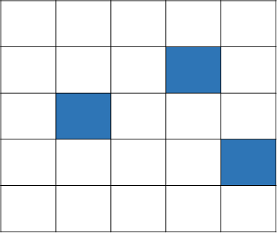
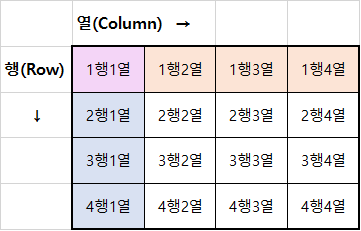
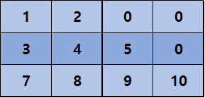
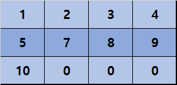
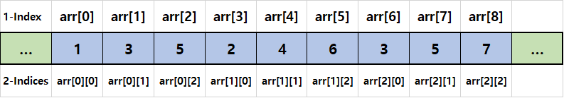
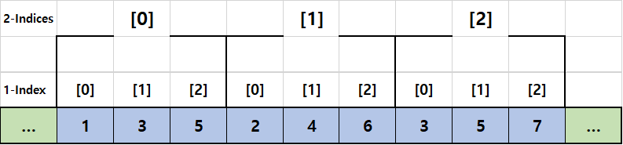

# C 학습 3주차

## 목차

1.  **배열**
    1.  배열의 정의
    2.  배열의 선언과 사용
    3.  배열의 초기화
    4.  배열의 활용
2.  **다차원 배열**
    1.  이차원 배열의 정의
    2.  이차원 배열의 선언과 사용
    3.  이차원 배열의 초기화
    4.  다차원 배열
    5.  다차원 배열의 활용
    6.  다차원 배열의 메모리 구조
3.  **문자열**
    1.  C 문자열의 정의
    2.  문자 배열의 선언과 사용
    3.  문자 배열의 초기화
    4.  문자 배열 사용 시 주의사항
4.  **문자열 배열**
    1.  문자열 배열의 정의
    2.  문자열 배열의 선언, 사용과 초기화
5.  **표준 문자열 라이브러리**
    1.  라이브러리란?
    2.  표준 문자열 라이브러리
    3.  strcpy - 문자열의 복사
    4.  strlen - 문자열의 길이
    5.  strcmp - 문자열의 비교
    6.  strcat - 문자열의 연결

---

## 1. 이차원 배열의 정의

이전 페이지에서 살펴본 배열은 **선형 자료구조**, 비유하자면 열차와 같이 일렬로 쭈욱 늘어진 형태를 가지고 있었습니다.

이처럼 선(Linear)의 형태를 1차원 형태라고 이야기합니다. 즉 배열은 1차원 형태로 데이터를 저장하여 사용하는 문법인 셈입니다.

그런데 이렇게 1차원의 형태로 사용하는 것보다 더 높은 차원의 형태로 사용하는게 편리할 때도 있습니다.

이차원 배열에 대해 살펴보기 전에, 다음과 같은 질문을 드려보겠습니다.

>   다음과 같은 보드판이 있을 때, 보드판에 파란색으로 칠해진 위치를 숫자를 통해 말해보세요.
>
>   

이 질문에 답할 때 이렇게 말하는 분은 없을 겁니다.

>   좌상단에 위치한 칸을 0번째 칸이라 할 때, 오른쪽으로 한 칸 움직이면 1칸 증가하고, 더 이상 오른쪽으로 갈 수 없으면 그 다음 줄로 이동한다고 가정하면 순서대로 9번, 11번, 19번 칸이 파란색으로 칠해져 있네요.

대부분의 사람들은 이렇게 대답합니다.

>좌상단에 위치한 칸을 위에서 0번째, 왼쪽에서 0번째라 할 때, 순서대로 
>
>아래로 한 칸 오른쪽으로 두 칸 떨어진 곳
>
>아래로 두 칸 오른쪽으로 한 칸 떨어진 곳
>
>아래로 세 칸 오른쪽으로 네 칸 떨어진 곳
>
>에 위치한 칸이 파란색으로 칠해져 있네요.

그리고 혹시나 행렬을 아는 연세가 좀 지긋하신(ㅎ) 분들은 이렇게 말 할 것입니다.

>   행과 열이 0부터 시작한다 할 때
>
>   1행 3열
>
>   2행 1열
>
>   3행 4열
>
>   에 위치한 칸이 파란색으로 칠해져 있네요.

참고로 행렬은 다음과 같은 구조입니다.



*가로줄(주황색)을 한 행, 세로줄(하늘색)을 한 열로 이야기할 수 있습니다.*

*또한 예시에서는 행과 열을 0부터 매겼지만, 위 이미지처럼 일반적으로는 행과 열은 1부터 매깁니다.*

이 예시에서 가장 첫 번째 방법은 보드판을 1차원 형태로 해석하고 말한 것이고, 그 다음 두 방법들은 보드판을 2차원 형태(행렬은 2차원 구조이므로)로 해석하고 말한 것입니다.

이렇게 보니 배열을 더 높은 차원으로 이용하면 얻게 될 편리함이 조금은 와닿으시나요?

위 예시를 배열을 이용한 C 코드로 나타내면 다음과 같습니다.

```c
#include <stdio.h>

#define SIDE_LENGTH 5
#define BLUE 1

int main()
{
    // 1차원 배열
    int arr[SIDE_LENGTH * SIDE_LENGTH];
    arr[9] = BLUE;
    arr[11] = BLUE;
    arr[19] = BLUE;
    
    // 2차원 배열
    int arr[SIDE_LENGTH][SIDE_LENGTH];
    arr[1][3] = BLUE;
    arr[2][1] = BLUE;
    arr[3][4] = BLUE;
    
    return 0;
}
```

이처럼 이차원 배열이란, 배열의 크기를 두 개 지정하여 사용하는 배열을 말합니다.

배열의 크기가 두개이므로 각각의 크기는 왼쪽부터 행과 열의 크기가 됩니다.

그리고 이차원 배열의 각각의 원소를 사용할 때에도 행과 열의 인덱스를 각각 지정하여 사용하게 됩니다.

그럼 이제 이차원 배열의 형태를 살펴 보았으니 선언과 사용, 초기화 방법을 살펴봅시다.

## 2. 이차원 배열의 선언과 사용

이차원 배열을 선언하는 방법은 다음과 같습니다.

```c
자료형 배열명[크기1][크기2];
```

이 때 크기1은 행, 크기2는 열의 크기를 나타냅니다.

이차원 배열 역시 일차원 배열(앞으로 일반적인 배열을 다차원 배열과 구분하기 위해 일차원 배열이라 부르겠습니다)과 동일한 배열이기 때문에 선언, 사용 시 주의사항이 같습니다.

그래도 워낙 중요한 내용이니 한번 더 정리하고 가겠습니다.

*   배열의 크기는 0이 아닌 상수만 지정할 수 있다. 단, 초기화를 해 주는 경우 생략이 가능하다.
*   배열의 인덱스는 유효 범위를 넘길 수 없다.
*   배열의 인덱스는 0부터 매겨진다.
*   배열의 인덱스와 크기는 다른 개념이며, 인덱스를 지정할 때에는 변수를 사용할 수 있다.

간단히 이차원 배열을 선언하고 사용하는 예시를 살펴보고 넘어가겠습니다.

```c
#include <stdio.h>

int main()
{
    int matrix[9][9];
    
    for(int row = 0; row < 9; row++)
    {
        for(int col = 0; col < 9; col++)
        {
		matrix[row][col] = (row + 1) * (col + 1); 
        }
    }
    
    for(int i = 0; i < 9; i++)
    {
   	for(int j = 0; j < 9; j++)
        {
		printf("%d * %d = %d | ", i+1, j+1, matrix[i][j]);
        }
	printf("\n");
    }
	
    return 0;
}
```

위 코드의 출력 결과는 아래와 같습니다.

```text
2 * 1 = 2 | 2 * 2 = 4 | 2 * 3 = 6 | 2 * 4 = 8 | 2 * 5 = 10 | 2 * 6 = 12 | 2 * 7 = 14 | 2 * 8 = 16 | 2 * 9 = 18 |
3 * 1 = 3 | 3 * 2 = 6 | 3 * 3 = 9 | 3 * 4 = 12 | 3 * 5 = 15 | 3 * 6 = 18 | 3 * 7 = 21 | 3 * 8 = 24 | 3 * 9 = 27 |
4 * 1 = 4 | 4 * 2 = 8 | 4 * 3 = 12 | 4 * 4 = 16 | 4 * 5 = 20 | 4 * 6 = 24 | 4 * 7 = 28 | 4 * 8 = 32 | 4 * 9 = 36 |
5 * 1 = 5 | 5 * 2 = 10 | 5 * 3 = 15 | 5 * 4 = 20 | 5 * 5 = 25 | 5 * 6 = 30 | 5 * 7 = 35 | 5 * 8 = 40 | 5 * 9 = 45 |
6 * 1 = 6 | 6 * 2 = 12 | 6 * 3 = 18 | 6 * 4 = 24 | 6 * 5 = 30 | 6 * 6 = 36 | 6 * 7 = 42 | 6 * 8 = 48 | 6 * 9 = 54 |
7 * 1 = 7 | 7 * 2 = 14 | 7 * 3 = 21 | 7 * 4 = 28 | 7 * 5 = 35 | 7 * 6 = 42 | 7 * 7 = 49 | 7 * 8 = 56 | 7 * 9 = 63 |
8 * 1 = 8 | 8 * 2 = 16 | 8 * 3 = 24 | 8 * 4 = 32 | 8 * 5 = 40 | 8 * 6 = 48 | 8 * 7 = 56 | 8 * 8 = 64 | 8 * 9 = 72 |
9 * 1 = 9 | 9 * 2 = 18 | 9 * 3 = 27 | 9 * 4 = 36 | 9 * 5 = 45 | 9 * 6 = 54 | 9 * 7 = 63 | 9 * 8 = 72 | 9 * 9 = 81 |
```

## 3. 이차원 배열의 초기화

이차원 배열의 초기화는 다음과 같이 이루어집니다.

```c
자료형 배열명[크기1][크기2] = {{초기화값01, 초기화값02,초기화값03,...}, {초기화값11,초기화값12,초기화값13,...},...}
```

조금 복잡한데, 다음과 같습니다.

```c
자료형 배열명[크기1][크기2] = { {0번째 행의 초기화 값들}, {1번쨰 행의 초기화 값들}, {2번째 행의 초기화 값들}, ...};
```

각각의 행에 속한 원소들(열 원소들)의 초기화값을 중괄호로 묶은 후, 이 묶음들을 행 순서대로 배치한 후 중괄호로 한 번 묶습니다.

따라서 아래 코드는,

```c
int arr[3][4] = { {1, 2}, {3, 4, 5}, {7, 8, 9, 10} };
```

아래 그림처럼 초기화됩니다.



이차원 배열도 마찬가지로 초기화할 원소보다 값을 적게 지정하면 나머지 값들이 0으로 초기화되는 것을 알 수 있습니다.

그리고 추가로 알아야 하는 것은, **이차원 배열도 사실은 일차원 배열과 동일한 구조(아래에서 자세히 살펴볼 것입니다)** 이기 때문에 일차원 배열과 동일한 방식의 초기화가 가능합니다.

```c
int arr[3][4] = {1,2,3,4,5,7,8,9,10};
```

이처럼 행 단위로 따로 묶지 않고 초기화를 하게 되면, 0행 0열 원소부터 순서대로 초기화값이 할당되고 나머지 원소들은 모두 기본값(0)으로 할당됩니다.

따라서 그림으로 나타내면 다음과 같습니다.



보이듯이 이차원 배열을 일차원 배열처럼 사용하면 제일 앞서 살펴보았던 보드판 예시의 1번째 대답처럼 사용되게 됩니다.

이차원 배열을 행과 열을 구분지어 사용하는 것과 그렇지 않게 사용하는 것의 차이를 이번 예시를 통해 확실히 살펴보시기 바랍니다.

그 외에 이차원 배열을 초기화할 때 일차원 배열과 다른 점 하나는 **초기화를 진행해도 모든 크기를 생략할 수 없다**는 점입니다.

이차원 배열의 경우 초기화를 진행하게 되면 제 1크기만을 생략할 수 있습니다.

```c
short test1[][2] = {0,1,2,3}; // OK
short test2[][] = {0,1,2,3}; // Error. 
```

이후 다차원 배열에도 살펴보겠지만, 배열을 초기화할 때 생략할 수 있는 크기는 **제1크기, 즉 가장 왼쪽 대괄호** 뿐입니다.

왜 이러한지 궁금하시다면 개인적으로 질문해주세요~

## 4. 다차원 배열

지금까지 살펴본 이차원 배열은 배열을 2개의 인덱스로 사용하는 방법이었습니다. C에서는 2차원을 넘어 N개의 인덱스로 배열을 사용할 수 있는 **다차원 배열(N-Dimentional Array)** 를 지원합니다.

**다차원 배열**은 **이차원 배열과 완전히 같은 사용 방식**을 가지며, **이차원 배열과 달리 사용될 일이 거의 없기 때문에** (기껏해야 삼차원 배열 정도만 게임 개발을 할 떄 가아끔 사용됩니다.) 간단하게만 살펴보고 넘어가겠습니다.

*   다차원 배열의 선언은 다음과 같이 이루어집니다.

    ```c
    자료형 배열명[크기1][크기2]...[크기N];
    ```

*   다차원 배열의 초기화는 다음과 같이 이루어집니다.

    ```c
    자료형 배열명[크기1][크기2]...[크기N] = {{{{{{크기N의 초기화값들},{크기N의 초기화값들},...}, {크기N-1의 초기화값들},...},{크기N-2의 초기화값들},...}, ...},...};
    ```

*   또한 다차원 배열도 초기화할 떄 제 1크기만을 생략할 수 있습니다.

    ```c
    int arr[][3][2] = {0,1,2,3,4, ...};
    ```

## 5. 다차원 배열의 활용

이번에는 다차원 배열의 활용에 대해 살펴보겠습니다.

다른 부분들은 일차원 배열과 동일하므로, 여기서는 **다차원 배열에 sizeof 연산자를 사용하는 방법**만 알아보겠습니다.

*   다차원 배열에 sizeof 연산자를 사용하는 방법

    보통 N차원 배열의 모든 원소에 동일한 작업을 수행하려면 N번 중첩된 반복문을 이용해야 합니다.

    앞서 일차원 배열에 반복문을 사용할 때 반복 조건으로 상수 대신 sizeof연산자를 사용하는 것이 좋다고 알려드렸는데, 그렇다면 다차원 배열을 통해 sizeof 연산자를 사용하려면 어떻게 해야 할까요?

    이차원 배열을 기준으로 설명하면, **이차원 배열은 각각의 행으로 이루어져 있고, 각각의 행은 각각의 열로 이루어져 있기 때문에** 다음과 같이 사용할 수 있습니다.

    ```c
    #include <stdio.h>
    
    int main()
    {
        int arr[3][5];
        
        for(int i = 0; i < sizeof(arr) / sizeof(arr[0]); i++)
        {
            for(int j = 0; j < sizeof(arr[0]) / sizeof(int); j++)
            {
            	// Do Something.
            }
        }
        
        return 0;
    }
    ```

    우선 각 행마다 작업을 반복한다고 생각하고 이차원 배열 전체를 한 행의 크기로 나누면 행마다의 반복 횟수가 나옵니다.

    그 다음 반복문에선 각 행마다 열의 수만큼 반복한다고생각하고 한 행의 크기를 한 칸의 크기로 나누면 열마다의 반복 횟수가 나옵니다.

    행렬 구조를 자주 접하지 않았다면 조금 어려울 수 있으니 천천히 따져 보면서 이해해 보시기 바랍니다. 모르겠으면 언제든지 질문해주세요!

## 6. 다차원 배열의 메모리 구조

지금까지 다차원 배열에 대해서 전부 알아보았습니다. 그런데 우리는 첫 주차에서 메모리가 1차원 구조(선형 구조)라고 배웠는데, 어떻게 다차원 형태로 배열을 사용할 수 있는 것일까요?

사실 이차원 배열을 알아볼 때 여러분께 드린 질문에 답이 있습니다.

컴퓨터는 선형 구조의 배열을 N차원의 형태로 사용하기 위해 예시 대답의 첫 번째 대답처럼 메모리를 사용합니다!

즉, 아래와 같은 이차원 배열이 있다면

```c
int arr[3][3] = { {1, 3, 5}, {2, 4, 6}, {3, 5, 7} };
```

일차원 배열을 아래 그림처럼 매겨서 사용하는 것입니다.



각각의 일차원 인덱스에 이차원 인덱스가 대응되는 것을 확인할 수 있습니다.

이를 다른 구조로 살펴보면 다음과 같이 표현될 수 있습니다.



이렇듯 N차원 배열은 오직 사람들에게 편리함을 주기 위한 기능일 뿐 컴퓨터 내부적으론 모든 배열들이 다 일차원 배열이기 때문에, 앞서 살펴본 다차원 배열의 초기화에서 각각의 차원을 중괄호로 묶지 않고 1차원 형태로 초기화할 수 있었던 것입니다.

여기까지 C에서 사용하는 배열의 모든 것에 대해 살펴보았습니다. 다음 페이지에서는 C에서 배열을 활용하는 대표적인 예인 **문자열**에 대해 살펴보겠습니다.

----

*(C) 2021. Im-Yongsik(Hamsik2rang) all rights reserved.*

<div style="text-align:left"> <a href="./1.배열.md">← 배열</a><div/>
<div style="text-align:right"> <a href="./3.문자열.md">문자열 →</a><div/>


